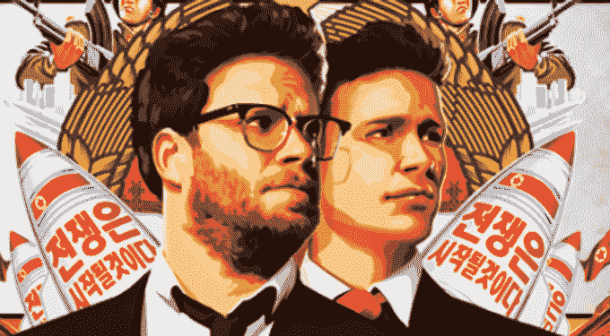

# 一位前索尼电影公司高管在 TechCrunch 上为取消《采访》的决定辩护

> 原文：<https://web.archive.org/web/https://techcrunch.com/2014/12/22/a-former-sony-pictures-exec-defends-the-decision-to-pull-the-interview/>

上周晚些时候，TechCrunch 与前索尼电影公司首席数字战略官米奇·辛格(Mitch Singer)进行了一次聊天，讨论索尼决定从影院撤出《采访》的动机以及该决定的影响。

电影院连锁店声称，他们叫停这部电影的理由(这实际上是迫使索尼出手，因为缺乏发行注定了它在票房上的失败)是为了保护他们的观众，免受黑客的暴力威胁。辛格指出，物理攻击的几率非常低，但以进一步黑客攻击的形式进行报复，似乎对所有参与者都有可能。

“我们知道只有一小部分文件被公开。如果你是索尼，你会说，好吧，我知道有 5 个人的电子邮件被泄露了，但是我们的公司战略主管的文件还没有公布，我们的公司法律主管的文件还没有公布，我们的医疗记录还没有公布。谁知道有哪些珍贵的文件没有被公开，”米奇说，他描述了索尼电影公司高层可能出现的想法。

他继续说道:“(除了)对员工和员工家属的威胁，我认为你必须严肃对待，索尼必须做出经济决定。这不是基于维护美国的价值观或言论自由，或允许某人强制进行自我审查，这是索尼必须做出的商业决定——如果我们发布这部电影，我们会损失更多的钱吗？当更多的文件被发布时，我们可能会毁了我们，或者我们应该埋葬它，接受损失，继续前进。"

即使我们这些索尼电影公司以外的人也可以看到，他们对黑客几乎没有什么影响力——从所有的账户来看，他们似乎已经完全妥协了，没有办法拿回他们的文件，或者在不向黑客的要求屈服的情况下防止进一步的转储。

然而，正因为如此，有人批评索尼没有发行这部电影，认为这是一种挑衅行为，以此表明我们美国人根本不在乎什么冒犯了世界另一端的独裁者。

《洛杉矶周刊》的艾米·尼科尔森甚至将取消这部电影的决定描述为好莱坞言论自由的终结，他写道:“更糟糕的是，我们以我们可能从未见过的方式阻碍了我们国家对言论自由的承诺:紧张的高管们会因为害怕自己的网络攻击而否决哪些剧本？有哪些电影是永远不会存在的？电影公司会保持沉默多久——为谁？另一部由史蒂夫·卡瑞尔主演、奥斯卡奖得主戈尔·维宾斯基执导的朝鲜电影已经被抢先叫停了。”

辛格指出，这并不是好莱坞第一次出于经济原因进行自我审查，他引用了无数美国电影公司修改电影以在利润丰厚的中国市场上映的例子，比如[在第三部《加勒比海盗》中将周润发的银幕时间减少了一半](https://web.archive.org/web/20221209040723/http://web.archive.org/web/20070618003655/http://www.cnn.com/2007/SHOWBIZ/Movies/06/15/china.pirates.ap/index.html)，因为他们认为这部电影对中国人有负面描述。“你认为任何想要吸引观众的主要电影都会批评中国政府吗？有人打算近期制作一部关于焚烧古兰经的电影吗？我不这么认为。”

这提出了一个值得思考的有趣问题:我们为什么要批评基于一套经济激励而非另一套经济激励来抑制自由表达的决定？我们知道最终在中国上映的电影是如何被修改的，对此没有太大的问题。这些情况与《采访》中发生的事情之间的明显区别是，*美国*观众被拒绝观看电影([反正可能是暂时的](https://web.archive.org/web/20221209040723/https://beta.techcrunch.com/2014/12/19/sonys-ceo-michael-lynton-we-have-not-given-in/))。

但是我们知道它被取消的唯一原因是因为对工作室的压力是公开发生的——我们不知道在我们听说它们之前有多少电影被取消了，因为它们在海外不会取得好成绩，考虑到近年来国内电影院的上座率下降。