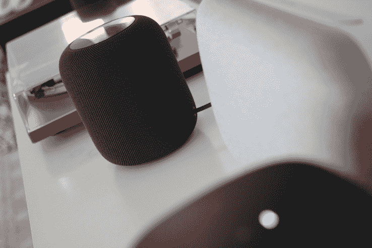
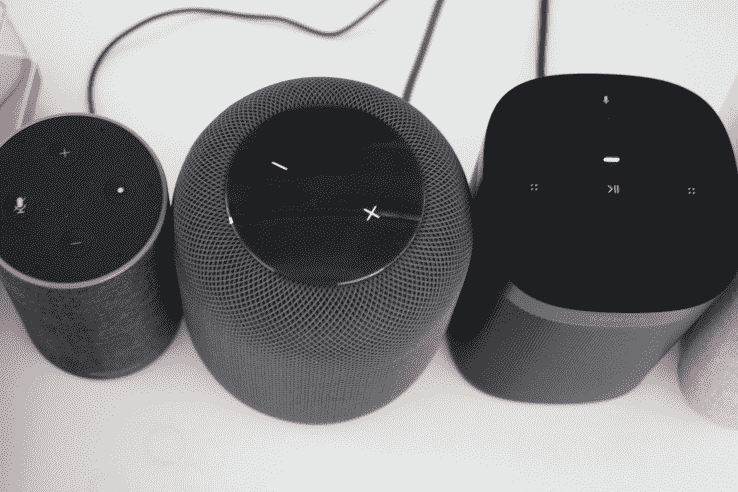

# 评论:苹果的 HomePod 提供了令人难以置信的声音，但 Siri 功能有限

> 原文：<https://web.archive.org/web/https://techcrunch.com/2018/02/06/a-four-sentence-homepod-review-with-appendices/>

苹果的 HomePod 无疑是有史以来声音最好的主流智能音箱。它的分离和低音响应比其他任何尺寸的产品都好，声音的细微差别和微妙性值得苹果公司为此努力了 7 年。

作为一款智能扬声器，它提供了一流的语音识别功能，远远超过了其他智能扬声器在远处或音乐播放时听到你试图触发命令的能力，但它的整体灵活性受到 Siri 协议提供的有限命令集的限制。

如果你已经有 Apple Music，或者你想拥有它，并且你正在市场上寻找一个令人难以置信的过度设计和令人印象深刻的扬声器，它将为你提供真正出色的声音，基本上没有调谐、大惊小怪、测量或调整。

我的评论就到此为止了。从现在开始一切都是细节…但是我喜欢细节，如果你也喜欢，让我们来谈谈。

**附录**

收集了关于 HomePod 创作的各个方面的信息，以及它在现实生活中是如何工作的。

*评审员:*

音箱很可能是“主观硬件”的巅峰。听的环境、经验、词汇、品味和评论者的耳朵都会和潜在的拥有者有一些细微的不同。这意味着，不管你读了多少评论，如果你还没有打算买一个，而且声音对你很重要，那么你应该去苹果商店或其他地方找一个至少听一次。

我还认为，这意味着在适当的背景下阅读这样的评论是必要的。

对于我来说，我在大约 15 年前销售了大约 7 年的高端音频设备。在我从事家庭音响业务期间，我花了无数时间聆听和学习各种扬声器，从 50 美元的书架模型到 20，000 美元的 Meridian 系统。服务于，希望，成为足够的教育，使适当的建议买家。当然，为了得到那 5%的佣金。我对音频的兴趣一直延续到今天，尽管我不是任何人的专家。我认为自己是一个受过中等教育的听众，有着坚实的耳朵和对美好事物的品味。尽管值得注意的是，我的特殊嗜好总是集中在家庭影院，而不是“让我们坐在一个房间里听范吉利斯的音乐，并凝视着对方”这一端。虽然那也不错。

上述评论和这些结尾笔记是在非常温和的音频体验和公认的非常主观的观点下编写的。

*构建质量:*

苹果确实非常重视这个™️。为了证明有多认真，它带着一群记者首次参观了位于库比蒂诺总部附近的音频实验室。该实验室拥有十几个消声室，用于测试 HomePod 的组件，其中包括一个位于 28 吨混凝土之上的巨大消声室。事实上，我以前参观过音频测试实验室，站在这些奇怪的隔音室中，让你可以隔离扬声器音调的最小变化，苹果展示的大部分内容都是开发新扬声器的标准操作程序。

但是在它上面涂上一层典型的苹果果冻。苹果表示，其最大的试验箱是美国最大的试验箱之一，位于一个垫子上，与外界隔绝，没有任何东西污染其音频纯度测试。除了测试扬声器的声学质量，这些试验箱还允许苹果深入研究并缓解在如此小的箱体中安装高偏移超重低音扬声器通常会出现的问题。更进一步，还有更小的腔体，允许他们将嗡嗡声与电子元件隔离开来(毕竟板上有一台计算机)，并尝试隔离和控制噪声，使其不会出现在最终输出中。

简而言之，当一艘潜艇像这艘潜艇一样繁荣时，你通常肯定会把一些部件弄得嘎嘎作响。那是当一个扬声器开得很大，或者你前面的一辆汽车的牌照架松了，并在播放 Culture II 时，你会听到的声音。多亏了大量的测试和工程设计，HomePod 不会对音频产生任何振动或嗡嗡声——即使是在超级重击音轨的最大音量下。在构建质量的这一方面获得了非常高的分数——这些分数直接转化为声音质量。

我不打算狂热地谈论覆盖在 HomePod 上的织物，尽管苹果对它对音频“透明”感到非常自豪。这意味着理论上它对通过它的声音几乎没有影响，这对于更便宜的扬声器来说可能是个问题。大多数质量不错的扬声器都覆盖着更好的材料，尽管在低端，许多扬声器只是用一些看起来不错的东西拉过来，这可能会使声音变得模糊。我将把它留给其他人来剥 HomePod 的皮并比较输出。我可以说，它很有吸引力，而且相对耐脏。我有孩子，起诉我吧。

顶部显示是绝对最低限度的需要。两个音量按钮和一个代表 Siri 的多色漩涡。与亚马逊 Echo、Sonos One 和谷歌 Home Max 的按钮和图标丰富的表面相比，它非常苹果化。

*音质和对比:*

来自 HomePod 的声音可以用精确来形容。它不如谷歌 Home Max 等其他一些产品响亮，也不如 Sonos One 明亮(和多功能)，但它破坏了亚马逊 Echo 等不太复杂的选项的浑厚声音。要真正填满一个大房间，你需要两个，但任何一个住在小房子或小公寓里的人都会从一个房间里听到很棒的声音。

我一直在测试 Home Max、Sonos One 和最新的 Echo 以及 HomePod，以便获得一些基本的参考框架，但最终也是为了找出它应该适合的位置。

HomePod 是“最好”的声音。它细致入微，微妙，在各种音乐中都有很好的分离和清晰。例如，一个有体面的中音范围，但过于明亮的高端只有开箱校准。在最大音量下，HomePod 保持平衡的地方变得尖锐而痛苦。

Home Max 听起来相当不错，因为它有两倍的潜艇，具有类似的偏移(22 毫米与 HomePod 的 21 毫米)，推动大约相同数量的空气，它真的很笨重。虽然它们是向下发射，而不是向上发射，我认为，加上相对标准的外壳，可能与声音被推在一起的方式有关。它肯定比 HomePod 的声音大得多，这是我测试中的一个常见主题——HomePod 听起来很棒，但没有其他扬声器那么大声。家庭最大持有的声音形状以及最大音量，这是更多的房间填充作为一个单一的单位比一个单独的 HomePod。

但是 Max 非常适合那种“取悦大众”的扬声器。这是响亮和低音，并做了体面的工作。但不是很老练。

从 Echo 到 Sonos 再到 Home Max，所有其他单元都未能提供真正独立的声音。这是 HomePod 的优势所在，主题也很合适。这需要大量的工程工作，再加上大量的克制，才不会让这件事变得又吵又闹。取而代之的是，根据扬声器在房间中的位置和正在播放的曲目的组成部分，精心制作一个声场。

HomePod 甚至会听回来的声音，以确定反射表面的声音特征。以一种还原的方式，HomePod 正在感应组成您房间的各种表面，并对它们进行补偿以消除回声和不想要的混响，并确定哪些音频片段最适合播放它们的自然属性。它通过发送和分别考虑来自每个扬声器的七个不同的音频源并听回这些音频来做到这一点。每一个都可以被视为一个独立的实体，并根据其靠近或远离墙壁的位置来调整播放音轨的不同部分。

所有这些处理都是由 A8 芯片完成的，这就是为什么 HomePod 上没有均衡器的原因。你甚至从哪里开始“调整”那些随着每条赛道和环境不断进行调整的东西呢？我和其他人一样喜欢很多滑块，但我也理解他们为什么不在这里。

HomePod 号有一个单独的，向上发射的减震潜艇。虽然 Home Max 肯定会颠簸，但它也需要使用一个单独的橡胶垫，你必须像低音三脚架一样放置它，以防止它在表面上出现不必要的振动。HomePod 通过身体传递的运动非常少，除了集成的橡胶脚之外，它不需要任何东西。它没有那么多的繁荣，但它得到了更好的利用。

这种潜艇的移动量非常可观(潜艇通常根据其能够推动的空气量来分类)，这种移动量通过定制的多波段压缩机来实现最大化，这种压缩机可以将锥体带到它能够推动的边缘，而不会越过边缘进入嗡嗡声。这种实时微调有效地利用了普通 sub 保留的“误差范围”,以扩展回放中可用的音调范围。

在公寓里，HomePod 的声音大得不能再大，房间里也坐满了人。但是在家里，在一个 20×30’的大房间里，地板上铺着地毯，我发现自己真的希望声音大一点。一旦苹果公司支持两个 HomePods 在“立体声对”中串联使用，这个问题应该会得到解决，~~尽管这是否是离散的 L/R 通道我不知道~~它们分别播放左右通道的内容。苹果公司的网站上说，它听起来“比传统的立体声对更好”，因为声场饱满，听起来很准确，而不是行业意义上的“立体声”。它在一个简短的演示中听起来确实不错，但我不能明显地测试它。

【 ***编者按**:我显然完全发明了一个术语——“满室”(FullRoom)，苹果公司称这个功能实际上并不是这个功能的名字。我不知道为什么 FullRoom 会出现在我的笔记里，但它是我想象出来的，不是真实的东西。抱歉。* ]

这很快就会实现，随后将推出“多房间”功能，让一群 HomePods 在任何地方同步播放相同的音频。但是现在，中小型房间很好，大房间你可能会发现 HomePod 有点电力不足。

只有 HomePod 和回声提供了真正的单向性的声音，回声是绝对的音频质量包的后面。绕着 HomePod 从一个房间的一个角落走到另一个角落，或者绕着它转圈，这真是一种难以置信的体验。声音在任何角度都不会衰减，音频的特征也不会改变。这就行了。

虽然我发现 Sonos 默认情况下很亮，但构建质量仍然很好，对于许多多声道音频爱好者来说，这可能是一个很好的选择。但是苹果并不是真的在追求同样的人。“这是一个昂贵的扬声器”的论点在这里真的很有意义。你不能用 HomePod 给你的家庭影院供电。整个家庭音频在发布时也不是实时的。最终，他们吸引的是苹果音乐的订户，而不是 Sonos 的爱好者。Sonos 也花了几年时间来共同行动，并放弃了大量的市场优势，拖着脚趾头推出了一款真正独特而可爱的产品。

就分离而言，Sonos One 非常清脆，总体来说肯定更响亮，因为有两个(价格与 HomePod 大致相同)。

但是不管有多坚固，他们仍然不能创造出像 HomePod 那样广阔的声场。这一点在《Bodak Yellow》和《La Grange》中一样明显。但在现场表演中，它真的很棒，感觉无论你站在哪里，人声都在你和 HomePod 之间的空气中，掌声和高帽来自扬声器上方和后方的某个地方——向外和周围投射。这是我从任何音乐装置中听到的最立体的声音之一，绝对是“单个扬声器”发出的最深沉的声音。

不幸的是，这是言语无法表达的事情之一。可以说，HomePod 是扬声器中最复杂和最有趣的，但绝对不是最夸张的。

*Siri:*

目前，Siri 没有做很多与音频内容无关的“其他”事情。苹果公司表示，这是因为绝大多数人将这些扬声器用于播放音乐和设置定时器等基本命令。过去一年的研究已经证实了这一点[。这使得 Siri 在音乐、新闻、体育和其他音频方面表现得非常好，在苹果为其发布的三个基本任务方面也相当不错，这在某种程度上是可以接受的，但并不理想。](https://web.archive.org/web/20230307142251/http://nationalpublicmedia.com/wp-content/uploads/2017/06/The-Smart-Audio-Report-from-NPR-and-Edison-Research-2017.pdf)

但这并没有把它放在任何一种智能音箱能力的极点位置。苹果在 Siri 方面有很多地方需要弥补，这显然是为什么它专注于扬声器质量和它作为苹果音乐渠道的精简价值主张。

虽然你可以在 iPhone 上发短信、记笔记、设置提醒和处理电话，但这只是所有的课外活动，它们都专注于单一用户体验。如果您登录到 iCloud 帐户，所有的信息和通话都是您的，都是您发出的。如果你是一个独自生活的单身男人，这很好，但在家庭环境中这就完全崩溃了。作为 iCloud 账户的所有者，苹果允许你关闭这些选项，我建议你在一切以悲剧收场之前这么做。除非你一个人住，在这种情况下，马泽尔，听起来很平静。

谷歌 Home Max 轻松获得通用信息，Echo 紧随其后，HomePod 紧随其后。Siri 很难理解蓝鲸的长度，Echo 死记硬背了维基百科，而 Home Max 用谷歌大脑中的口语说话，这是最好听的。

整合和扩张显然是现在的回声。不管是好是坏，亚马逊一直奉行一种开放的政策，用它的软件策略积极地吸引所有的来者。对于 Alexa 命令的每一个“嘿，这真不错”的实现，都有十几个糟糕的实现——但这是任何新应用平台的情况。重要的是，Echo 已经突破了早期采用者的隔膜，并在尽可能多的花盆中种植了自己的卷须。Echo Anywhere 的策略与苹果对 Siri 采取的策略没有任何不同，它为亚马逊提供了一个坚实的护城河。现在是一场比赛，看 Siri 是否能像亚马逊一样快速改进，让亚马逊音乐成为一件值得关注的事情。

纯粹的音乐信息和命令是一场更激烈的比赛，因为 HomePod 的“音乐学家”功能在传递音乐信息方面要好得多(尽管在汇编或最佳唱片方面犯了很多错误)，并使用链接或组合命令来深入音乐选择。

智能家居功能与你手机上的家居应用完全一样，这也是 HomePod 生活的地方，所以它有一定的意义。场景、直接附件控制和设备状态更新都在这里，它们完美地工作。这些都得益于 HomePod 作为桥梁的能力，让你可以访问你所有的设备。如果你有苹果电视，它将取代苹果电视，如果你没有，它将取代苹果电视的功能。它还充当本地网桥，可以扩展对仅支持 BLTE 且兼容 HomeKit 的设备的访问，因此，如果您目前有一些给你带来麻烦的设备，请战略性地放置。

他们还受益于 Siri 检测在 HomePod 上像纯精灵魔法一样工作的事实。我完全相信，当你让你的私人助理大声做一些事情，但它没有回应或给你一些不合理的结论时，没有什么比感觉自己像个白痴更不利于语音计算的成功了。让你觉得自己很无力，很傻，很尴尬。与语音命令应该做的完全相反。

采用语音的支点首先归结为检测和可靠响应的能力。

我在 40 英尺外和走廊拐角处测试了它，同时以正常音量播放音乐，效果非常好。非常非常令人印象深刻。

这不是万无一失的，但运行在 A8 上的 iOS 软件使用盲源分离来识别和分离两种环境噪声。这可能是当你启动一个命令时，自来水或一台“开着”的洗衣机发出的声音，也可能是你说话时盘子叮当作响的声音。它能够隔离和忽略这些，以更好地识别您的命令。

顺便说一句，Siri 在距离很近的设备之间的自动检测非常棒。如果你的 HomePod 在房间里，但你的手机就在你面前，当你说嘿 Siri 时，你的手机会触发，但很快进入休眠状态，HomePod 将接受命令。在我给 HomePod 下的数百个命令中，我的手机只意外地从 HomePod 那里抢走了一次命令。他们在这里做的一切都很好。

同样值得注意的是，苹果一直执着于在设备上保留 Siri 命令，除非他们确定你想让它出现在云上。苹果在 A8 设备上本地收听一段几秒钟的滚动音频，并且只有在你真的说了嘿 Siri 的情况下，它才会开始录制广播命令。然后，它会从您的特定 HomePod 发送完全加密和匿名的片段。苹果知道你在那一点上说了什么，并用它来训练它的语音算法，但没有办法把它和你联系起来。您也可以随时轻按来停用 Siri，让它停止聆听。

*详情:*

如果你是那种对一根电线感到头晕的人翻白眼的人，那就把目光移开。HomePod 上的电源线是王牌。它有一个柔韧的编织外部和一个灵活的护套，这使它有一个超级紧的转弯半径，可以通过便携式摄像机或支架进行布线。感觉就像一条旧牛仔裤。它比绝大多数智能扬声器附带的 bog 标准硬塑料电缆或纤细的 DC 电源线好得多。干得好 cord 团队。

使用 HomePod 从一个地方移动到另一个地方不一定是一个主要的用例，但是设置一次 HomePod 并在我的工作、公寓和家之间移动而不需要改变任何东西是一个很好的惊喜。当你把它插在一个新的点上时，它就会启动并在几秒钟内连接到你的手机已知的任何网络。真的是又快又无缝。

*商业理由:*

HomePod 的商业理由是苹果音乐。一旦你使用了回放和音乐学家功能，这一点就变得非常清楚了。全球有 3600 万人使用苹果音乐，仅在美国就有 3900 万人拥有智能音箱。Apple Music 是第一波 HomePod 销售的完美线索生成机制，也是苹果公司沿着其主轴:硬件赚钱的一种方式。

鉴于上述数字，苹果目前在 Apple Music 上的季度收入不到 1B 美元。它需要在未来 12 个月内销售约 1100 万台 HomePods 才能实现这一收入。每一笔购买都将保证苹果音乐用户的长期保留。

我的评论只有四句话是有原因的:如果你不喜欢 Apple Music，就不要买 HomePod。

HomePod 听起来很棒，但从表面上看，如果纯粹从这些优点而不是作为苹果生态系统的一个组成部分来比较，它是否足以证明其智能功能的局限性是值得商榷的。

然而，如果你是苹果音乐的订阅者，这个等式会立即倒向另一个方向:购买任何其他扬声器几乎都是无用的，这个听起来很棒，为什么不呢。

作为一个鞋履收藏的主人，他的收藏大到足以让游客惊呼“伊梅尔达·马科斯！”我是最后一个对人们觉得值得花钱的东西下结论的人。但如果你有一部 iPhone、一份 Apple Music 订阅和至少一台 HomeKit 设备，那么你就是一款声音美妙、售价 349 美元的扬声器的目标市场，这款扬声器能与所有这些东西配合得最好。