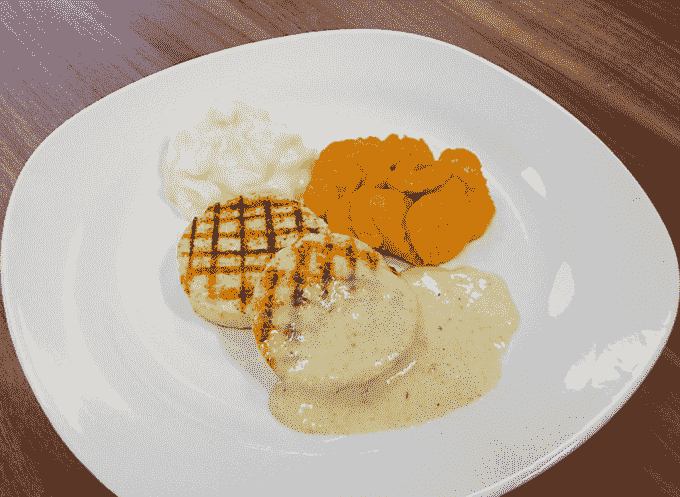

# 一家德国公司正在为老年人打印食物 

> 原文：<https://web.archive.org/web/https://techcrunch.com/2014/04/09/a-german-company-is-printing-food-for-the-elderly/>

# 一家德国公司正在为老年人打印食物

一家名为 [Biozoon](https://web.archive.org/web/20221209172816/http://biozoon.de/produkte/seneopro/) 的德国公司正在研发一种 3D 打印食品挤出机，这种挤出机可以制造出真正在嘴里融化的食品，让患有[吞咽困难](https://web.archive.org/web/20221209172816/http://en.wikipedia.org/wiki/Dysphagia)(无法吞咽)的老年患者能够吃东西而不会窒息。

Biozoon 使用分子美食学来创造可以使用标准挤压式打印机“打印”的食物。食物凝固了，完全可以食用，但是当它被吃掉后，很快就会在口中溶解。超过 60%的老年患者有吞咽困难。这可以通过确保它们不会将食物残渣吸入肺部来挽救生命。

产品本身可以以不同的方式成型和挤压，你可以添加着色剂和纹理剂，使东西看起来和尝起来几乎像真的一样。

根据该网站:

seneoPro 系列的粉末混合物能够普遍实施，因此家庭护理人员和专业厨师和护士都可以轻松制作新的饮食。开胃菜，主菜，甜点和小吃现在可以定制适合，平衡，也是最重要的视觉吸引力。一个食物与你所有的感官，愉悦和享受再次成为可能，一个结构化的日常功能可以恢复。

该产品名为 seneoPro，将于今年用于 3D 打印机。这是真正的“定制”食物，这是一种令人着迷的技术应用。

[通过 3Dprint](https://web.archive.org/web/20221209172816/http://3dprint.com/2121/german-company-biozoon-working-on-3d-food-printers-for-the-elderly/)