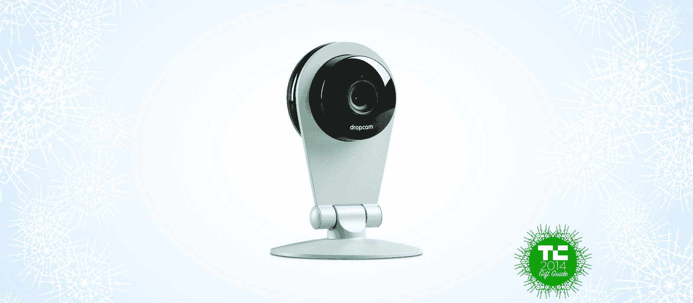
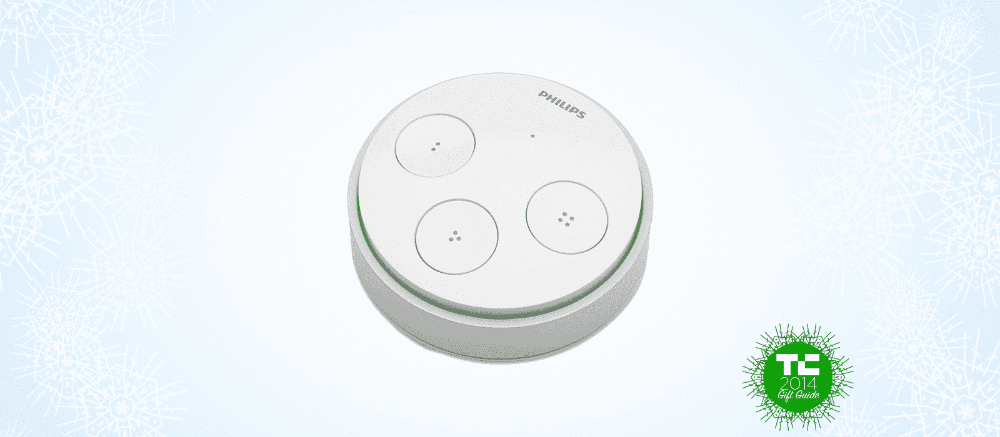

# 智能家居入门礼物指南 

> 原文：<https://web.archive.org/web/https://techcrunch.com/2014/11/28/a-gift-guide-for-the-starter-smart-home/>

智能家居产品的激增意味着现在是最好的时机，即使你对技术并不狂热，也不熟悉这个市场。这里有一个列表，可以帮助你进行基本的设置，如果你想更进一步的话，还可以添加一些有用的东西。

Connect 灯泡现在在家得宝有了自己相当大的一部分，但我仍然是飞利浦 Hue 的粉丝。具有讽刺意味的是，新的 Lux 灯泡没有改变它们的色调，但它们提供了温暖的白光，具有该系列其余部分的所有地理围栏、遥控和手动亮度选项，每个灯泡的价格是一半。

说到 Hue，它们可以由罗技 Harmony Ultimate Home 系统控制，该系统包括一个带触摸屏的物理遥控器，以及一个可以连接到 iOS 和 Android 设备上的应用程序的集线器。因为你在和集线器说话，然后和灯说话，有时会有一些输入延迟，但使用同一个遥控器来控制你的家庭娱乐系统、灯光和 Nest 恒温器仍然非常方便。

说到 Nest，他们的学习恒温器仍然是业内最好的，与一系列设备兼容，包括前面提到的罗技 Harmony remote、联网设备和 Dropcam 安全解决方案，谷歌今年收购了 Nest。

说到 Dropcam，他们提供了最佳的联网摄像机解决方案，包括录像云存储、远程控制、地理围栏、日程安排等。它们看起来也很好，所以你不必为了利用它们而把你的房子变成监视状态狂热梦想之外的东西。

回到飞利浦，该公司为其 Hue 产品制造了一种新的光开关，它有几个简洁的功能——包括通过动能存储供电，这意味着它不需要电池，你只需使用它就可以为它提供运行所需的所有电力。它还配有一个安装板，可以轻松拆卸，这样你就可以随身携带它，在家里的任何地方都可以控制它，甚至不需要你的智能手机。

这种新的 Wi-Fi 门铃很快就要上市了，这是一个很好的选择，因为该团队已经经历了一次失败，并获得了一些宝贵的经验。他们在工程、设计和用户体验上加倍努力，新版本看起来准备统治这个领域。

如今，智能手机控制的锁已经足够普遍，但 August 智能锁可能是其中最好的。它已经获得了强烈的评论，它的安装意味着你可以保留现有的插销，加上它甚至可以在没有电力的情况下使用你的旧的无聊的机械钥匙，并使用 insider your place 的扭曲外环。

