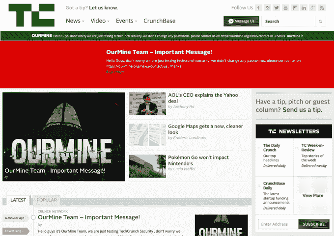

# 一个叫 TechCrunch 的黑客

> 原文：<https://web.archive.org/web/https://techcrunch.com/2016/07/26/a-hack-by-any-other-name/>

今天早上——太早了，以至于我们的大多数观众可能都没有看到 TechCrunch 上发布了一个来自非常友好的 OurMine 黑客团队的故事。该帖子发布了几分钟后就被删除了，同时被删除的还有自动生成的社交帖子。

我们加入了一个由实体组成的俱乐部，其中包括威廉·夏特纳、特拉维斯·卡兰尼克、杰克·多西、《我的世界》和其他人，这些实体已经被我们的采矿团队的探测活动所损害。“黑客”似乎涉及使用一个贡献者的账户在 TechCrunch 上发布这篇文章(截图来自我们的姐妹网站 [Engadget](https://web.archive.org/web/20230315011537/https://www.engadget.com/2016/07/26/ourmine-techcrunch-compromise/) )(感谢 Engadget！):

一段时间以来，我们一直在报道 OurMine 团队的活动，因为他们一直在通过高调名人推特账户的妥协和像 Pokemon Go 这样的热门游戏的 DDoS 而攀登恶名的阶梯。

当我们就攻击事件联系 OurMine 团队时，他们说“我们不讨厌 TechCrunch，我们喜欢他们，我们没有黑它，我们只是在测试 TechCrunch 的安全性。”

正如安全格言所说，要么你已经受到威胁，要么你只是还不知道。现在我们知道了，我们希望能做得更好。

就目前的经验来看，显然多因素身份认证应该是任何新闻机构的强制性要求，至少是这样。在这种情况下，重复使用的密码似乎有助于所发生的事情。在网站和服务之间共享密码是最糟糕的，不要这样做。尤其是现在像我们这样的团体已经把目光转向了新闻。这一次的意图是宣传，但下一次它可能是恶意的，就像一个真实领域的恶作剧市场移动故事，[而不是一个假的](https://web.archive.org/web/20230315011537/http://www.poynter.org/2015/fake-bloomberg-story-has-twitter-mulling-31-billion-takeover-offer-hikes-share-price/357673/)。我们将继续调查发生了什么，并实施额外的安全措施。

我们的官方声明如下，请尽情享受，并随意用于报告目的:

> 一名未经授权的个人侵入了我们一名 TechCrunch 作者的 CMS 账户，并使用该账户发布了一篇文章。这是一个孤立的例子，我们已经保护了帐户。对我们的读者或他们的数据没有任何风险。

**这个故事被更新以包括额外的细节。*