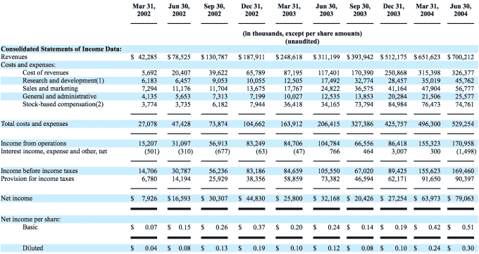

# IPO 回顾:谷歌，利润机器

> 原文：<https://web.archive.org/web/https://techcrunch.com/2017/07/31/a-look-back-in-ipo-google-the-profit-machine/>

亚历克斯·威廉是

[Crunchbase News](https://web.archive.org/web/20230306195902/http://www.crunchbase.news/)

和共同主持人

[Equity](https://web.archive.org/web/20230306195902/https://itunes.apple.com/us/podcast/equity/id1215439780?mt=2)

，TechCrunch 的专注于风险投资的播客。

More posts by this contributor

我们正在关注科技巨头的首次公开募股，这些公司我们称之为[五大](https://web.archive.org/web/20230306195902/https://techcrunch.com/2017/07/19/techs-5-biggest-players-now-worth-3-trillion/)。我们从[亚马逊](https://web.archive.org/web/20230306195902/https://techcrunch.com/2017/06/28/a-look-back-at-amazons-1997-ipo/)开始。我们名单上的下一个是搜索和广告巨头谷歌。

谷歌，现在是 Alphabet 的一部分，它创建了一家控股公司，于 2004 年上市。当时，该公司在其[创始人信](https://web.archive.org/web/20230306195902/https://abc.xyz/investor/founders-letters/2004/ipo-letter.html)中坦率地告诉投资者，它“不是一家传统的公司”，它也“不打算成为一家传统的公司。”

对谷歌来说，非传统的态度奏效了，而且效果很好。但在 10 多年前首次公开募股之前，该公司的未来很难确定。谷歌上市的环境几乎难以想象:在前独角兽时代，最有价值的互联网公司甚至不到 500 亿美元(我们将会看到)。今天，有比这更多的私有科技公司。

最终，谷歌上市，市值约 230 亿美元。这个数字听起来应该很熟悉，因为它仅比 Snap 今年早些时候设定的 IPO 价值低 10 亿美元。

要理解谷歌的首次亮相，我们得把时钟拨回到 2003 年。我们走吧。

## 2003

据报道，在首次公开募股之前，微软和谷歌曾讨论过合作。具体细节还不清楚，但是 Ars Technica 在 2003 年末，也就是谷歌上市的前一年公布了一些有趣的细节。

根据肯·费舍尔同期的报道，以下是用来描述微软和谷歌合作潜力的词语:

> 有消息称[微软之前正在追求谷歌](https://web.archive.org/web/20230306195902/http://news.com.com/2100-1030_3-5100360.html)，寻求从某种合并到彻底收购的选择。看来他们的提议未能达成任何交易，所以现在雷德蒙德将不得不等待；谷歌正朝着首次公开募股的方向前进，如果有合并的话，很可能是与上市后的谷歌。

同一篇 *Ars Technica* 文章继续报道说，是的，谷歌“似乎正准备转变为上市公司”，这将是一个“巨大的”结果这个结论非常正确。

(好玩:2006 年，微软推出 Windows Live 搜索。2007 年更名为 Live Search。后来在 2009 年更名为必应。)

谷歌和微软离达成协议有多近现在已经不重要了，因为在 2004 年 4 月 29 日，谷歌[发布了它的第一款 S-1。](https://web.archive.org/web/20230306195902/https://www.sec.gov/Archives/edgar/data/1288776/000119312504073639/ds1.htm)

## 近距离谷歌一下

随着 2004 年首次公开募股的进行，该公司最初的 S-1 报告后来补充了另一个季度的财务结果，但值得注意的是，在最初的文件中，该公司报告了急剧增长的*和*增长的 GAAP 利润。

该公司后来提交的文件对这一扩张有更全面的描述，因为它们包括了截至 6 月 30 日的季度。下面是[全套数字](https://web.archive.org/web/20230306195902/https://www.sec.gov/Archives/edgar/data/1288776/000119312504139655/ds1a.htm):

正如你所看到的，当谷歌提交申请时，它的收入和利润正以惊人的速度增长。该公司第一至第二季度的环比增长率仅为 7.5%，但谷歌在 2004 年第二季度设定的同比增长率为 181.6%。

随着谷歌收入的增长，其净收入也在增长。2004 年上半年，谷歌的总收入为 13.51 亿美元，而 2003 年上半年为 5.598 亿美元。利润从 2003 年前六个月的 5890 万美元增加到 2004 年前两个季度的 1.43 亿美元。

(请记住，随着我们的继续，谷歌的价值最终会比其首次公开募股时的价值少*。)*

 *在深入探讨围绕其 IPO 的定价传奇之前，谷歌当时还有其他一些我们没有提到的东西。该公司有一桶现金——近 5.5 亿美元——和有限的负债。

从这些数字中不难猜测，谷歌凭借自身的力量增长迅速——这家搜索引擎并不真的需要 IPO 所得来资助它的业务。在这一点上，创始人的信再次说明了这一点:“谷歌有足够的现金来资助我们的业务，并通过运营产生了额外的现金。”正确。

## 定价之舞

谷歌值多少钱？最终数字在上市时很难披露。

也就是说，谷歌的第一份 S-1 表明该公司希望在 IPO 中筹集多达 27.2 亿美元的资金。后来[提交的文件](https://web.archive.org/web/20230306195902/https://www.sec.gov/Archives/edgar/data/1288776/000119312504139655/ds1a.htm)将这一数字推高至 39.89 亿美元，这一估值意味着每股价格为 135 美元。

谷歌的首次公开募股愿望最终被削减，以允许该公司越过终点线。下面这段来自 2004 年 7 月 27 日的 [*《纽约时报》*文章](https://web.archive.org/web/20230306195902/http://www.nytimes.com/2004/07/27/business/as-it-goes-public-google-says-it-is-worth-up-to-36-billion.html?_r=0)描述了该公司 2004 年夏季中期的价格变动:

> 这家广受欢迎的互联网搜索公司正试图以非常规拍卖方式向公众出售股票，该公司昨日在提交给美国证券交易委员会(sec)的一份文件中表示，预计其股票售价为每股 108 美元至 135 美元。
> 
> 这将使该公司的市值达到 290 亿至 360 亿美元，略低于雅虎的 380 亿美元，雅虎是一家更大、更成熟的互联网公司。最有价值的互联网公司，易贝，价值 490 亿美元。

这一分析很有趣，原因如下:

*   谷歌未能维持预期的价格区间。该公司最终的 IPO 价格为 85 美元，处于区间之内。
*   雅虎价值 380 亿美元。
*   当时最大的互联网公司的价值还不如今天的优步。

一个不同的时代。

无论如何，谷歌在将股票数量从近 2500 万股削减至 1960 万股后，以 85 美元上市。该公司的估值最终达到 230 亿美元。

快速算一下，230 亿美元，谷歌的市盈率刚刚超过 10 倍。以今天的 SaaS 标准来看，这已经很高了(谷歌不是我们想象中的 SaaS)，但当你意识到你可以计算谷歌当时的市盈率(大约 120)时，以现代标准来看，这就变得非常便宜了。它已经盈利了，而且在其他条件不变的情况下，盈利收入比非盈利收入更有价值。

尽管以今天的标准来看，谷歌会非常健康，但从那时起就不难找到反对者。这个乐的，比如[突出](https://web.archive.org/web/20230306195902/http://money.cnn.com/2004/08/18/technology/googleipo/):

> 谷歌周三表示，将以每股 85 美元的价格上市，为人们广泛期待但陷入困境的股票发行最终在周四上市铺平了道路。

天哪，CNN 的钱！

然而，关键是谷歌认为它的价值高于当时的市场价值，希望达到每股 135 美元，但最终只有 85 美元。最后双方都错了。谷歌的股价可能很便宜，为每股 135 美元，这是其最高价格区间的上限。

但是首次公开募股既是魔术又是数学，随着谷歌如何上市，它已经发展到了一个新的水平。

## 荷兰式拍卖

谷歌不满足于按常规行事，而是采用荷兰式拍卖方式上市。如果这听起来很陌生，不要难过。除了谷歌，我想不起有哪家真正知名的公司自那以后使用过类似的流程。

正如我们将会看到的，也许这是有原因的。无论如何，早在 2004 年，该公司的荷兰拍卖是大新闻。《福布斯》[引用了当时一位基金经理的话，他称这一选择是首次公开募股的“绝对最大的故事”。](https://web.archive.org/web/20230306195902/https://www.forbes.com/2004/05/10/cx_aw_0510mondaymatchup.html)

这是不正确的；谷歌核心业务的实力是最大的故事，但这句话显示了谷歌当时的决定是多么奇怪。

《福布斯》的同一篇文章很好地详述了荷兰式拍卖的内容:

> 在荷兰式拍卖中，一家公司会披露出售股份的最高金额，有时还会披露这些股份的潜在价格。然后投资者陈述他们想要的股票数量和价格。一旦确定了最低清算价格，出价至少达到该价格的投资者将获得股份。如果投标数量超过可用股份数量，则按比例分配——根据投标数量的百分比授予实际可用股份的百分比——或按最大数量分配，通过为最大投标数量设置分配来填补较小投标的最大数量。

正如美国消费者新闻与商业频道[在 2014 年](https://web.archive.org/web/20230306195902/https://www.cnbc.com/2014/08/19/es-took-off-but-the-auction-didnt.html)指出的，这种模式可能“从华尔街和大款那里拿走短期收益，至少给普通人一些所有权”。然而，谷歌的使用并没有帮助荷兰拍卖起飞。

美国消费者新闻与商业频道的文章提出了两个有说服力的论点，解释了为什么荷兰拍卖公司在谷歌使用后没有获得大量粉丝。首先，“(类似的)拍卖是有风险的，”尤其是在你可能需要一些帮助来推动需求的时候。对于最热门的 IPO 来说，这不是问题，但它们只占总数的一小部分。

这篇文章接着指出:

> 第二个原因是，谷歌的出价不是真正的拍卖，而更像是一种混合。毕竟，显然有足够的投资者需求将股票定价在接近 100 美元，因为这是股票开盘的价格，但在最后一刻，主承销商摩根士丹利和瑞士瑞信银行将价格降至 85 美元。预期区间的下限是 108 美元。

尽管如此，在所有的压力和定价工作结束后，谷歌开了个好头，起飞了。

## 后见之明是 20-20(而且非常昂贵)

谷歌首日交易表现良好，股价从 85 美元的起点上涨了 18%左右，至 100 美元多一点。根据 2008 年的一份报告，该公司的历史盘中低点为 95.56 美元，历史最低收盘价为 100.01 美元[。](https://web.archive.org/web/20230306195902/https://www.cnbc.com/id/32466664)

在最终完成首次公开募股后，谷歌做得很好，而且它继续做得很少。该公司目前价值约 6500 亿美元，仅次于苹果。但在当时，在五大赛事中名列第二并不是一个确定的赌注。

[陶醉于此](https://web.archive.org/web/20230306195902/http://money.cnn.com/2004/08/19/technology/goog/):

> “在这种水平上仍然很昂贵，”核心资本合伙人公司的董事总经理威尔·邓巴说，这是一家没有谷歌股份的风险投资公司。“在不久的将来会有激烈的竞争，这是让我对价格犹豫不决的原因之一。”
> 
> Janco 的 Pyykkonen 补充称，他听说有意做空谷歌的交易员很难从参与拍卖的银行和经纪商那里获得股票贷款。[…]
> 
> 根据 CNN/Money 的一项非正式调查，23000 多名受访者中有 85%表示，一旦谷歌开始交易，他们不打算购买其股票。*