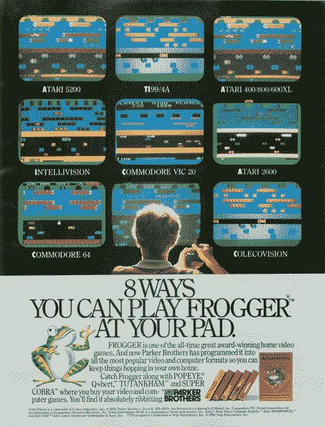
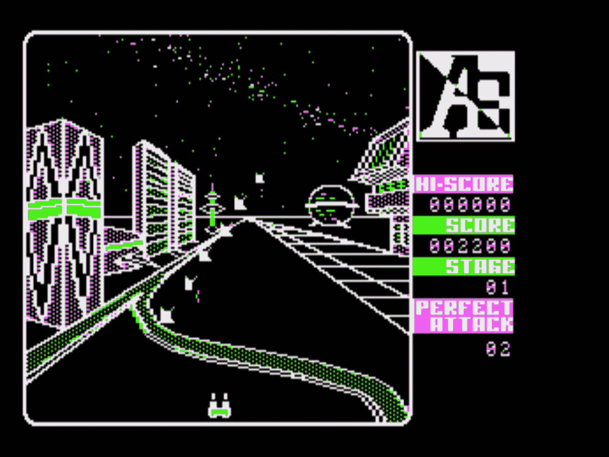
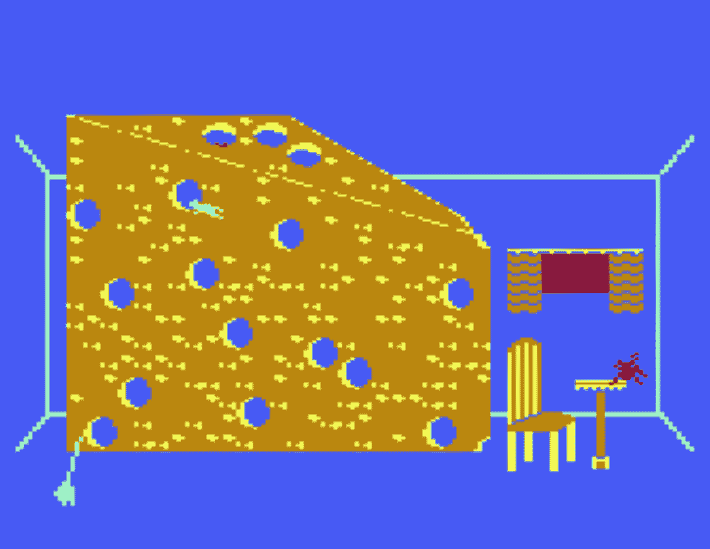
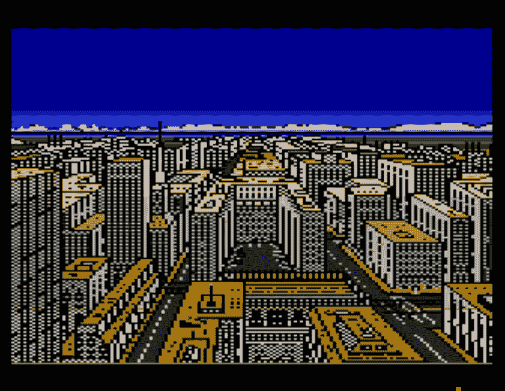
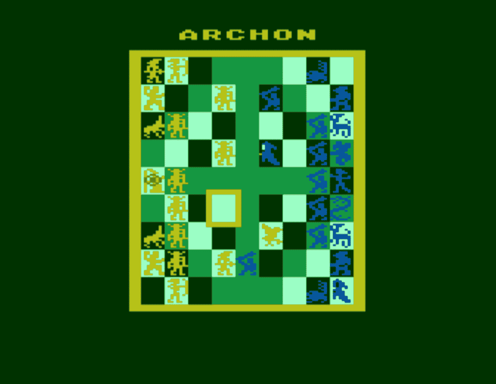

# 回顾雅达利游戏的黄金时代

> 原文：<https://web.archive.org/web/https://techcrunch.com/2017/04/03/a-look-back-on-the-golden-age-of-atari-gaming/>

这段摘录来自杰米伦迪诺的 *[突围:雅达利 8 位电脑如何定义一代人](https://web.archive.org/web/20230322201030/https://www.amazon.com/dp/0692851275/)* ，这本书以一种痴迷的眼光详细描述了雅达利 8 位电脑的兴衰。虽然只有在 Atari 800XL 上运行 BBS 的人才能真正喜欢这本书的后面部分，但每个人——从休闲游戏玩家到铁杆程序员——都可以欣赏 Lendino 在带回他年轻时一些最好的游戏和游戏平台时所付出的努力。在这一章中，他浏览了几个他最喜欢的雅达利游戏，并回忆起了在电脑游戏的黎明中转动操纵杆度过的漫长周末。

* * *

这是不争的事实:雅达利的 8 位电脑系列非常适合游戏。这个平台上有几千款游戏，其中至少有 300 到 400 款值得一玩。此外，大量的标题出现在其他机器或在街机第一。为了缩小范围，我将重点关注最大和最好的平台独占，Atari 8 位版本是第一个。我将注意到 Atari 8 位转换的一些有趣特征。有些游戏玩起来棒极了，是拥有雅达利电脑体验的一大部分，即使其他平台上有*端口。最后，我会列举几个没有达到预期的关键游戏，并解释原因。无论您手边是否有模拟器或真正的雅达利电脑，或者您只是想记住美好的时光，让我们通过最重要的游戏来美化雅达利 8 位平台。*

**剔除列表**

一些游戏在 Atari 8 位平台上的体验与在其他平台上并没有明显的不同。一个典型的例子是:交互式小说，由于其基于文本的特性，可以在所有的计算平台上运行。Infocom 可以说是最著名的文本冒险游戏开发商，甚至其早期的游戏都由复杂的语言解析器和复杂的情节和地图组成。Infocom 的员工开始在麻省理工学院的 DEC PDP-10 主机上编程游戏，但所有最好的游戏都在几年内转移到了雅达利，特别是在 1982 年到 1986 年之间。像 Zork 和 Enchanter 系列的游戏，以及银河系漫游指南，本质上都是你可以玩的小说，我一直在自己的 Atari 800 上玩。Infocom 游戏还因其包含的“感觉”或小饰品、地图和其他材料而闻名，这有助于为编写良好的基于文本的游戏注入活力，而无需基于计算机的视觉组件。如果你打算在模拟器上重新体验这些游戏，而不是用实际的 Atari 硬件和软件，那么去 Atarimania.com 这样的网站下载手册和艺术图片是值得的。(在某些情况下，这是必要的，因为这些材料也起到了事实上的复制保护的作用。)

Infocom text adventures 甚至不是第一个达到 Atari 8 位的公司。斯科特和亚历克西斯·亚当斯在 1978 年创立了鲜为人知的冒险国际，这是最早的游戏开发工作室之一。从著名的“第一次”文本冒险“巨大的洞穴”中得到启示，冒险国际发布了一系列针对各种计算机平台的冒险，包括 Atari 8 位。在雅达利上，每本书都有独特的字体，其中一些更著名的书名是《伯爵》和《鬼城》。在该公司最终于 1985 年倒闭之前，总共有十几部，外加一些图像冒险。虽然该公司的解析器不如 Infocom 的先进，但 Adventure International 比 Infocom 早几年上市。

雅达利自己早期的一些游戏表现平平；他们是非常基本的，篮球，刽子手和其他游戏的仓促版本，充斥着早期公司的目录和手册。雅达利的大多数商业、教育和家庭管理软件都不足以展示该平台的广泛功能，除了在 8 位雅达利早期的 Apple II 旁边大喊“我也是”。更糟糕的是，一些主流游戏根本没有进入 Atari 8 位平台。作为一个公认的角色扮演游戏迷，我为缺少魔法、力量和魔法以及吟游诗人的故事游戏而感到悲哀。Origin Systems 在 Atari 上停止了其著名的 Ultima CRPG 系列，推出了 Ultima IV:Avatar 任务。但 400 或 800 有如此多的游戏好处，这并不重要。(差不多。)

**构建 8 位生态系统**

虽然雅达利拒绝承认自己的开发者，但这个时代的一些游戏程序员还是获得了声誉。比尔·巴奇、比尔·威廉姆斯、菲利普·普莱斯和斯科特·亚当斯是最大的四个，而跨多个平台开发的程序员，如理查·盖瑞特和达尼·邦滕，也为雅达利用户所熟知。最终，游戏软件工作室的整个健康生态系统迎合了雅达利 8 位电脑用户的安装基础。中坚力量包括卢卡斯影业游戏公司、阿瓦隆希尔公司、帕克兄弟公司、Datasoft 公司、Datamost 公司、电子艺界、Epyx 公司、第一星软件公司、Synapse 软件公司、brder bund 公司和 subLogic 公司。

最大的早期趋势之一是流行的街机硬币机如小行星和蜈蚣的转换。在我的脑海中最突出的——作为一个孩子，最重要的是——就是家庭版能有多接近街机。这样你就可以免费在家玩，而不是乞求你的父母带你去游戏厅(然后在你的口袋里塞满硬币)。那个时代的游戏玩家可能还记得整版广告，在一个网格中描绘了六个或九个电视截图，展示了 Q*bert 或 Popeye 在各种游戏机以及 Atari 和 Commodore 电脑上的家庭转换效果。最大的罪过是在杂志广告中贴假截图。广告没有记录屏幕上的图形，而是显示了一个理想化的柏拉图式的版本，似乎没有限制屏幕分辨率(我正在看着你，Activision)。

街机转换在 400 和 800 上的表现明显不同于在 VCS 上的表现。《吃豆人》很扎实，《导弹指挥》也很出色，但其他的就没那么好了；特别是太空入侵者和小行星受到了一些批评，我会谈到的。后来，随着越来越多的第三方开发者开始使用该平台，我们开始看到独家游戏首先出现在 8 位 Atari 计算机阵容中。

少数游戏甚至支持多人游戏——不仅仅是早期街机游戏的“轮到你，然后轮到我”模式，而是真正的双人游戏。根据游戏的不同，它可以是分屏竞技模式(Spy vs. Spy 和 Ballblazer)，Atari 800 的四个操纵杆端口的四人模式(M.U.L.E .)，正邪模式(李小龙)，或真正的双人战斗(Archon)。如果你有创意，你可以用操纵杆玩星际突袭，然后指派你最好的朋友作为僚机来控制键盘。

**最早是哪个版本？**

发布时间也变得有点棘手。开发者可以先在 Atari 8 位上编写游戏程序——通常是因为那是他们已经拥有的电脑——然后移植到其他平台上。或者，通常情况下，开发者首先瞄准 Apple II，然后将其移植到 Atari——调色板和声音功能有限的游戏通常是这样创建的。作为雅达利电脑的拥有者，令人抓狂的事情之一是等待其他平台的流行游戏的移植，这变得越来越普遍，因为 Apple II，尤其是 Commodore 64 的销量继续超过雅达利系列。通常最受欢迎的游戏首先出现在这些平台上，然后出现在雅达利上。这成了一个先有鸡还是先有蛋的问题；随着其他平台开始占据主导地位，雅达利无法有效竞争，大型开发商开始将雅达利作为第二或第三考虑因素来规划他们的路线图。

即便如此，当 XL 系列在 1983 年如火如荼的时候，有更多的软件开发者在为 800 编写和移植游戏。一旦雅达利放松其限制性的第三方开发政策，它就为雅达利软件真正的黄金时代打开了大门。不过，这些游戏不仅仅是为最新的 8 位雅达利电脑的用户准备的。许多(升级的)400 和 800 所有者也可以利用这些产品，因为它们都不需要超过 48KB，尽管有些需要磁盘驱动器。

最后，给出的所有游戏日期都是它们到达 Atari 8 位计算机平台的时间，而不是它们首次在 arcades 或另一个计算机平台上发布的时间。例如，Taito 在 1978 年发布了 Space Invaders 作为单机街机游戏，但 Atari 400/800 盒式版本在 1980 年发布，所以它被标记为 1980 年发布。

**原子能机构(1982 年，布鲁塞尔)**

任何阅读大约 1982 年或 1983 年 Atari 杂志的人可能都会记得 A.E .的整版彩色广告。总部位于俄勒冈州尤金的 brder bund 软件早期以其优秀的游戏而闻名，据报道，该软件在海外寻找最好的程序员。“‘日本人在这方面是最擅长的。“这是他们对细节的关注，”[联合创始人]加里·卡尔斯顿说——以及他们对完美的奉献。卡尔斯顿不得不从(程序员)Jun Wada 和 Makoto Horai 的废纸篓里找出游戏 A.E .的代码。他们认为它不够好，卖不出去。它目前是 brder bund 销量最好的产品之一。”^(【1】)

这个 brder bund 游戏是 Galaxian 和 Galaga 的远亲。你的游戏是击退连续不断的外星人浪潮，这些浪潮以不断变化的队形旋转。你可以在基本的调色板中看到 Apple II 的根源，由于人工制作，它在 Atari 8 位上得到了渲染。即便如此，如果你来自 VCS 甚至一些早期的街机，游戏美丽的太空背景确实是超凡脱俗的。雅达利版本有更好的音频，在游戏过程中有复调音乐和更强劲的音效。

从软盘开始，需要一段时间才能开始播放；由于所有的图形数据，你必须加载整个第一张磁盘，然后在开始之前翻转它。奇怪的是，虽然 A.E .是一款 48KB 的基于磁盘的游戏，但雅达利显然考虑将其移植到 16KB 版本，并作为 5200 超级系统的卡带发布。它作为一个成熟的原型已经制作完成了，但是它晚了两年，在 1983 年视频游戏大崩盘之后才完成，而且从未发布。^(【2】)

**代理美国(学院派，1984)**

"在美国的某个地方，这种危险的炸弹正在四处流窜！"(我不知道 FuzzBomb 这个词是否有商标，但它看起来确实需要一个。)这就是《美国特工》的开头，一部披着科幻 B 级电影外衣的穿越美国的恐怖电影。模糊炸弹正在把人们变成模糊的漫游球(FuzzBodies)，它们乘火车旅行，污染整个国家。

你必须乘坐国家的火车系统从一个城市到另一个城市，根据疾病传播的方式收集关于炸弹位置的线索。一路上，你了解了美国的城市、州府、时区和国家的整体地理。但是《美国特工》感觉一点也不像一个教育游戏——这是一种恭维。较大的城市有更高速的火箭列车。你可以在售票点买到免费的火车票，在州府，你可以得到哪些城市有模糊人群的信息。不过，要拿到票，你必须输入城市的全名，这有助于你记住它的名字。

为了解除人们的恐惧，你使用水晶；你开始游戏时有 10 个，但通过减少几个并让它们相乘可以得到更多。当模糊体接触到水晶时，它们就被治愈了；普通人只会偷它们。杀死炸弹需要 100 块水晶。你必须找出它目前的位置，去那里，不要碰任何被弄糊涂的人，直到你找到它，否则他们会耗尽你的水晶供应。通常情况下，雅达利 8 位版本有一个时髦的音轨。人类，就像他们一样，是一顶黑色的小帽子，有着灵活的双腿。你有一顶白色的帽子。呃，开始吧。

**小巷猫(Synapse 软件，1983)**

这款独家雅达利 8 位游戏是我最喜欢的游戏之一，后来它被移植到 MS-DOS 上，采用了可怕的青色和品红色 CGA 兼容版本。约翰·哈里斯开始着手这项工作，但由于对他的单屏幕原型版本不满意，他把这个项目交给了比尔·威廉姆斯。^(【3】)Williams 首先为 Atari 800 开发了 Salmon Run(见下文)，然后是 Alley Cat 和死灵法师——该平台最好的原创游戏中的三款——然后是一些 Amiga 游戏，包括 Sinbad 和 Cinemaware 的猎鹰王座。

无论如何，作为猫弗雷迪，你必须通过五个不同的房间，每个房间都是一个独立的迷你游戏。一个房间的桌子上放着一个鱼缸；你必须跳进水里，游来游去，抓住鱼，但不要碰到任何电鳗。另一个房间里有一个鸟笼，你必须打掉桌子，这样你才能抓住里面的鸟。

在厨房里，你必须抓住出现在一大块瑞士奶酪中的老鼠。然后去客厅找一个爬起来很有趣的书柜，书柜上面有三棵蕨类植物，你必须在躲避一只大蜘蛛的时候撞倒它们。第五个房间包含睡觉的狗；你必须在不吵醒狗的情况下吃盘子里的食物。还有一个奖励回合，你必须在避开丘比特之箭的同时到达你的情人节猫咪约会，丘比特之箭会刺穿形成你行走平台的心脏，使你摔倒。

大量巧妙的接触比比皆是。例如，在厨房里，你跑来跑去，在地板上留下爪印，一个*幻想曲*风格的动画扫帚必须在你回来之前先清理干净。主屏幕上有一系列垃圾桶和晾衣绳，你必须跳上去到达其中一个房间(游戏随机选择)。

**交替现实:城市(Datasoft，1985)和地牢(1987)**

有史以来为 8 位开发的最好和最有特色的游戏之一是《交替现实:城市》。这是菲利普·普莱斯六部曲系列的第一部:城市、竞技场、宫殿、荒野、启示录和命运。可悲的是，只有前两个游戏被编写和发布——它们原本应该一起组成第一个游戏。Datasoft 强制提前发布，因此将该系列的第一款游戏分成了两半。^(【4】)

因此，另一个现实是:在传统意义上，这座城市勉强算是半个游戏，尽管一开始并不明显。游戏从你被绑架开始，被带上一艘宇宙飞船，从现在的地球带到(你猜对了)另一个现实世界。从那里，你创造一个角色，开始探索这个城市，找工作赚钱，打败怪物，睡在客栈，和水平。在相当长的几个小时甚至几天里，它会让人上瘾，充满乐趣——而且环境肯定是身临其境的。但随着它最终变得清晰，一旦你探索了整个城市的地图，就没有真正的目标，甚至没有情节。这个城市本来是作为一个漫游区来连接其他章节的，而其他章节中只有一个进入了市场(下面我会讲到)。

尽管如此，另一个现实是:这座城市的氛围和现实主义令人难以置信。它具有当时复杂的 3D 纹理映射图形、声音和音乐，所有这些都充分利用了 Atari 8 位平台所提供的优势。没有其他版本，甚至在 16 位机器上也没有，Commodore 64 端口简直是可悲。该游戏还会记录你的角色的健康状况，包括饥饿、疲惫以及你是喝醉了还是中毒了。直到今天，我仍然记得主要的歌曲，包括歌词。我不时地播放它，只是为了听和看它运行。同样令人愉快的是 16 位 Atari ST 版本，它可以让你加入公会，并提供一点点成就感。作曲家 Gary Gilbertson 重新创作了他的歌曲的三声部版本，以便充分利用 Atari ST 功能较弱的声音芯片。

与此同时，地牢是一个三维视角的经典地牢爬行。在地下城内，你可以购买武器和其他供应品，你会在旅行中遇到喷泉、巫师、秘密之门和大量的怪物。在探险的时候，你需要吃食物和喝水来维持生命。你需要一个指南针来导航，你会发现钥匙，宝石和珠宝作为你任务的一部分。

地牢中的四层被认为是城市下面的下水道。菲利普·普莱斯最终在地下城开发中期离开了游戏行业；另外两个程序员为 Datasoft 完成了这个游戏。虽然《城市》在 1985 年是一个真正的突破和技术成就，但《地下城》上市时看起来已经有点过时了。《Dragon》杂志的一篇评论批评了这两款游戏过多的磁盘交换，尤其是在试图保存游戏然后继续玩的时候。你需要一个单独的空白磁盘来保存你的角色数据，并且它必须是一个不同于你在城市中的角色的磁盘。(同样是 1988 年的*龙*评论也批评 Mac 版不让你拷贝到硬盘，但雅达利 8 位用户没想到这种奢侈。)同年，FTL 游戏公司在 Atari ST 上发布了实时地下城主，拥有更大的视野和四个角色的队伍来控制，地下城探索从此不再相同。

**执政官:光明与黑暗(电子艺界，1983)**

执政官是一个暴力象棋游戏——我的意思是作为一种赞美。每一方都有一个首领:光明面的巫师和黑暗面的女巫。这个游戏在一个九乘九的正方形格子上进行，格子颜色交替。除此之外，它看起来像一个棋盘，尽管在顶部、底部、左侧、右侧和中心有所谓的电源点。就像在国际象棋中一样，每颗棋子都有不同的能力。你的目标是要么夺取棋盘上的五个灵能点，要么在实时战斗中击败对手的所有棋子。

这两条通往胜利的道路都比听起来要复杂。每当两个棋子占据相同的空间时，一方会与另一方决一死战。正方形的颜色影响每边的能量。因此，如果一个光明的棋子在一个黑暗的方格中与一个黑暗的对手战斗，光明的一方的生命值会比平常少，而黑暗的一方会多。总数也根据作品的种类而变化；有些人天生就更有耐力。这使得很难击败一方的自然颜色方块(白色或黑色)。

另一个复杂的问题是时间。时间在游戏中不断前进，日夜交替。这会影响棋盘上大约一半的方格，包括十字图案中的所有中间方格。五个灵能点中的三个位于这些变化的方块上。当你移动足够多的棋子来占领大部分的方格时，颜色将会对你不利——这是你的对手攻击和击败你的绝佳机会。

执政官:光明与黑暗今天继续玩得很好。最初由自由落体协会为 Atari 8 位开发，它成为电子艺界出版的第一批游戏之一。它提供了战略、速度和完美的平衡。没有人会误解开头的音乐片段，它不断上升的前奏和夸张的主题。几个后来版本的执政官试图更新原来的游戏，特别是 1994 年的执政官超(结果喜忧参半)和 2010 年的执政官经典(更成功)的 PC 版。也有过昙花一现的 iOS 版本。

**执政官二:娴熟(电子艺术，1984)**

执政官 2:Adept 改变了主板布局和机制。这一次，游戏不再是象棋式的设计，而是围绕着气、土、火、水四种元素进行带状排列。你在两边各操控四个法师(擅长者)中的一个，秩序或混乱。这五个灵能点对游戏来说仍然至关重要，甚至可能更重要，因为现在更强调法术施放——你不再局限于每种法术中的一个。你在游戏中花费了大量时间召唤各种元素和恶魔与对方战斗，包括海怪、神像、幽灵和蛇发女怪。有五种方式可以获胜，而不是两种，包括在虚空中进行最后一场战斗来触发天启。

称《执政官 2:比前作更娴熟》可能有些牵强——更强硬是一个更准确的词。但绝对值得一玩，甚至有人更喜欢原版。奇怪的是，Commodore 64 失去了相对于 400/800 版本的图形优势；这一次，两者看起来非常相似。我一直觉得这个游戏非常难玩，不过从好的方面来说。今天，在一个“续集”通常意味着“更多相同”的世界里，回顾这部续集是多么的创新是一件有趣的事情。《执政官 2:Adept》吸取了第一部游戏的一些最佳元素，并将故事情节带到了一个更宏大、几乎史诗般的规模——即使它没有第一部那么严密。

**小行星(雅达利，1981)**

在 20 世纪 80 年代初，如果没有小行星的某个版本，你就不可能有一个家用计算机平台，雅达利一开始就需要竭尽全力来建立雅达利 8 位的墨盒库。然而，即使是这种脑残-明显的选择作为一个现有的 1979 年雅达利硬币操作的*的端口，也花了一年多的时间才到达 400 和 800。不幸的是，管理层确信 800 首先应该是家用电脑，其次才是游戏系统；《星际突袭者》的巨大成功，让雅达利重新考虑它的电脑阵容计划，并把像小行星这样的转换重新提上日程。*

对于三个还没有玩过这款经典街机游戏的人来说，你控制着一艘小行星上的小飞船。你必须清除每一个屏幕上的小行星，不要撞上任何一个，并摧毁定期出现攻击你的大小不明飞行物。你可以作为防止碰撞的最后手段跳入超空间，但不能保证你不会再次出现在不同小行星的路径上，无论如何都会死去。当游戏发布时，你的飞船推进器和子弹的物理感觉就像你今天将要玩的任何东西一样真实。

虽然这个 8 位 Atari 转换的还过得去，但并不精彩。与任何小行星克隆一样，它的主要问题是复制街机版本的无污点、清晰的矢量图形。在这方面，8 位 Atari 比低分辨率的 VCS 做得好一点，当你拍摄它们时，会将小行星打碎成多个更小的碎片。但是它的淡蓝色小行星很怪异；无论是谁决定在 VCS 版本中使用不同的颜色来弥补较低的分辨率，都是有道理的。不过，雅达利 8 位游戏机在整体游戏平衡性上有所欠缺。出于某种奇怪的原因，你不能直接向左或向右开火；无论你做什么，子弹总是会稍微偏向上方或下方。

同样值得注意的是一个有趣的游戏变化:由于 400 和 800 的四个操纵杆端口，多达四个人可以同时玩，互相对抗或对抗小行星。

**阿斯特罗·蔡斯(第一个明星软件，1982)**

Astro Chase 拥有流畅的滚动和吸引人的发射序列屏幕，是首批展示 8 位 Atari 能力的第三方游戏之一。这是多产的(并且仍然在经营！)第一个 Star 软件工作室，由 Atari 的 Star Awards 的第一个获奖者为 Atari 程序交换开发。帕克兄弟公司以当时惊人的 25 万美元预付款获得了游戏的版权。这款游戏还获得了来自*电子游戏*、*创意计算*和*电脑游戏*杂志的奖项。

这个游戏让你负责保卫地球(当然)免受外星人攻击(当然)。你可以在 2D 空间景观的八个方向移动和射击。更重要的是，你可以独立于运动方向射击。这通常需要两个独立的操纵杆，就像在《太空堡垒:2084》或《太空地牢》这样的游戏中一样，但 Astro Chase 让它发挥了作用。共有 34 级；你的目标是摧毁所有 16 个巨型地雷，同时打击八种不同类型的敌人飞船。操场有许多屏幕宽。四个能量发生器标志着空间最远的角落，以及顶部、侧面和底部的护盾仓库。

像雅达利的许多游戏一样,《阿童木追逐》有磁带和磁盘版本；两个版本都需要 32KB 才能播放。这将 Atari 400 用户拒之门外，至少在内存升级可用之前是如此。今天，这个游戏看起来过时了。对于 Atari 8 位游戏来说，声音很弱，虽然在一个宽阔的操场上向八个方向移动你的船显然是一个新颖的壮举，但控制感觉僵硬。前面提到的发射序列现在看起来也有点蹩脚。对于类似的游戏，如果你今天玩，我会推荐 Sinistar 或 Zone Ranger，但 Astro Chase 肯定在 Atari 8 位知识中赢得了一席之地。

**变异骆驼的攻击(Llamasoft，1983)**

这款水平滚动的射击游戏本质上是《星球大战:帝国反击战》的克隆版，除了巨型骆驼。谈谈一个奇怪的血统:这是杰夫·明特的作品，他是著名的游戏开发者，在 20 世纪 90 年代初为雅达利的美洲虎游戏机设计了 Tempest 2000 和 Defender 2000，后来又为 Xbox 360 设计了一个名为 Space Giraffe 的 Tempest 克隆版。

有一个实际的情节，但它太复杂了，而且与实际的游戏无关，不值得费心。事情是这样的:在每一波中，几只巨大的骆驼缓慢地向右朝着你的大本营行进。你的飞船可以摧毁骆驼，但要杀死每只骆驼需要大约一百次射击。如果骆驼到达你的大本营，游戏就结束了。物理学的工作方式和《帝国反击战》中的一样。很难保持你的飞船在一个地方，所以你会发现自己不断超越骆驼目标，并折回，直到你变得更好。骆驼也会向你射出彩色的子弹。就像我说的:星球大战:帝国用巨大的骆驼反击。

目前还不清楚 Minter 是先为 800 还是 C64 开发游戏。不管怎样，800 版本更优越，因为它有更详细的分级背景；色彩快速变化的迷幻运动操场线；和详细的，遥远的山脉。2012 年，史密森尼博物馆在其(现已结束的)“电子游戏艺术”展览中展出了这款游戏。这是一个艰难的游戏，今天绝对值得一看，尽管它最终重复播放，这是另一个例子，只是在雅达利 8 位计算机上看起来和玩得更好。