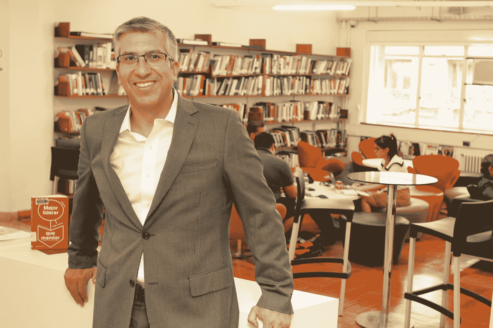
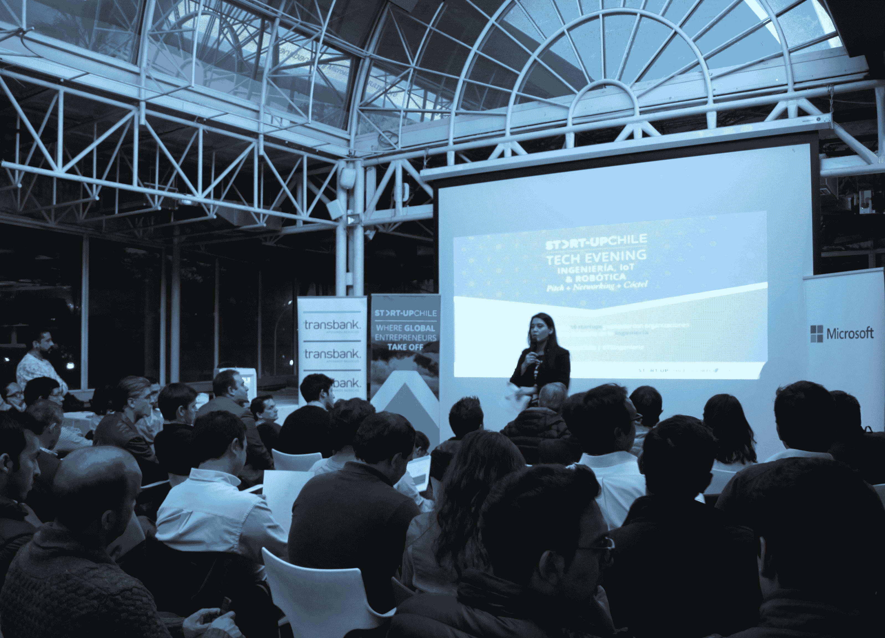

# 了解智利的创新创业公司 government 

> 原文：<https://web.archive.org/web/https://techcrunch.com/2016/10/16/a-look-into-chiles-innovative-startup-government/>

More posts by this contributor

维多利亚·奥希撰稿人

维多利亚·奥希是来自阿根廷的企业家，是

[Publicize](https://web.archive.org/web/20230129235900/http://publicize.co/)

。她之前是拉丁美洲一家孵化器的投资组合经理。

不管是好是坏，智利经常被奉为拉丁美洲的经济典范。

在 20 世纪 70-80 年代失去的十年里，该地区正跌跌撞撞地陷入债务和毁灭的漩涡。在随后几十年不均衡的复苏中——在智利被誉为“奇迹”——许多国家发现自己把欧洲大陆第一个也是唯一一个[经合组织](https://web.archive.org/web/20230129235900/http://www.oecd.org/)成员国作为榜样。

如今，智利再次引起了人们的关注，这一次是因为一项与其稳定财政管理的声誉似乎不一致的举措。六年前，智利开始将自己转变为拉丁美洲的创新和创业中心。这是一个大胆的设想，需要政府做出相应的大胆承诺。幸运的是，这正是它所收到的。

自 2010 年以来，智利已向来自近 80 个国家的 1 300 家新兴企业发放了 4 000 多万美元。截至去年夏天，这些公司已经在智利创造了大约 1600 个工作岗位，并从外部筹集了 1 亿美元。根据布鲁金斯研究所的数据，大约 20 万智利人已经从政府支持的创业项目中获得了这样或那样的好处。

批评人士说，投资回报不值得。他们说，这些公司中的大多数没有政府的援助就失败了，或者在利用完智利慷慨、低成本和相对较轻的税收负担后，就离开去其他地方开店了。但其净影响是不容置疑的:在曾经一无所有的地方，现在存在着一种强大且不断发展的创业文化。

对这个国家来说,“智利谷”( Chilecon Valley)的兴起再好不过了。智利比预期更好地经受住了全球金融危机和大宗商品价格下跌。它始终保持着令人羡慕的净债权国地位。但是经济放缓已经有一段时间了，而且，在多年的反周期停滞之后，失业率最终可能会上升。

这意味着智利吸收新创新的需求正接近一个生死存亡的十字路口。这加大了世界各国一直试图复制的创业实验的风险。

## 起源故事

与其他新兴科技中心相比，智利的创业故事更是一部政府政策协同的故事。

在智利，这项政策首先是由智利生产发展公司制定的，该公司的任务是促进该国的经济增长。CORFO 成立于 1939 年，在预测和鼓励智利下一阶段发展方面有着数十年的历史。

以前，这意味着从电信到银行服务的一切。最近，促进智利一些偏远地区的小企业扩张成为优先事项。在过去的十年里，重点一直放在创新上，尤其是创业创新。

这有助于 [CORFO](https://web.archive.org/web/20230129235900/http://www.corfo.cl/inicio) 在与一般创业公司相似的约束下运营。2014 年，智利[将其国内生产总值的 0.37%用于研发——比任何其他经合组织成员国都少。CORFO 今天的创新年度预算只有 4500 万美元。与 CORFO 合作过的私营部门人士表示，有限的资源使它变得足智多谋。](https://web.archive.org/web/20230129235900/http://www.oecd.org/about/membersandpartners/list-oecd-member-countries.htm)

> 初创企业智利在解决严重的结构性问题时表现出的灵活性令人鼓舞。

至少，融资渠道受限迫使 CORFO 努力思考如何最好地对更广泛的创业经济产生倍增效应。2010 年，经过多年的磋商和规划，初创企业智利的成立达到了高潮。该加速器的双重任务是提升智利的国际形象和建立当地的创业文化。

该项目在两个方面都立即受益于 Groupon 对 ClanDescuento 的 3000 万美元收购，收购发生在 CORFO 开始推出初创企业 Chile 的前一个月。该国的第一个主要退出，它使智利在国际上闻名，并验证了政府对创新的信念。更重要的是，它给了本土企业家一些渴望的东西。

初创企业智利的首次亮相恰逢其时，还有其他原因。欧洲当时正处于衰退之中，复苏缓慢，而美国正陷入移民问题的泥潭，至今仍未走出。这种结合使得智利张开双臂的方式对世界各地的公司更具吸引力。

科尔福公司的创业主管因蒂·努内斯

来自 14 个国家的 20 家公司接受了初创公司智利的提议，开始了他们的第一个“试点项目”到 2012 年，来自 37 个国家的 500 家公司已经从它的一个加速器轨道毕业。《经济学人》承认该计划存在一些明显的缺点，但也写道，根据它为自己设定的目标，该计划“无疑是成功的”

第二年，这一评估更加可信。首先，拉丁美洲最活跃的早期风险投资基金 [NXTP 实验室](https://web.archive.org/web/20230129235900/http://www.nxtplabs.com/)在圣地亚哥开设了分支机构，并开始在智利市场投资。然后，另一个拉丁美洲基金 [Nazca Ventures](https://web.archive.org/web/20230129235900/http://www.nazca.vc/) 筹集了 1500 万美元，主要投资于智利公司。

同年春天，PayPal 以智利 1000 万互联网用户和日益增长的在线消费习惯为由收购了 Multicaja，收购金额未披露。去年 12 月，微软宣布将与 CORFO 合作，在智利为初创 ICT 公司开设一个创新中心。作为最初的基准，微软表示，该中心将在未来六年内为 2000 家公司和 6000 名企业家提供服务。

该中心之所以成为可能，是因为一年前通过了一项法律，允许 CORFO 直接投资第三方孵化器和加速器。这不仅是明智政策的结果，也是适应性的结果。

最终，正是这种基于表现和不断变化的条件做出改变的意愿，使得智利的实验充满希望。例如，CORFO 和 Start-Up Chile 认识到，只有 32%经过 Start-Up Chile 的公司最终会长期留在这个国家。2015 年，一个新的投资工具被创建，以解决明显的人才流失问题。

初创企业智利在解决严重的结构性问题方面表现出的灵活性令人鼓舞，但智利也做了大量工作来缓解投资者在处理政府主导的计划时的另一个隐忧:政治操纵的可能性。然而，历届政府都发生了变化，初创企业智利的基本使命保持不变，其年度资金从 700 万美元递增至 900 万美元。

## 圣地亚哥

今天，在这个横跨南美洲一半以上长度的国家，大约三分之一的人生活在大约 400 年前西班牙人选择作为他们殖民首都的同一个中央山谷。

无论从哪方面来看，圣地亚哥都很大，但真正令人印象深刻的是它相对于智利其他地区的面积，以及它集中了这个国家的权力和财富的程度。这是做决定的地方；这是做生意的地方。建筑更大了，街道更宽了，基础设施更新了，维护得更好了。当谈到智利的创业生态系统时，这种差异尤其明显。据大多数估计，大约 90%的创业活动发生在圣地亚哥。

鉴于政府是大部分活动的中心，有必要更详细地解释一下智利的公共规划是如何运作的。正如 CORFO 的创业主管因蒂·努内斯解释的那样，CORFO 开创了一个被称为“创业之旅”的过程，该过程将一个国家的创业生态系统分为不同的部分。

> 圣地亚哥比这个国家的其他地方更昂贵、更混乱、污染更严重，但是……在这个地区起步的成功公司最终都迁移到了那里。

在创业之旅中，CORFO 资助了 50 多个不同的分销点，无论是孵化器还是联合工作空间，它还在全国各地雇佣了 1000 多名导师，旨在最大限度地提高企业家的成功机会。CORFO 通过一个认证加速过程每一步的系统，密切监控分销点的表现。例如，如果一个加速器正在寻求政府的资助，它需要获得一个证明，以表明它确实在产生结果。

智利创业之旅中最受认可的玩家是[初创智利](https://web.archive.org/web/20230129235900/http://startupchile.org/)。该加速器现已发展到第 16 代，每年为圣地亚哥带来 250-300 家公司，而这一数字随着每一轮申请的增加而大幅增长。企业沿着一条轨迹被评估，并被邀请申请三个不同的加速等级之一。

初创企业智利执行董事 Rocio Fonseca 在一次活动中发言

**“S 工厂”为仍在构思阶段的女性创业者提供 1.4 万美元的资助和为期 12 周的实习指导。准备接受“种子”指导的公司将在六个月内获得 3 万美元。一旦企业通过了“种子”或其他一些早期阶段的 CORFO 培训，大约 9 万美元的“规模”计划将帮助他们获得资金，并在智利或其他市场获得牵引力。**

 **像 Seedstars World 和 MeetLatAm 这样的大型国际会议分别从 2012 年和 2013 年开始举办。风险投资会议数字银行 Latam 将于今年晚些时候召开。NXTP 的黑客马拉松是许多常规的本地制作之一。在 Josefa Villarroel 主持的圣地亚哥之夜，企业家们聚在一起分享欢笑，对商业失败表示同情。创始人研究所的圣地亚哥分部向初创公司开放了指导和反馈会议。

联合工作空间，包括[启动联合工作](https://web.archive.org/web/20230129235900/https://www.launchcoworking.cl/)、 [Lofwork](https://web.archive.org/web/20230129235900/http://www.lofwork.cl/) 和 [Latam Ideas Cowork](https://web.archive.org/web/20230129235900/https://ideascowork.com/) ，容纳了城市中的一些创业活动。

所有这些活动的不利方面是，其巨大的地理集中已经成为自我延续。圣地亚哥比这个国家的其他地方更昂贵，更混乱，污染也更严重，但是，几乎无一例外的是，在这个地区起步的成功公司最终都迁移到了那里，如果不是为了市场准入，而是为了获得资本。

像[智利全球天使](https://web.archive.org/web/20230129235900/https://www.crunchbase.com/organization/chileglobal-angels)、[澳大利亚资本](https://web.archive.org/web/20230129235900/https://www.crunchbase.com/organization/austral-capital)和 [Magma Partners](https://web.archive.org/web/20230129235900/http://magmapartners.com/about/) 这样的公司基本上都呆在他们的总部所在地首都。他们在附近的人脉关系自然更强，即使他们在该地区找到了有希望的前景，搬迁也经常成为投资条款的一个因素。

圣地亚哥创业生态系统的领导者包括初创企业智利的罗西奥·丰塞卡、智利全球天使投资公司的胡安·卡洛斯·穆尼奥斯-布德格、Magma Partners 的迭戈·菲利皮、纳斯卡风险投资公司的艾伦·法卡斯、NXTP 实验室的大卫·阿尔沃·弗杜戈、 [InverSur Capital](https://web.archive.org/web/20230129235900/https://www.crunchbase.com/organization/inversur-capital) 的马塞洛·迪亚斯·鲍文、 [CAAAPITAL](https://web.archive.org/web/20230129235900/https://www.crunchbase.com/organization/caaapital#/entity) 的格特·芬德尔、 [DADNEO](https://web.archive.org/web/20230129235900/https://www.crunchbase.com/organization/dadneos#/entity) 的艾伦·贾里和[微软的奥利弗·弗洛格尔](https://web.archive.org/web/20230129235900/http://news.microsoft.com/es-xl/microsoft-y-gobierno-de-chile-suscriben-acuerdo-en-materia-de-ciberseguridad/oliver-flogel-gerente-general-de-microsoft-chile-junto-al-subsecretario-del-interior-mahmud-aleuy/#sm.000015rv5x1ma9d3bz2oyoby1rgnh)。

## 瓦尔帕莱索

如果任何一个城市有机会自立门户，你会认为瓦尔帕莱索会是它。距离圣地亚哥只有一个半小时的车程，它是游客和艺术家最喜欢的目的地，它的高档姐妹城市比尼亚德尔马也只有几分钟的路程。该地区至少有八所大学，正是这些人才帮助瓦尔帕莱索获得了发展势头。

托马斯·根蒂纳(Tomas Gentina)在 28 岁的成熟年龄自称为“老家伙”，他的成长方式与智利政坛的大多数其他领导人大致相同:前往西班牙参加会议，申请美国的项目，尽可能从博客和国际科技名人那里汲取知识。“六七年前，这里甚至没有人知道什么是创业，”更不用说如何成长了，他说。“我们的学校没有为我们准备我们需要的知识。这里没有人可以学习。”

> 瓦尔帕莱索有一些相对优势，但也有许多令人生畏的挑战。

现在，Gentina 是 Patricia Universidad Catolica de Valparaiso 下属的国家支持的孵化器[chrysis](https://web.archive.org/web/20230129235900/http://www.chrysalis.cl/)的营销总监。他说，下一代的前景已经发生了很大的变化。

仅 Gentina 在过去三年就投资了 35 家公司。他说，Chrysalis 目前的投资组合包括 70 家初创公司，其中大部分是基于软件的。今年 4 月，该大学向全球中心(Hub Global)敞开了大门，这是一个 1200 平方米的共同工作空间，旨在促进开放式创新以及与智利和整个地区的大公司建立高科技产业伙伴关系。这是一个雄心勃勃的项目的一部分，旨在推动瓦尔帕莱索进入大数据、增强现实和生物技术等前沿领域。

这不是典型的硅谷模式，但是，话又说回来，典型的硅谷模式除了在北加州以外，在任何地方都行不通。Fernando Fischmann 是水晶泻湖的创始人，这是一家设计和建筑公司，使用获得专利的环保技术来建造人工泻湖，他在瓦尔帕莱索南部购买了一处僻静的海边房产，在那里完善了自己的想法。随着数百亿美元的房地产开发项目在世界各地完成，他最终创建的公司是智利迄今为止唯一的独角兽。

瓦尔帕莱索在这方面有一些相对优势，但也有许多令人生畏的挑战。比如，这种文化还不存在——Gentino 说，这就是为什么 Chrysalis 重新关注“真正融入我们自己的大学，和我们自己的学生。”初创企业智利已开始向愿意在圣地亚哥以外开店的公司额外提供 1 万美元资金，但 Gentino 在让自己的公司留下来方面遇到了足够多的麻烦。

瓦尔帕莱索领先的初创公司包括由帕洛玛·法瑞斯和约翰尼斯·韦格创立的物联网初创公司 [Gnome](https://web.archive.org/web/20230129235900/http://gnome.ag/) 、由克莱门斯·哈泽和莫里茨·哈维卡创立的 [pik'd](https://web.archive.org/web/20230129235900/http://pikd.co/) 以及由胡安·雷耶斯和马里奥·米兰达创立的虚拟现实初创公司 [YOY Simulators](https://web.archive.org/web/20230129235900/http://yoy.cl/) 。

该市的中心包括由沃尔特·罗森塔尔、伊格纳西奥·奎瓦斯、黛博拉·阿胡马达、哈维尔·戈茨里奇和托马斯·根廷领导的蚕蛹企业孵化器，由沃纳·克里斯詹斯波勒、安德烈斯·卡斯蒂洛领导的 3ie，由毛里西奥·希福恩特斯领导的 IF Valparaíso，以及由海梅·冈萨雷斯领导的 Housenovo。

在 Hub Global Pucv 工作的创业公司，蝶蛹在瓦尔帕莱索的总部

## 康塞普西翁和其他城市

在瓦尔帕莱索生长的这种生态系统可能会在 400 英里以南的地方扎根。康塞普西翁在一个不到 10 万人的城市地区有几十所学院和教育机构，理所当然地享有智利大学之都的美誉。

它也是智利工业最重要的纽带。当地领导人认为，年轻人才和企业创新需求的结合，是正在形成的强大创业经济的支柱。

其他人也抓住了这一潜力。2012 年，组织者说他们选择康塞普西翁作为国际会议“创业周末”的第二个举办地，因为这个城市代表了“学生和工业之间的一个重要交汇点。” 三年后 ，黑客之路将国内和国际的观察员和企业带到当地的一所大学，评估企业家在 24 小时世界末日黑客马拉松中的表现。

像[恒温箱](https://web.archive.org/web/20230129235900/http://www.incubatec.cl/)(隶属于弗龙特拉大学)和[砧巴·UdeC](https://web.archive.org/web/20230129235900/http://incubaudec.cl/)(隶属于康塞普西翁大学)这样的恒温箱专门解决问题，满足周围地区的工程和农业需求。[工作场所](https://web.archive.org/web/20230129235900/http://workinghouse.cl/site/)是城市生态系统的另一个中心。

> 有一点你会注意到，和智利生态系统中的人们交谈时，他们是多么的现实。

就目前而言，围绕当地需求进行创新似乎是脱离圣地亚哥核心区的地区最可行的前进之路。[淡水](https://web.archive.org/web/20230129235900/https://www.indiegogo.com/projects/freshwater-drinkable-water-for-everyone#/)是一名刚从智利创业的毕业生，他发明了从大气中提取饮用水的技术，目前已经在阿塔卡马沙漠北部的小城 Cachiyuyo 与 40 个家庭合作。再往北，在伊基克，圣托马斯大学与当地矿业协会合作开办了一所神学院，旨在“加强”地区采掘业的技术能力。

NXTP 的 David Alvo 说:“以前，智利的每个人都试图像美国一样做生意，没有任何事情会像美国那样成功。”。“现在，有了更多的经验，更多的视角。一代企业家学会了如何让事情在这里运作，现在这些经验正在与整个生态系统分享。”

## 走向

有一点你会注意到，和智利生态系统中的人们交谈时，他们是多么的现实。他们认识到，智利最大的成功故事，水晶泻湖，和最大的出口，ClanDescuento，都是在初创公司智利成立和运营之前创建的。他们意识到，尽管从那时起还有其他的例子——

[Chileautos](https://web.archive.org/web/20230129235900/https://www.crunchbase.com/organization/chileautos#/entity)

在线汽车市场今年以 2000 万美元的价格被收购——对于大多数企业家来说，很难复制任何接近这个水平的成就。

事实上，让现场的任何一个人说话，他们都会很高兴地找出弱点。智能手机和互联网的渗透率很高，但软件和技术没有真正的消费市场可言。B2B 交易所吸引了更多的兴趣，但实际交易仅限于少数几个行业，金融机构是其中之一。

越来越多的公司开始起步，但由于资本有限，无法帮助他们扩大后加速器规模，更多的公司也失败了。风险投资人阿尔沃(Alvo)说，“当他们以免费资金开始时，企业家并不总是做那些对生存至关重要的事情。即使是像 Gentino 这样乐观的内部人士也不认为智利的情况接近自我维持。“如果 CORFO 突然退出画面，一切都会立刻崩溃，”他说。

有鉴于此，有两个重要的乐观理由。首先是时间。“把它想象成一个创业公司，”阿尔沃说。“把你的产品弄下来需要多长时间？那你的商业模式呢？然后才能真正创收？然后开始计划首次公开募股或收购？如果这里的创业场景是一项业务，我们将刚刚到达你想要开始看到结果的阶段。”

另一个原因是时机。毕竟，依靠铜、葡萄酒、鳄梨和鱼来维持一个注定会发生剧变的世纪的运转，并非没有风险。“作为一个民族，我们必须做出决定，”根蒂纳说。“我们是不是要保持现状，希望事情会有结果？还是我们想保护自己免受繁荣和萧条模式的影响，为气候变化和所有其他即将到来的重大变化做好准备？”

智利的初创企业已经准备好在经济中扮演更重要的角色。作为一个国家，智利应该为此做好准备。**