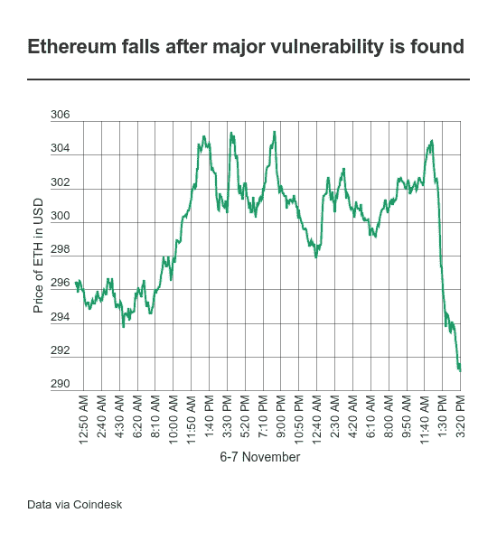

# 一个重大漏洞冻结了以太坊数亿美元的资金

> 原文：<https://web.archive.org/web/https://techcrunch.com/2017/11/07/a-major-vulnerability-has-frozen-hundreds-of-millions-of-dollars-of-ethereum/>

# 一个重大漏洞冻结了数亿美元的以太坊

今天对以太坊来说不是个好消息。一个流行钱包中发现的漏洞可能冻结了数亿美元的加密货币，这是近几个月来的第二次挫折。

广泛使用的钱包服务 Parity 背后的公司 Parity Technologies 今天[披露了一个问题](https://web.archive.org/web/20230401223517/https://paritytech.io/blog/security-alert.html)，该问题可能会导致钱包中的内容被擦除。

这个问题影响了多签名钱包——一种利用多方同意来增加交易安全性的技术——在 7 月 20 日之后部署。换句话说，此后持有的 ico 可能会受到影响。

这是一个意外，因为这是短短几个月内第二次发现重大的平价漏洞，可能会对以太坊造成代价高昂的影响，以太坊是世界上第二高价值的加密货币，总市值超过 270 亿美元。早在 7 月，[的一个奇偶校验漏洞导致 15 万 ETH](https://web.archive.org/web/20230401223517/https://www.coindesk.com/30-million-ether-reported-stolen-parity-wallet-breach/) (当时价值约 3000 万美元)被盗。

这个错误在 7 月 19 日得到了修复——因此 7 月 20 日的日期具有重要意义——但第一次恐慌的一个积极因素是以太坊社区的许多人，特别是那些持有 ico 的人，放弃了这项技术，转而支持替代技术。即使那些使用平价的人可能也不会选择多签名钱包。

但这仍然是一个具有广泛影响的重大安全问题。奇偶校验解释说，当一个用户的钱包被擦除时，它发现了问题:

> 在修复了 7 月 19 日被利用的原始多签名问题(函数可见性)后，新版本的奇偶钱包库合同于 7 月 20 日部署。然而，该代码仍然包含另一个问题——通过调用 initWallet 函数，可以将奇偶校验钱包库契约转换为常规的多签名钱包，并成为其所有者。这个问题似乎是意外触发的 2017 年 11 月 6 日 02:33:47 PM +UTC，随后一个用户自杀了将库变成钱包，清除了库代码，这反过来导致所有多签名合同不可用，因为它们的逻辑(任何状态修改函数)都在库中。

问题似乎集中在平价钱包作为智能合约运作这一事实上。

目前还没有硬币丢失或被盗的报道，但很明显相当数量的以太坊处于危险之中。

UCL 加密货币研究员 Patrick McCorry 的早期估计表明[至少有 60 万 ETH(价值约 1 . 5 亿美元)](https://web.archive.org/web/20230401223517/https://twitter.com/paddyucl/status/927889557189726208)被冻结。麦考利告诉 TechCrunch，随着更多关于平价使用和钱包数量的信息曝光，总数可能会更高。

受影响的一家知名公司是 Polkadot，[，这是一个连接区块链公私合营的项目，通过象征性销售筹集了超过 1.4 亿美元](https://web.archive.org/web/20230401223517/https://techcrunch.com/2017/10/17/polkadot-passes-the-140m-mark-for-its-fund-raise-to-link-private-and-public-blockchains/)，由 Parity 联合创始人 Gavin Wood 创办。Polkadot 证实其钱包已被冻结，TechCrunch 了解到其 60%的 ICO 增长可能会受到影响。

平价继续研究这个问题。该公司在推特上表示，它认为钱包是锁着的。它补充说，对 ETH 受影响程度的预测是“推测性的”。

该漏洞的消息传出后，以太坊的价格下跌，从 305 美元跌至 291 美元，达到两周以来的最低点。接下来会发生什么可能取决于漏洞的严重程度，以及 ETH 受影响的总比例。

