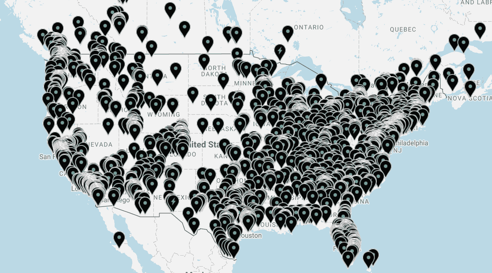
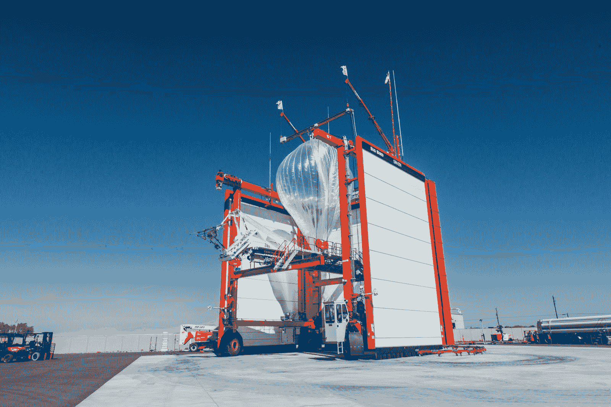

# 网状网络在美国自发形成，帮助连接波多黎各 

> 原文：<https://web.archive.org/web/https://techcrunch.com/2017/11/14/a-mesh-network-spontaneously-erupts-in-the-us-and-helps-connect-puerto-rico/>

今年早些时候，当 goTenna [将](https://web.archive.org/web/20221208211506/https://beta.techcrunch.com/2016/09/28/gotenna-mesh-keeps-people-connected-even-when-theyre-miles-apart-and-off-grid/) 推出他们的网络设备时，我认为这种脱离电网的通信设备将非常适合应急装备或野外徒步旅行。但事实证明，我和 [goTenna](https://web.archive.org/web/20221208211506/https://gotenna.com/) 都低估了人们对弹性的、用户供电的网状网络的渴望:数以千计的专用节点现在遍布全国各地的城市，志愿者们正在使用它们让波多黎各在一个毁灭性的飓风季节后恢复在线。

[Mesh](https://web.archive.org/web/20221208211506/https://gotenna.com/pages/mesh) 的工作方式很像最初的 goTenna，它使用蓝牙与你的手机配对，然后使用对讲机无线电频率向与他人手机配对的另一个设备发送文本通信(不需要手机网络)——可能在一两英里以外。

网状网络增加的是转发这些信息的能力:一个设备链或一组设备将听到信息(当然，它是加密的),并把它传递下去，直到它到达目的地。你甚至可以将你的网状网络设置成一个固定的中继站，它与其他设备协同工作，即使在停电或电信中断的情况下，也可以让整个社区甚至整个城市进行通信。

 我一直觉得网状网络很吸引人，但我只是在某种程度上假设，它们会从我们已经拥有的无线设备的激增中出现:电话、路由器、笔记本电脑。但到目前为止，还没有人能够统一各个部落，并制定出某种通用的中继协议。当然，goTenna 网格是为它开箱即用而构建的。(他们给我送来了几台设备，但我只测试了最基本的功能。)

当我与 goTenna 的创始人兼首席执行官 Daniela Perdomo 交谈时，大约在 Mesh 推出的时候，一些早期用户已经在该公司创办的名为 IMeshYou 的地图和论坛[上注册了他们的设备。创建永久节点的用户数量让该公司大吃一惊，地图和网格固件都进行了更新以适应它们。](https://web.archive.org/web/20221208211506/http://www.imeshyou.com/)

佩尔多莫说:“我没有想到的是，这种创建自己人际网络的能力，对其他人来说，其长期潜力会如此明显。”。果然，地图上的设备爆炸了。

 节点的确切数量有规律地变化，因为只有一些是永久的“固定中继”(用闪电表示)，而其他的可能来来去去。佩尔多莫透露，对于已经购买了网状设备的人来说，这显然是一个受欢迎的用例——现在已经有近 10 万人。

“我们在这里创建的网络层是新的，”她说。“有些人认为这是垃圾频谱——但我们可以创建这样一个始终可用的、自下而上的分散网状网络。如果事情变糟了，你不能拥有网飞，但你可以说‘嘿，来这里见我’"

您可以部署一次，然后忘记它；太阳能固定继电器将持续运行或耐心等待，直到它被需要。

事实证明，当你生活在一个通信基础设施被一系列飓风摧毁的岛屿上时，这是一个特别引人注目的用例。该公司抓住机会，帮助波多黎各断开连接的公民，并展示了用户供电的电信网络的潜力。

## 啮合圣胡安

“飓风过后，报告显示 93%的电信中断，我可以告诉你，感觉就像 100%，”PR Reconnects 项目主任 Javier Malavé解释说。“我开车四处逛了逛，所有的天线都坏了，卫星天线坏了，传输层和主干层也坏了。”

换句话说，这不仅仅是让发电机为手机信号塔供电——发电机和燃料无论如何都很难获得——即使你可以，它们也无法连接到主干网。特别是在基础设施已经很薄弱的内陆社区，人们完全与外界隔绝。

“如果你没有回程线路，就忘了 Wi-Fi 或互联网吧，”他说。“经过一点头脑风暴，我们认为最好的解决方案是在一个地区至少能提供文本通信。”

他听说过 goTenna，决定向他们寻求帮助；在一次试点活动之后，goTenna 和 Malavé [在 Razoo](https://web.archive.org/web/20221208211506/https://www.razoo.com/story/Gotenna-Mesh-Reconnects-Puerto-Rico) 上发起了 PR Reconnects 众筹活动。佩尔多莫说她很高兴能帮上忙。(goTenna 还向休斯顿和美属维尔京群岛发送了设备。)

“我创办 goTenna 的部分原因是飓风桑迪，”她说。“所以，看到从这样的风暴中走出来的东西，你知道，在这样的风暴中帮助人们，对我个人来说真的很有成就感。”

他们运送了一些设备来帮助 Malavé和几名志愿者连接圣胡安——他指出，由于城市的建设方式，这不是一个小任务。

这看起来是个好地方

“在波多黎各，我们基本上生活在射频掩体中，”他说。如果你在城市里的起居室里只有一个射频设备，“信号甚至不会传出你的房子。”

“我们不得不实际制定计划，”他继续说道。“我们与一位农学家进行了交谈，他开车带我们四处逛了逛，找到了一些你可以看到其他地方的地方。我们挨家挨户地询问人们，让我们进入他们的屋顶，安装太阳能充电器和 goTenna。”

让人们使用这款应用同样具有挑战性。没有互联网，他们无法下载，虽然侧装有时是一种选择，但人们不太可能只是交出他们的手机，并说“当然，附上你的奇怪的闪存驱动器，并加载一些我从未听说过的软件。”

所以他们最终不得不快刀斩乱麻:“我们刚买了 iPod touches。”很贵，但这个想法不是让每个公民都重新上网，只是恢复一些基本的便利。

巴兰基塔斯是一个小镇，位于该岛的山区中心，那里缺乏电信，人们通过传统的方式获取信息:步行。“教区有这个有机的交流网络，”马拉韦说。但是一些位于战略位置的 goTenna 设备实现了这一点，例如，一个人可以步行 3 分钟到教堂，而不是步行 40 分钟到医院寻求医疗援助，在那里他们可以立即向医院发送消息。

到目前为止，志愿者组织已经在圣胡安周围安装了一些设备，并且正在与一些较小的社区合作，建立像巴兰基塔斯这样的小型网络。他们还在可以依赖连接的地方设置了端点——一个可以发送文本信息的工作卫星连接(网格可以充当短信网关，发送来自没有信号的地方的文本)或连接到 Twitter 等网络工具 API。就像佩尔多莫说的，它不是网飞，但在一场风暴的余波中，网飞在优先考虑的名单上是相当低的。

如果你想帮忙，请随意[向 PR Reconnects](https://web.archive.org/web/20221208211506/https://www.razoo.com/story/Gotenna-Mesh-Reconnects-Puerto-Rico) 捐赠，或者送来一个备用的太阳能充电器或网状设备(如果你有的话)。

## 启动并运行

一种非常不同的重建通信的方法，谷歌的 Loon 项目声称已经通过风暴后发射的气球[连接了 10 万人](https://web.archive.org/web/20221208211506/https://blog.x.company/turning-on-project-loon-in-puerto-rico-f3aa41ad2d7f)；但是气球实际上充当了电话和远距离工作的手机网络之间的桥梁。如果没有这些(Malavé提到的回程)，系统将无法做很多事情——尽管在这种情况下，他们看起来能够做到。但从谷歌博客的帖子来看，这看起来非常昂贵，而且需要几周时间才能付诸行动。

在波多黎各上线之前，一只气球在内华达州升空

一个网状网络(goTenna 与否)的一次性安装成本可能是数万美元，可以为整个城市和周围大部分地区提供基本的文本通信，这是自然灾害后最重要的能力之一。

但也许我们不需要这样做:考虑到 goTenna Mesh 的受欢迎程度及其用户购买三四个并建立一个中继站的倾向，可能在下一次风暴来袭之前，主要城市已经被积极的用户联网了。

“当像这样的灾难成为主流意识时，它允许我们就基础设施进行有趣的对话，”佩尔多莫说。“这些事件让人感觉非同寻常，但实际上，它们每天都在发生，我们应该对我们基础设施的恢复能力提出质疑。未来的一个关键部分是分布式系统、风能和太阳能等等，但是人们并没有就通信展开讨论。没有一个特定的网络是最重要的，但我认为未来的通信包括点对点层。”

佩尔多莫认为，或许最终 goTenna 会淘汰自己的硬件:

“今天，我们的手机不允许我们做 goTenna 做的事情，但我们将证明它们应该能够做到。”