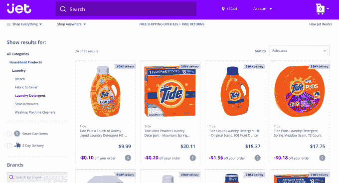
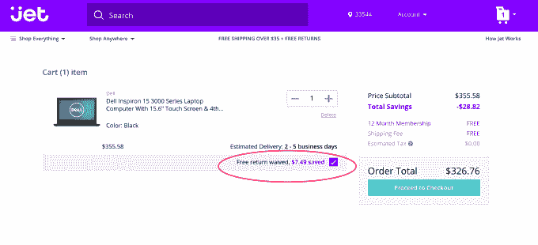

# 推出一个月后，折扣购物网站 Jet.com 成为第四大市场 

> 原文：<https://web.archive.org/web/https://techcrunch.com/2015/09/11/a-month-after-launch-discount-shopping-site-jet-com-becomes-4-marketplace/>

[Jet.com](https://web.archive.org/web/20221204014647/http://jet.com/)，这个[的电子商务新来者，正以更低的价格与亚马逊](https://web.archive.org/web/20221204014647/https://beta.techcrunch.com/2015/07/20/jet-com-takes-on-amazon-with-the-promise-of-lower-prices/#.s2agxy:dEik)展开竞争(目前由[数亿](https://web.archive.org/web/20221204014647/http://www.wsj.com/articles/frenzy-around-shopping-site-jet-com-harks-back-to-dot-com-boom-1437359430)风险投资推动)，根据今天早上[发布的一份新报告](https://web.archive.org/web/20221204014647/http://www.channeladvisor.com/blog/?pn=marketplaces/jet-com-taking-off-full-throttle)显示，它有了一个强劲的开端。在 Jet 于 7 月底推出后，该网站已经成为销售额排名第四的市场，这意味着，仅仅一个多月之后，它已经超过了西尔斯、百思买、新蛋、乐购和乐天等市场。

ChannelAdvisor 今天报道了这一数据，这是一家帮助商家在易贝、亚马逊等在线市场上销售产品的公司。通过跟踪使用其平台的第三方卖家客户群的交易，ChannelAdvisor 能够深入了解特定市场的商品总量。

基于这一分析，ChannelAdvisor 发现，Jet.com 卖家的平均销售额是西尔斯(Sears)或新蛋(Newegg)等已运营多年的市场的两倍。

ChannelAdvisor 首席执行官大卫·施皮茨(David Spitz)表示:“2016 年，它有可能成为我们的第三大市场，仅次于亚马逊和易贝。”。“那将是非凡的。”

ChannelAdvisor 指出，自 Jet 公开推出以来，其卖家已经看到数万名独立客户在 Jet 上购买，并看到 23%的重复购买率。这充分证明了 Jet 留住早期顾客的能力。

毕竟，很可能会有一些客户在 Jet.com 网站推出后立即访问它并尝试一下，以了解该网站的工作情况以及它是否兑现了自己的承诺，但重复购买率表明，很大一部分客户发现 Jet 上的价值足以吸引他们再次光临，Spitz 解释道。

相比之下，易贝在同一时期有 17%的重复购买率，亚马逊有 11%的重复购买率。

当然，Spitz 指出，考虑到市场的年龄，与 Jet.com 的用户群相关的样本量很小，但数字仍然很有说服力。

然而，如果 Jet 的策略是从亚马逊那里吸引顾客，那到目前为止，还没有发生。斯皮茨还表示，目前他们还没有看到亚马逊或易贝销售的任何蚕食。换句话说，人们在 Jet 上购物，但他们在亚马逊和易贝上的购买率保持一致。这可能意味着，Jet 反而成功地赢得了原本会通过其他折扣市场购买产品的客户，比如好市多(Costco)或山姆会员店(Sam's Club)。

尽管如此，ChannelAdvisor 的数据只是 Jet 表现的一个窗口，但并不能描绘出这家电子商务公司及其整体进展的全貌。这是因为 Jet 的产品只有一部分来自第三方卖家，比如那些使用 ChannelAdvisor 平台的卖家。

虽然在某些情况下，Jet 上销售的产品来自自己的库存或来自合作零售商的库存，但也有一些时候 Jet 会从其他没有合作的网站购买产品，然后将这些产品运送给客户。这样做的成本很高——[零售商甚至不总是意识到这种情况的发生(或对此感到高兴)](https://web.archive.org/web/20221204014647/http://www.wsj.com/articles/frenzy-around-shopping-site-jet-com-harks-back-to-dot-com-boom-1437359430)——但这是 Jet 扩大规模计划的一部分。

在推出之初，Jet 只有三分之一的客户订单是自己完成的，另外三分之一来自合作伙伴，其余则通过这种“礼宾”服务从其他网站购买。

与此同时，Jet 的“智能购物车”功能吸引了顾客，这有助于他们在网上购物车中装满更多商品时节省更多费用。(在幕后，Jet 正在计算产品是否可以从离客户地址更近的仓库一起运送，这使得它可以对商品进行折扣。)

由 Quidsi (Soap.com，Diapers.com)创始人兼首席执行官马克·洛尔创立，Jet 的模式意味着该公司在达到规模之前一直处于亏损状态。Lore 之前曾表示，当 Jet 的产品达到每年 200 亿美元时——他预计到 2020 年将达到这一水平——它将拥有 1500 万付费客户，他们将每年支付 50 美元的会员费。只有这样，电子商务公司才会成功。

但目前尚不清楚的是，Jet 的现有客户是否会长期留在公司。虽然销售数字和重复购买率很有希望，但今天大多数喷气购物者都在免费试用的基础上使用该网站——3 个月或 6 个月，取决于他们何时注册。到了支付年费的时候，并不是所有人都会转变为付费会员。