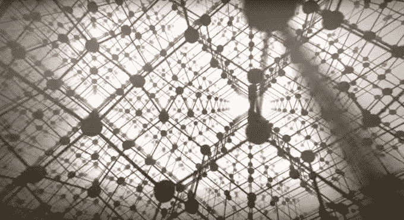

# 人的一小步，人类的一大步 

> 原文：<https://web.archive.org/web/http://techcrunch.com/2015/12/23/a-nano-step-for-man-a-giant-leap-for-mankind/>

Ambika Bumb 是牛津大学马歇尔奖学金的毕业生，是癌症检测和治疗技术开发商的联合创始人和首席执行官，

[Bikanta](https://web.archive.org/web/20230131005754/http://bikanta.com/)

.

上个月，我被邀请加入几位科学家对国会山的访问，与我们国家的领导人谈论纳米技术的创新如何塑造今天的国家。

我们一整天都在马拉松式的会议中度过，会见了许多重要的国会议员、工作人员和委员会成员，实际上是在山上迷宫般的建筑中来回奔跑。

除了对通过国会大厦大厅和地下隧道所需的技能有了充分的了解，这次访问还启发我评估当今公众对纳米技术的看法以及政策关注点。

像《T2》《奇妙的旅程》《T3》《T4》《亲爱的我让孩子们变小了》《T5》《T6》《蚁人》《T7》这样的电影只是一些例子，说明了所有的小事是如何抓住我们的想象力的。“纳米”毕竟不是什么新鲜事物，也不再是令人恐惧的未知事物。如果你曾经喝过牛奶，围坐在篝火旁，或者使用天然眼线笔，你就摄入了纳米颗粒。

一纳米是十亿分之一米。在经典的尺度比较中，如果一个弹球是纳米，那么一米就是地球的大小。

今天，纳米技术的定义不仅仅是 1 至 100 纳米尺度的材料科学或工程，而是更具包容性，即尺寸本身引入新特性的范围。尺寸的减小可以导致熔点的降低，新的磁性，甚至颜色和电子性质的巨大变化。

> 像《神奇之旅》、《亲爱的，我让孩子们变小了》和《蚁人》这样的电影仅仅是几个例子，说明了所有微小的事物是如何抓住我们的想象力的。

以黄金为例。想到的颜色是女性喜欢用来装饰自己的黄色。然而，在小颗粒的形式下，它看起来是红色的，已经在彩色玻璃窗上使用了几个世纪。

了解元素在大小方面的特性，为 2D 元素周期表引入了第三个维度，开启了大量新材料和基本“积木”。这种纳米尺度的调查研究本质上是跨学科的，需要物理、化学、材料和生物方面的交叉专业知识。

今天，纳米材料创新已经跨越了所有可以想象的领域，从清洁污染水的颗粒(环境)到注入纳米管的防化学武器服装(国防)到脑瘤的局部治疗(医学)。

事实上，我很幸运成为一家纳米医学技术开发商的首席执行官，该公司将医生和科学家的手延伸到细胞和分子水平。

当我在佐治亚理工学院做本科研究时，我就萌生了将有效的纳米工具带到医生和病人手中的兴趣。这种最初的兴趣促使我在牛津大学攻读博士学位，开发一种三态纳米粒子，用于对从癌症到自身免疫疾病的各种疾病进行成像。

我的研究生研究只是增加了我的好奇心，所以我在国家癌症研究所和国家心肺血液研究所做了一对博士后研究员。当我似乎注定要从事终身学术生涯时，我们的技术吸引了很多关注，我发现自己在湾区创建了现在屡获殊荣的比坎塔。

回想我的历程，很明显，如果我们国家的领导人几十年前没有重视和资助纳米技术的研究，我就不会有这样的轨迹。

乔治亚理工学院是最早获得纳米中心资助的学校之一，我的研究生和博士后研究涉及到美国国立卫生研究院(NIH)纳米医学路线图的资源，今天我的公司通过能源部(DOE)资助的用户设施 Molecular Foundry 获得其大部分仪器。

通过 2003 年的[国家纳米技术倡议(NNI)](https://web.archive.org/web/20230131005754/http://www.nano.gov/) 和纳米技术研究与发展法案，我们的联邦政府在过去 13 年里已经在纳米研究上投资了 200 亿美元。这项投资的回报已经促成了 628 项机构间合作、数十万份出版物以及纳米产品带来的超过 1 万亿美元的收入。

鉴于医疗创新转化为临床产品至少需要*10 年的时间，已经实现 50 倍的回报是一个令人震惊的成就。从学术和商业的角度来看，放慢脚步是违背直觉的。*

> 联邦资金在五年前的 2010 年达到顶峰。NNI 投资从 2010 年的 15.8 亿美元下降到 2015 年的 11.7 亿美元(以定值美元计)，降幅达 26%。

然而，这就是正在发生的事情。联邦资金在五年前的 2010 年达到顶峰。NNI 投资从 2010 年的 15.8 亿美元下降到 2015 年的 11.7 亿美元(以定值美元计)，降幅达 26%。2013 年，美国发表的纳米相关论文数量约为 2.5 万篇，而欧盟和中国分别为 3.3 万和 3.5 万篇。

历史一再表明，当商业化基础设施得不到充分支持时，美国在开发高价值技术方面的早期竞争优势如何被国际竞争所取代。

例子包括半导体、高级汽车电池和水泥基建筑材料，所有这些产品最初都是在美国开发的，但现在在其他地方生产。

根据我在世界各地领先中心的亲身经历，我观察到了纳米医学领域最新和最令人兴奋的发展，这将使更好的疾病检测和治疗成为可能。然而，如果没有支持将其转化为商业化的生态系统，美国在这一领域的领导地位将面临风险。

现在是时候进入第二个时代了——NNI 2.0。作为更高和持续投资的回报，NNI 2.0 的目的不仅仅是基础研究，也是对纳米技术快速商业化的必要支持。将基础科学转化为商业现实需要学术界、工业界、联邦政府和慈善机构的合作。

当我从东海岸著名的 NIH 搬到西海岸创办 Bikanta 时，最优先考虑的问题之一是，在没有高端表征仪器来分析我们材料质量的情况下，我们如何开发纳米金刚石技术。对于一家初创公司来说，购买所有这些设备在经济上是不可行的，甚至是不明智的。

试图在不同的地点访问每台仪器将是一项挑战，并会减慢研发速度。在工业中，时间就是金钱，对于实现目标里程碑非常关键。

> 现在是时候进入第二个时代了——NNI 2.0。作为更高和持续投资的回报，NNI 2.0 的目的不仅仅是基础研究，也是对纳米技术快速商业化的必要支持。

我们非常幸运，因为我们的提议被分子铸造所接受，这是能源部资助的五个纳米科学用户机构之一。虽然 Foundry 主要促进学术和国家实验室用户的基础纳米科学项目，但财富 500 强公司和像我们这样的初创公司也利用其能力来回答基本问题和进行概念验证研究(约 10%)。

不是每个人的后院都有这种纳米天堂。数百名用户(2015 年为 908 名)来自 29 个不同的州和 24 个不同的国家，以利用铸造厂多样化的多学科科学专业知识和资源。

暂且不考虑活跃的知识界，这家铸造厂的仪器价值可能超过 1.5 亿美元。一个早期的创业公司永远不会梦想筹集到这么大的第一轮融资。

Bikanta 成功的因素之一是分子铸造厂使我们能够在短短几个月而不是几年内在 R&D 取得巨大进步。非常需要更多的用户设施、孵化中心和纳米技术商业化的资金。

虽然在我访问期间看到双方共同通过两党预算法案是有希望的，但我们需要鼓励的是通过预算拨款增加对纳米科学的支持。

如果联邦研究基金在令人惊讶的几年内带来了 50 倍的回报，补充支持将使其复合，并使纳米技术成为美国如何通过投资自身增长来确保竞争优势的冠军故事。让我们迎来 NNI 2.0 的时代。