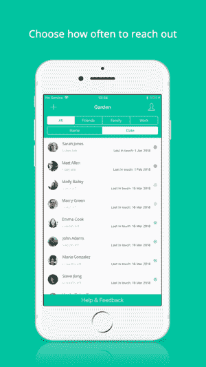

# 一款名为 Garden 的新应用可以帮助你在没有脸书的情况下与朋友和家人保持联系

> 原文：<https://web.archive.org/web/https://techcrunch.com/2018/04/10/a-new-app-called-garden-helps-you-stay-in-touch-with-friends-and-family-without-facebook/>

脸书已经成为今天人们与朋友和家人保持联系的事实上的方式，有时也是他们更广泛的专业熟人和同事网络的方式。但它对用户数据保护的忽视正导致一些人寻找出路。一款名为 [Garden](https://web.archive.org/web/20221025222603/https://itunes.apple.com/us/app/garden-stay-in-touch/id1230466454) 的新应用今天正式发布，它希望为人们提供一种更加私密和个性化的方式来与那些对他们来说重要的人保持联系。

这款应用是由赞德·阿德尔(Zander Adell)开发的，他曾是包裹递送初创公司[的首席执行官，该公司于去年秋天关闭。](https://web.archive.org/web/20221025222603/https://techcrunch.com/2017/09/25/package-delivery-startup-doorman-is-shutting-down/)门卫曾试图通过允许人们安排网上订单实际送达的时间来解决最后一英里送货的问题。和许多初创公司一样，这项业务需要做大量的工作。这分散了 Adell 维持其他关系的注意力。

“我建造花园是因为我失去了一个朋友，”他说。“我忙于经营上一家初创公司，以至于忽略了一些最亲密的私人关系，以为当生活平静下来时，我们会联系起来。几年过去了，生活从未变得轻松过，”阿德尔承认道。

他还认为，社交媒体欺骗了用户，让他们认为自己与他人的关系比实际上更密切——例如，“喜欢”一个帖子是某种有意义的体验，而实际上并不是这样。

“维持一个真实的个人或商业关系，为你的生活增加价值和意义，需要定期和实质性的努力，”阿德尔解释道。“就像你不能指望花园里的植物在没有定期浇水的情况下保持健康一样，你也不应该指望你的关系在没有投入时间的情况下茁壮成长。”

Garden 最初是由 Adell 自己努力打理人际关系得来的，他把这份工作做成了一个大电子表格，最后一次和某人见面时他会把它写下来。他发现，这有助于他更好地跟上他的业务联系和他的个人关系。

其他公司也为类似目的构建了自己的电子表格，他听到这些消息后认为，将该解决方案作为应用程序提供或许更有意义。

[gallery id = " 1619606，1619605，1619604"]

使用 Garden，您可以在手机中为联系人设置提醒频率，并指明希望与相关人员保持联系的频率—每周、每月、每季度、每六个月等。如果你与朋友取得了联系，你可以在 app 中留下笔记，并写下上次谈话的细节。实际上，这是一种个人 CRM。

当然，app-CRM 在 T2 就像 T4 的 T3 一样，只是关注点几乎都集中在业务关系上，而不是个人关系。加登可以有效地管理这两者。

该应用程序与以前所有替换通讯录的应用程序在同一个空间播放，而且几乎没有一个应用程序能保持这样的播放状态。例如， [Tinder 收购了胡敏](https://web.archive.org/web/20221025222603/https://techcrunch.com/2016/03/29/tinder-acquires-humin-as-it-broadens-out-from-dating-creates-sf-office/)，[布鲁斯特的团队加入了 RBI](https://web.archive.org/web/20221025222603/https://techcrunch.com/2015/10/23/brewster-contacts-app-team-gets-acqui-hired-by-burger-king-owner-rbi-brewster-lives-on/) ，而 [Cobook 出售给了 FullContact。](https://web.archive.org/web/20221025222603/https://techcrunch.com/2014/01/15/fullcontact-acquires-cobook-to-build-a-better-universal-address-book/)

但也许现在人们会用另一种眼光看待那些帮助他们维持人际关系的新应用。

Garden 设计得很好，但相当简单——它是一个带有推送通知的联系人管理器。真正跟上潮流的艰巨任务必须由你来完成——你不能光是看几篇帖子就收工。但这可能是一些人目前想要的，因为他们正在逐渐摆脱对脸书的依赖。

鉴于 Garden 是一个关于你个人关系的数据库，Adell 说数据隐私是至关重要的。他说，数据本身通过 AWS 托管在云中，并进行安全传输。它也不会像过去很多应用那样向你的朋友发送垃圾邮件。

也就是说，联系人应用程序之前已经给自己惹上了麻烦——[bug 暴露了私人信息](https://web.archive.org/web/20221025222603/https://techcrunch.com/2012/07/13/brewsters-address-book-app-briefly-exposes-ashton-kutchers-others-private-data-company-says-its-fixed/)，人们总是[对授予应用程序权限](https://web.archive.org/web/20221025222603/https://thenextweb.com/apps/2012/02/07/path-2-uploads-your-address-book-but-says-that-its-for-friend-matching-and-will-be-opt-in-soon/)给他们的私人联系人感到有点不舒服。Garden 和其他公司一样，要求访问您的联系人来完成工作。这将让一些人踌躇不前。

Adell 说这个项目是他自己启动的，但目前是他的全职工作。

该应用目前[在 iOS](https://web.archive.org/web/20221025222603/https://itunes.apple.com/us/app/garden-stay-in-touch/id1230466454) 上免费下载，但以后可能会支持广告。

*图片来源:top: [乔治亚风格的花园](https://web.archive.org/web/20221025222603/https://www.flickr.com/photos/jamespaullong/539010126)由 Flickr 上的[ricoeurian](https://web.archive.org/web/20221025222603/https://www.flickr.com/photos/jamespaullong/)；其他:花园*