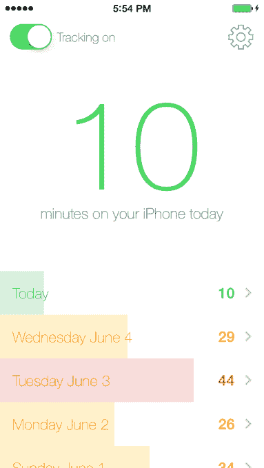

# 一款名为 Moment 的新应用向你展示你对 iPhone  有多上瘾

> 原文：<https://web.archive.org/web/https://techcrunch.com/2014/06/27/a-new-app-called-moment-shows-you-how-addicted-you-are-to-your-iphone/>

我们中的一些人开玩笑说，我们对我们的 iPhones 上瘾了。一款新发布的名为 [Moment](https://web.archive.org/web/20230316192802/http://inthemoment.io/) 的应用将向我们展示这种说法有多正确。Moment 旨在促进我们的真实生活和通过数字设备的小屏幕生活之间更健康的平衡，它可以跟踪你每天使用手机的时间，帮助你设定每日使用限制，并在你接近这些限制时提供“偶尔的提醒”。

该应用程序的开发者凯文·霍利什(Kevin Holesh)表示，在意识到自己对数字的沉迷对现实世界中的人际关系有多大影响后，他为自己创建了 Moment。

Holesh 通过博客文章向[解释说，在和他的未婚妻搬进来并一起适应他们的新生活后，他们都开始在一天结束时拿出他们的 iPhones 来放松。虽然在某种程度上这没什么，但对他来说，这正成为一个严重的问题。](https://web.archive.org/web/20230316192802/https://medium.com/@kevinholesh/im-addicted-to-my-iphone-4b9601e2776f)

“我们不再做有趣和富有成效的事情，而是选择了阻力最小的道路，”他写道。

有时候，似乎太多的好事就是太多了。

作为一名 iOS 开发者，Holesh 决定建立一个解决方案——是的，以 iPhone 应用程序的形式。但这款应用并不意味着会被频繁使用。相反，它“被设计成隐形的”，Holesh 说。也就是说，在你第一次设置了[时刻](https://web.archive.org/web/20230316192802/https://itunes.apple.com/us/app/moment-track-where-you-go/id771541926?ls=1&mt=8)之后，你就再也不需要打开它了。该应用程序将在后台运行，当你超过每日限额时会提醒你。

Holesh 告诉我们，大多数人并没有意识到他们在手机上花了多少时间。

“作为一个小实验，我让人们猜测他们的日常用量，他们几乎总是少了 50%，”他说。“每日限额帮助人们设定了使用手机时间的目标。我使用 Moment 的主要目的是让我知道自己每天在手机上花了多少分钟，这也帮助了我的测试人员。”

Holesh 在该应用的网站上指出，Moment 的总体目标不是让你“永远放下手机，去森林中生活”。这是关于在我们的生活中创造一种平衡。

该应用程序中还有一个奖励功能，与我们是否放下手机出去逛逛有关，可以说——Moment 还可以选择性地跟踪你一天都去了哪里。

**我们的数字瘾**

像 Holesh 一样，我们许多人都担心数字环境对我们现实生活的影响。一方面，我们有一些公司——像谷歌这样的[——希望将技术嵌入我们生活的方方面面，包括我们所有的移动和计算设备上的](https://web.archive.org/web/20230316192802/https://techcrunch.com/tag/google-io/)[，我们](https://web.archive.org/web/20230316192802/http://www.android.com/tv/) [的家](https://web.archive.org/web/20230316192802/https://nest.com/)，[的](https://web.archive.org/web/20230316192802/http://www.android.com/auto/) [的汽车](https://web.archive.org/web/20230316192802/https://techcrunch.com/2014/05/14/googles-self-driving-car-project-is-a-worlds-fair-fantasy-turned-city-street-reality/?utm_campaign=sfgplus&%3Fncid=sfgplus)，甚至通过[手表](https://web.archive.org/web/20230316192802/http://www.android.com/wear/)，[眼镜](https://web.archive.org/web/20230316192802/https://www.google.com/glass/start/)甚至有一天[隐形眼镜](https://web.archive.org/web/20230316192802/https://techcrunch.com/2014/01/16/google-shows-off-smart-contact-lens-that-lets-diabetics-measure-their-glucose-levels/) [戴在我们身上](https://web.archive.org/web/20230316192802/https://techcrunch.com/2014/04/14/google-patents-tiny-cameras-embedded-in-contact-lenses/)

另一方面，对于技术继续以这种方式侵蚀我们的生活意味着什么，有一股恐惧的暗流。例如，[去年](https://web.archive.org/web/20230316192802/https://techcrunch.com/2013/08/24/forget-your-phone/)的一段令人心酸(也相当悲伤)的视频问道:当你一天忘记带手机时，世界会是什么样子？(见下文)。

[YouTube https://www.youtube.com/watch?v=OINa46HeWg8]

另一个视频(再次，如下)，[现在正在传播](https://web.archive.org/web/20230316192802/http://9gag.tv/p/a984Zz/what-s-on-your-mind-perfect-generation-social-media-depressing?ref=fbl9)，更多地关注我们如何通过我们的数字屏幕与他人联系，充其量是经常远离现实的表演。

它说，我们是为了“喜欢”而演戏。我们是*而不是*活着。

【YouTube https://www.youtube.com/watch?v=QxVZYiJKl1Y]

当然，移动应用时刻并不是解决所有困扰我们的数字习惯和困扰的灵丹妙药。

但是，对于那些在爱人醒来之前拥抱手机的人，对于那些认为现实世界的对话比收到的短信和电子邮件更重要的人，对于那些在 Instagram、Twitter 和脸书上度过雾蒙蒙的几个小时，只是为了寻找短暂的分心的人来说，时刻可能是朝着正确方向迈出的一步。

对 Holesh 来说，这种影响是显而易见的。他过去每天花 75 分钟在他的 iPhone 上。现在，他只花 40 英镑。

这款应用现在也是 Holesh 的主要业务，因为他通过应用内购买获得收入，这种购买可以让你解锁每日限额设置。

Moment 本身是 T4，可以在 iTunes 上免费下载。