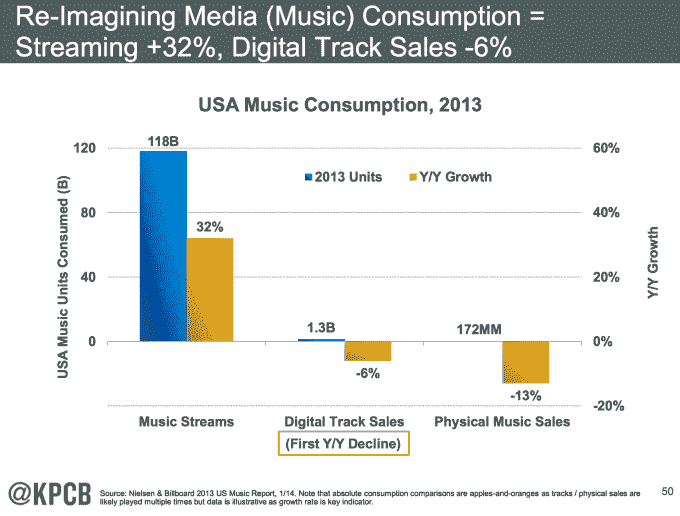

# 苹果将独立于 iTunes 下载商店 TechCrunch 运营 Beats Music 的流媒体服务

> 原文：<https://web.archive.org/web/https://techcrunch.com/2014/05/28/a-smooth-transition-from-music-sales-to-streaming/>

苹果刚刚收购了 Beats ，但它不会冒险将 iTunes 下载业务发展成流媒体服务，而是将同时运营 Beats Music 的流媒体服务，为听众提供一个随心所欲的订阅选项。这证实了我上周的独家报道，即[苹果公司希望分开运行这两个软件](https://web.archive.org/web/20230103004009/https://techcrunch.com/2014/05/22/bridging-the-download-and-cloud-music-eras/)，以便在下载销售下滑和流媒体业务加速时实现平稳过渡。

“Beats 的加入将使我们的音乐阵容更加强大，从 iTunes Radio 的免费流媒体到 Beats 的世界级订阅服务，当然还有客户多年来喜欢的从 iTunes 商店购买音乐，”苹果 SVP 和 iTunes 负责人埃迪·库伊在新闻稿中谈到其 30 亿美元收购 Beats Electronics 和 Beats Music 时说。

注意最后一行。Cue 和苹果不想让用户震惊，因为他们不喜欢熟悉的下载购买模式，而喜欢流媒体。

iTunes 的艾迪·库伊(左)和 Beats 的吉米·艾奥文(右)

相反，流媒体的早期用户可以选择苹果，而那些仍在收集数字音乐文件的用户可以继续从 iTunes 购买。《金融时报》 [Tim Bradshaw 报道【Beats 将继续适用于 Android 和 Windows Phone。](https://web.archive.org/web/20230103004009/https://twitter.com/tim/status/471755140761149441)

正如凯鹏华盈合伙人玛丽·米克尔在她最新的 [2014 年互联网趋势报告](https://web.archive.org/web/20230103004009/http://t.co/FACfcFwFbu)中所显示的，数字音乐下载销量正在下降，而流媒体却在蓬勃发展。从 2013 年的 Q1 到 2014 年的 Q1，数字音乐的销售额在 2013 年下降了 6 %,总计下降了 13.3%。与此同时，美国流媒体音乐消费在 2013 年增长了 32%。本质上，销售音乐是一个垂死的行业，流媒体才是未来。

但是销量还没有死，苹果也不会把它们放进坟墓。虽然在硅谷似乎没有人购买音乐，但 2013 年仍有 12.6 亿首歌曲和 1.176 亿张专辑在网上销售。如果苹果立即将 iTunes 转变为流媒体订阅服务，那么随着用户慢慢转向流媒体订阅，它每年支付给唱片公司的约 10 亿美元可能会化为乌有。

因此，苹果可以使用 Beats Music 来平滑过渡。那些想要流媒体的人可以去 Beats，如果有一天，苹果认为音乐销量已经低于临界点，它可以将 iTunes 切换到流媒体。

在一封写给苹果员工的信中，首席执行官蒂姆·库克说:

> “Beats Music 对艺术家和粉丝都怀有深深的敬意。我们认为这是第一个真正正确的订阅服务。苹果和 Beats 都认为，一个伟大的音乐服务需要一个强大的编辑和管理团队，我们将继续扩大我们在这些领域的工作。Beats 的加入将使我们不可思议的 iTunes 阵容更加出色，扩展我们的客户与音乐的情感联系。”

库克在这里讨论的个性化、策划化的 Beats 体验是对 iTunes 一刀切方法的补充。虽然 iTunes 会在其主页上展示新的和即将到来的艺术家，但大多数用户可能会带着他们要花钱买什么的意图来到商店。由于 Beats 上的每个附加流都是免费的，用户可以进行更多的探索和实验。这使得策展和个性化更为重要，比如它的“只为你”主屏幕，因为用户需要指导。

这又一次展示了一个高度功能化的二分法，更多的传统音乐听众可以使用 iTunes，而更多愿意发现新艺术家和新风格的开明用户可以在 Beats 上找到一个家。

苹果会拿 Beats 怎么办？正如库克对 Re/Code 的彼得·卡夫卡(Peter Kafka)所说，这一切都是关于他们在未来可以一起打造什么。但与此同时，他表示“从财务上来说，这很好，因为即使在短期内也会产生协同效应。利用苹果的全球足迹，在订阅服务上有所突破……”后来他指出，“我们可以建造任何你能想到的东西。但这不是问题所在。Beats 为我们提供了一个良好的开端。”

现在的问题是，Beats 的价格是否会保持在每月 9.99 美元不变，或者苹果是否能说服唱片公司降低价格，使其更容易获得。然后，我们会看到苹果的优雅和 Beats 的街头信誉能否结合起来，让世界相信，整个录音音乐的历史每个月只值几美元。