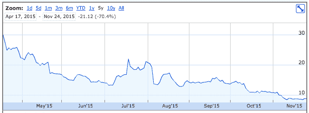
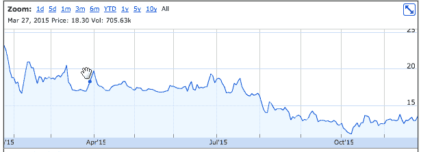
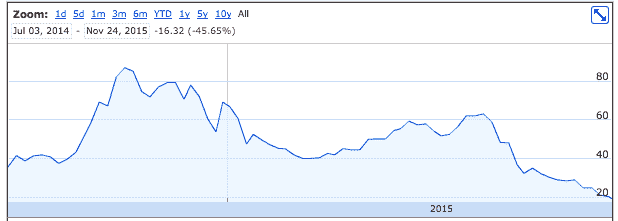
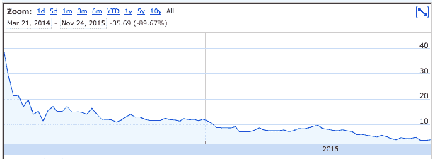
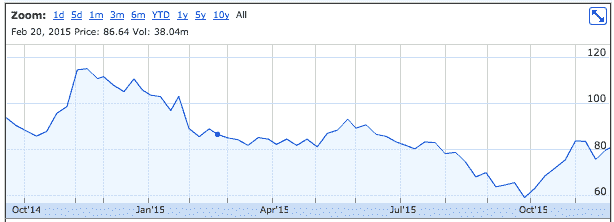
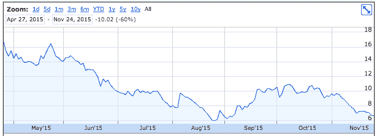

# 一杯方形汽水和一滴 

> 原文：<https://web.archive.org/web/https://techcrunch.com/2015/11/24/a-square-pop-and-a-drop/>

Square 的首次公开募股表现抢眼，上市首日涨幅超过 40%。定价保守，此次发行做了所有 IPO 必须做的事情，以树立一个积极的叙事:上涨。

在随后几天的交易中，Square 出现了下滑。今天，据 TechCrunch 报道，Square 的股价连续第三个交易日下跌。第一天过得好并不意味着第一周过得好。

模式:价格，流行，然后下降，现在是一个熟悉的舞蹈。强调这一点很重要；TechCrunch 并没有试图将不公平的矛头指向 Square。然而，这家公司确实存在，在一批遵循类似模式的公司中。

数据不言自明。例如，这是 Etsy 上市以来的图表:

博克斯的日子很不好过:

还有别忘了 GoPro:

哦，还有 Castlight 健康中心:

阿里巴巴:

阿皮亚吉！

如同一切事物一样，反例是存在的。Zendesk、GoDaddy、Arista Networks 和 PayPal 基本上保持不变。然而，有理由认为，鉴于许多公司的表现，我们在 2015 年看到的适度 IPO 步伐并不完全令人惊讶。

将此与[不断上涨的私人估值](https://web.archive.org/web/20221007055224/https://beta.techcrunch.com/2015/11/10/fidelity-writes-down-snapchat-investment/)联系起来，你几乎就有了一个趋势。

对 Square 来说，现在还为时尚早，很难知道股价或公司价值会发生什么。Square 上市首日股价飙升，攀升至每股 13 美元。但读卡器公司的估值大幅下降，将之前 60 亿美元的账面价值削减了一半。目前的价值约为 38.8 亿美元。

Square 可能压低了 IPO 股价，以关注更大的涨幅，并创造积极的投资者情绪。

这对硅谷来说是什么样的预兆？谁知道呢，但正如我们在这里看到的，一个弹出不是锁。