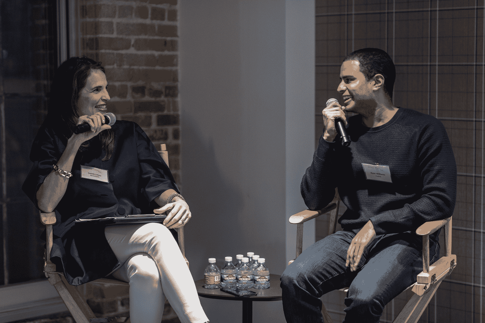
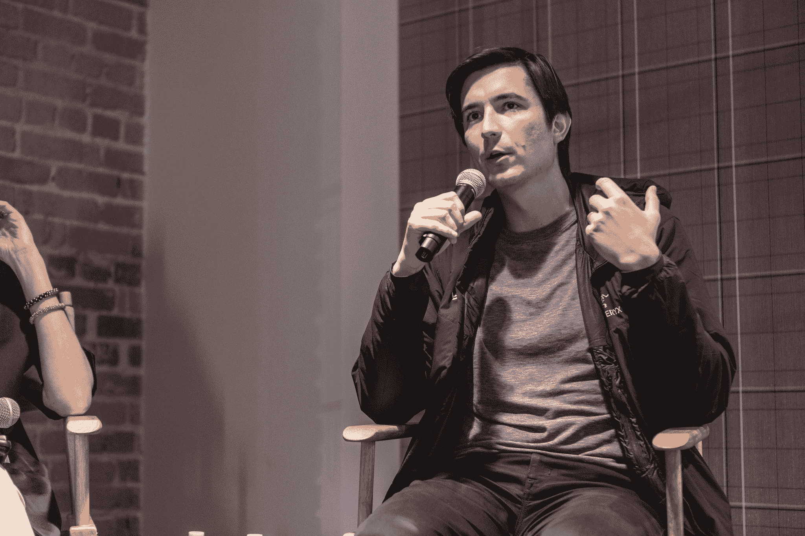

# 两个有着“超级商店”野心的创业公司的故事:Robinhood 和 drum 

> 原文：<https://web.archive.org/web/https://techcrunch.com/2018/03/06/a-tale-of-two-startups-with-superstore-ambitions-robinhood-and-cadre/>

时髦的初创公司“罗宾汉”和“T2 干部”因不同的事情而闻名。成立 5 年的 Robinhood 通过提供免佣金的股票交易建立了自己的声誉，而成立 3 年的干部则凭借一个房地产投资平台突然出现。然而，两家公司都有成为金融“超级商店”的类似雄心，使用亚马逊的剧本，从一个地方开始，迅速扩展到其他领域。

“如果你想想亚马逊，他们采用了图书模式，建立了品牌资产、信任和信誉，现在他们是任何零售产品的超市，”干部的联合创始人兼首席执行官瑞恩·威廉姆斯上周在旧金山的一个[严格风险投资活动](https://web.archive.org/web/20221209135530/https://svc9.splashthat.com/)上告诉与会者。“我们正在为投资界做同样的事情。”

Robinhood 的联合创始人兼首席执行官弗拉德·特涅夫(Vlad Tenev)在当晚晚些时候的同一场活动中发表了几乎相同的讲话。“从现在起的五年内，”Tenev 告诉人群，Robinhood 将成为一家“提供全面服务的金融机构”，提供人们可以在“当地银行分行”找到的所有产品，甚至更多。

无论是初创公司还是两者都将实现自己的梦想，我们在未来几年都不会知道，但可以肯定的是，两家公司都已经受到竞争对手的密切关注，其中许多公司发现自己正在迎头赶上。事实上，打破守旧派的平衡在很大程度上是两家公司的惯用手法。

这是他们与他们最想效仿的公司的共同点——但最终可能会发现自己在与之竞争。正如《华尔街日报》昨天报道的那样，亚马逊正在与包括摩根大通在内的大银行就开发类似支票账户的产品进行谈判。你可以猜测，这只是未来许多金融产品中的第一个。

**钱，钱，钱，钱**

干部和罗宾汉的创始人来自截然不同的地方。作为一个路易斯安那州人，科瑞的威廉姆斯在他八岁的时候就开始向鱼饵和渔具店卖虫子来支付运动服装的费用，包括吸汗带。十几岁的时候，他很难买得起耐克和阿迪达斯的商品，于是开了一家自己的定制刺绣吸汗带商店。

当他进入哈佛时，威廉姆斯有了创业精神。事实上，在一次去亚特兰大的旅行中，他确信有机会在几个充满止赎房屋的社区进行再投资，最终与一个投资者财团合作——包括他的哈佛同学约书亚·库什纳和库什纳的哥哥贾里德——购买了 700 多套住房，然后在 2010 年大学毕业后被高盛(Goldman Sachs)即黑石(Blackstone)聘用。(威廉姆斯说，一家资产管理公司最终买下了许多这样的房子。)

像威廉姆斯一样，罗宾汉的特涅夫不一定会想象经营一家科技公司。事实上，作为为世界银行工作的父母的儿子，“我没有想到我会成为一名企业家，”他上周在活动中说。“我家里没有企业家。它几乎是从两个想一起做生意的朋友开始的”——Tenev 和他的 Robinhood 联合创始人 Baiju Bhatt，他们最初在斯坦福相遇。

首先，两人开始努力，他们“根本不关心赚钱或成功，而那家公司实际上并不成功，”Tenev 告诉观众。虽然与会者嘲笑这个故事，但对他的父母来说这不是一个笑话。“你什么时候回学校？”他们问。“你什么时候才能找到一份真正的工作？”Tenev 说，他的父母“相当厌恶风险”。他们冒着很大的风险把我们全家从保加利亚搬到了美国。从那以后，基本上就像是，‘我们完了。我们不要搞砸了。"

**钱，钱，钱，[钱](https://web.archive.org/web/20221209135530/https://www.youtube.com/watch?v=GXE_n2q08Yw)**

尽管背景不同，威廉姆斯和特涅夫领导的公司现在正朝着非常相似的方向前进。

总部位于纽约的 Cadre 目前是一个帮助合格投资者深入研究商业房地产交易的平台，它声称这种方式要透明得多。威廉姆斯将其产品比作棒球卡。访问者可以获得关于已经获得干部批准的财产的信息。只需预付一笔费用和定期订阅费，他们就可以根据自己的目标买卖一处房产的股份。

他们也可以在平台上与其他投资者交易他们的股份。至少，有些人可以。威廉姆斯说，干部公司前段时间推出了二级市场，尽管他补充说，它“还没有完全扩大产品规模。”

它也没有如此广泛地扩展其主要业务。迄今为止，Brady 已经将超过 10 亿美元的投资者资金投入到近 20 座商业建筑中，其中大部分位于纽约，四座位于加州。但这并没有阻止投资者将大量资金推到威廉姆斯面前。该公司迄今已从包括创始人基金、安德森·霍洛维茨、通用催化剂和福特基金会在内的投资者那里筹集了 1.3 亿美元。

威廉姆斯上周告诉观众，它还从高盛的私人财富客户那里吸引了 2.5 亿美元，这些钱将通过该平台流入——与高盛和其他公司的更多合作伙伴关系正在到来。“我擅长谈判，”他和蔼可亲地说。

或许这也难怪威廉姆斯不再把干部称为一个房地产平台，而是将其描述为“世界上第一个替代资产的数字股票市场。”有这么多大品牌的支持，干部现在想要的是“释放我们用户投资组合中的每一个潜在产品，让他们真正多样化，这样他们就可以在非股权产品中建立自己的定制投资组合。”

想想木材、能源、私募股权——甚至农田。

每一种都是很难进入的资产类别，很难看到，并且需要很长的持有期。威廉姆斯认为，通过引导更多的投资进入这些市场——并让投资者买卖和交易他们的股份——他可以创造一个流动性市场，围绕他的前雇主黑石和高盛运作，同时打击较小的中型市场参与者。

总部位于帕洛阿尔托的 Robinhood 也突然发生了快速的变化。今天，它被称为一个免佣金的交易平台，允许用户买卖股票。但它的等候名单也越来越出名了。Robinhood 吸引了 400 万用户，但它的许多最新客户被两种产品的平台所吸引，这两种产品仍在缓慢推出。去年 12 月底，它宣布推出免佣金期权交易，Tenev 称这是许多客户要求的工具。本月，它推出了[免费密码交易](https://web.archive.org/web/20221209135530/https://techcrunch.com/2018/01/25/free-cryptocurrency-trading-app/)。

Tenev 说，这两种产品都有 100 万用户在排队使用。

对后一种产品的兴趣并不奇怪。[比特币基地](https://web.archive.org/web/20221209135530/https://www.coinbase.com/?locale=en-US)，总部位于三藩市的数字货币交易所，已经成立 6 年，目前在加密交易方面独占鳌头。但是，这家在 2012 年首次推出买卖比特币服务的公司，在迎合其快速膨胀的客户群方面存在众所周知的问题。(截至 11 月中旬，它已拥有超过 1300 万注册用户[，而 2016 年 11 月为 470 万。)](https://web.archive.org/web/20221209135530/https://www.cnbc.com/2017/11/27/bitcoin-exchange-coinbase-has-more-users-than-stock-brokerage-schwab.html)

比特币基地还收取一些用户抱怨的过高交易费用。

罗宾汉赚了一些钱，尽管可能不多。它对允许用户借钱购买股票的保证金账户每月收费 10 美元。它还从管理的资产中赚取利息，尽管 Tenev 拒绝谈论它监管的资产数量或使用这种保证金产品的客户比例，称 Robinhood“更喜欢谈论其他数字。”

与此同时，该公司不想对交易收费，这样它就可以增长。特涅夫对观众说，“很多人问，‘为什么不收 99 美分什么的？你可以赚很多钱。但我们愿意牺牲这一点，因为我们想建立一个大企业。我们希望成为向客户提供最优惠价格和费率以及客户体验的地方。"

就在那时，特涅夫像他之前的威廉姆斯一样，唤起了亚马逊。他说，“你看看亚马逊这样的公司，在零售电子商务方面也有类似的战略。人们误解了那家公司大约 20 年。我认为，直到最近，华尔街和分析师们才开始关注它，并说，‘这里有些东西。(首席执行长杰夫·贝索斯)不只是在给股东的信中向我们撒谎"

Tenev 和 Williams 可能有相似的想法并不完全令人惊讶。大约十年前，当金融市场崩溃时，两人都从大学毕业——对雷曼兄弟这样家喻户晓的名字的信任也随之崩溃。

去年富国银行的揭露的新的欺诈案件，只会让年轻的投资者更加怀疑把他们的新兴资产托付给老牌投资者。(Tenev 表示，Robinhood 的用户中有一半是首次投资者。)

创始团队也很友好。当 Robinhood 去年在 C 轮融资中筹集到 1.1 亿美元时，Williams 将 Tenev 和 Bhatt 介绍给了 Thrive Capital，这是一家由约书亚·库什纳联合创立的风险投资公司，也是干部的首批投资者之一。事实上，从技术上讲，约书亚和贾里德·库什纳是干部公司的联合创始人，尽管威廉姆斯长期以来一直表示，唐纳德·特朗普的女婿兼白宫顾问老库什纳“对公司没有运营控制权、治理权或发言权”

**卑鄙，卑鄙的绿色**

干部和罗宾汉还有一个共同的特点:两家公司都不愿意(现在)考虑被收购。Williams 的公司在最近一次融资中被估价为[8 亿美元](https://web.archive.org/web/20221209135530/https://www.vanityfair.com/news/2017/06/the-real-estate-start-up-jared-kushner-co-founded-is-now-worth-800-million)，他欣然承认，要让事情按计划进行，还有一长串事情要做。但他已经看到有一天，干部建立了一个“更具流动性的平台”，“甚至大玩家都吵着要加入我们”，因为“他们没有流动性。”

与此同时，当被问及 Robinhood 是否会接受查尔斯·施瓦布或 E*trade 的大额支票时，Tenev 上周表示:“我不会接受。这两家公司都在努力争取那些涌向 Robinhood 的千禧一代。我们这样做不是为了钱，我不想看到这项任务夭折。”

Robinhood 的 Tenev 说:“我们这样做是因为我们看到了一个机会，可以建立一个非常非常大的公司，对客户非常非常友好。我们播种的种子的回报会比大多数其他公司发芽更晚。10 年或 20 年后，我们真的会看到它。”

如果有时间的话。鉴于亚马逊对金融服务的新兴趣，它可能不会。

“我们认为金融科技将对传统机构构成主要的数字威胁”，麦肯锡去年秋天发布的一份报告[如是说。相反，该报告指出，电子商务巨头正在“重塑一个又一个行业，模糊行业界限，因为他们寻求成为所有人的一切。”](https://web.archive.org/web/20221209135530/https://www.bloomberg.com/news/articles/2017-10-25/banks-need-to-fear-amazon-com-s-finance-ambitions-mckinsey-says)

事实上，虽然银行正在关注像干部和罗宾汉这样有超市野心的灵活玩家，但更大的危险——如果这些初创公司动作不够快——可能是最终的超市本身。

(瑞恩·威廉姆斯和弗拉德·特涅夫的照片，由 strictly VC/达尼·帕吉特提供。)