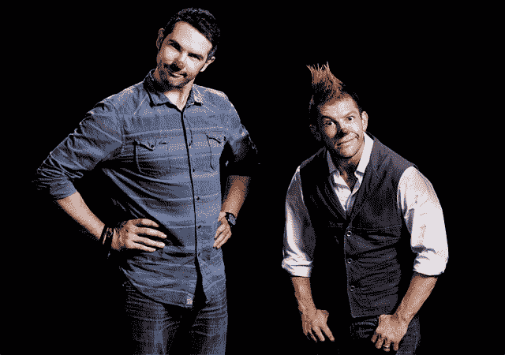
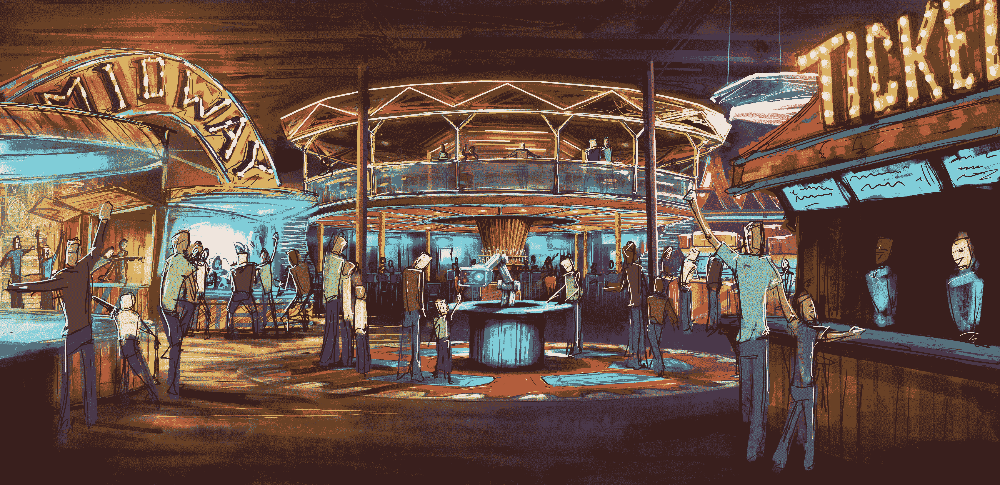
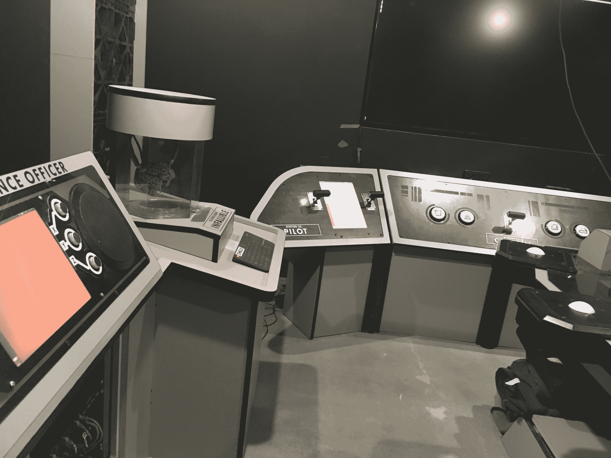
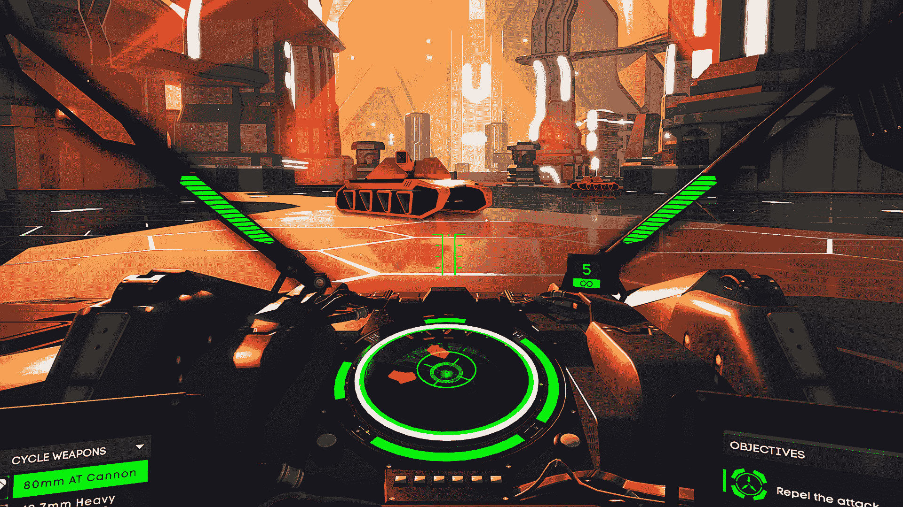
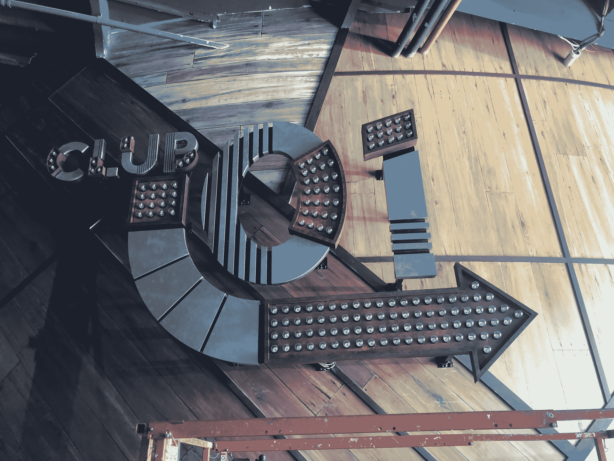

# 一个虚拟现实驱动的马戏团在洛杉矶开设了它的第一个(虚拟)大帐篷 

> 原文：<https://web.archive.org/web/https://techcrunch.com/2018/08/22/a-vr-powered-circus-is-opening-its-first-virtual-big-top-in-los-angeles/>

在洛杉矶一个炎热的七月天， [Two Bit Circus](https://web.archive.org/web/20221209205325/https://twobitcircus.com/) 的联合创始人布伦特·布什内尔(Brent Bushnell)通常戴着领结，他正带着一群客人参观一个室内游乐园的虚拟现实变形表演，当时这个表演仍在进行中。

但在短短的几周内，洛杉矶的每个人都将有机会登上布什内尔和他的联合创始人埃里克·格拉德曼多年来一直在寻求的第一座高峰，为新一代的娱乐爱好者重新改造游乐园。

Two Bit 的故事实际上始于 2008 年，位于洛杉矶市中心外围的一个阁楼和艺术家空间的大杂烩，在那里，Gradman、Bushnell 和一群快乐的恶作剧者将实验所有前几代技术设计师和制造商推向市场的新设备和小发明。秉承最优秀硬件黑客的传统，布什内尔、格拉德曼和他们杂牌军(crue？)正在寻找方法，将新兴的传感、投影和可视化技术结合到令人愉悦和惊喜的体验和活动中。

“我们八到十个人只是在一起，分享我们正在做的项目，”布什内尔说。布什内尔回忆说，在洛杉矶市中心举办的名为 MindShare 的活动中，布什内尔和格拉德曼被称为“智囊团，负责想出有趣的方法来取悦观众”。

两位马戏团创始人布伦特·布什内尔和埃里克·格拉德曼

当 Bushnell 和 Gradman 开始将叙事元素融入他们的游戏时，那些与观众打交道的实验开始有了更多的形式。两人最后的体验之一是“Versic 反间谍研究所”，这是一个早期的逃生室，包括沉浸式剧院的各个方面，发生在每个人生活和工作的啤酒厂建筑群中。“这整个事情基本上是一个高科技的寻宝游戏，”Gradman 说。

最终，这两个人创造的游戏和活动的受欢迎程度给了他们在洛杉矶的某种声誉，这就是公司打电话来的时候。

“第一阶段是我们把自己的东西带到别人的聚会上，第二阶段是我们用别人的东西做东西，并把它带到其他地方，”布什内尔谈到公司的早期时说。

他们的第一份有偿工作是在 E3 游戏大会期间为微软在洛杉矶的大型发布会提供娱乐。接下来是英特尔、华纳兄弟等公司的其他演出，在那里，Gradman 和 Bushnell 能够从旧的 carnie 和 Coney Island boardwalk 技巧游戏中汲取灵感，并与新技术相结合，创建一种数字和物理的体验。

“一开始我们做临时装置，因为我们最大的困难是没有人知道我们在建造什么，”Gradman 说。“我们必须让人们相信这是他们想要的。现在，许多年后，人们开始承认科技正在改变我们娱乐的方式。”

[https://web.archive.org/web/20221209205325if_/https://www.youtube.com/embed/O25y0sIxhj4?feature=oembed](https://web.archive.org/web/20221209205325if_/https://www.youtube.com/embed/O25y0sIxhj4?feature=oembed)

视频

对布什内尔来说，这种发明精神是家族遗传的。他是著名的雅达利(和查克·奶酪)创始人诺兰·布什内尔的八个孩子之一，他的一生几乎都是在游戏、博彩和游乐园、游乐场、小贩和表演者的狂野世界中长大的。

事实上，布什内尔本人散发出 21 世纪 PT 巴纳姆的气息——或者现实生活中的威利·旺卡为所有年龄段的孩子创造了一个基于技术的奇迹工厂。把这个二比特马戏团场地想象成蒸汽朋克戴夫和巴斯特的混合体，以及他父亲的查克·e·奶酪特许经营权的更成熟版本(尽管年轻的布什内尔可能不想这样描述它)。

第一个二比特马戏团设计的早期艺术家渲染

**迷失在游乐园**

进入 Two Bit Circus，游客首先看到的是改造后的仓库空间中心的一个圆形酒吧，这将成为布什内尔和格拉德曼全球野心的试验场(稍后会有更多介绍)。

左边是一个中途拱廊，充满了康尼岛风格经典的更新版本，如“毁灭地带”，两个玩家在虚拟的摩天大楼上挥动一个物理破坏球，看谁能造成最大的破坏；或者叫“大顶气球爆炸”,这是一种最多四人参加的游戏，参赛者必须给喂给他们的比赛用球涂上颜色，然后将球扔向他们面前的彩色气球，以爆炸尽可能多的气球。像 skee ball 这样的经典也是不加修饰和永恒的(真的，谁会破坏完美？).

在中途站的后面是一个专门建造的机器人酒保，它与侧身过来观看自动鸡尾酒制作机施展魔法的顾客开玩笑。酒吧后面的机器人名叫 Guillermo del Pouro，它将为滴酒不沾的人和爱喝酒的人混合经典和原始饮料。

当顾客前往该机构的后部时，他们可以找到故事室，这是虚拟现实增强的类似逃生室的体验，在这里，潜在的冒险者可以探索秘密的阿兹特克神庙，在游戏“太空小队”中遨游太空并探索陌生的新世界，或者尝试在路易斯安那州河口的闹鬼河流中幸存下来。

沉浸式虚拟现实游戏《太空小队》的内部场景

“大约 80%的游戏都是专门设计的，”布什内尔在谈到为潜在的马戏团观众展示的娱乐项目时说。一些游戏，如太空中的太空小队，依赖于情节内容，因此玩家可以通过多个级别前进，并获得重复游戏的奖励。其他人有一个更离散的故事情节。

布什内尔还指出，有一个沉浸式剧院的元素可供任何进入公园的人使用，不管他们是否进入虚拟现实体验。布什内尔说:“公园里有线索带你体验不同的经历。”“我们想奖励好奇者，为粉丝提供复活节彩蛋。”

拿起位于公园内的一部看似随机的手机，可以为布什内尔所谓的元游戏提供线索，这是简单探索公园本身的冒险。布什内尔说，通过各种各样的游戏选择——从虚拟现实到经典的游乐场游戏，再到公园内的沉浸式剧院，每个人都应该有所收获。

“我最喜欢的是元游戏，”Gradman 在今年早些时候的一次采访中说。“我们面临着如此独特的机会，因为我们控制着整个公园。我们可以让整个公园感觉到它本身就是一个故事，一个值得体验的故事。”

Two Bit Circus 还为那些不想让自己的体验如此身临其境的人提供了更传统的虚拟现实和街机游戏选择。有一个模块化的虚拟现实迷宫，这是一个 6 米乘 4 米的物理迷宫，玩家戴着 HTC Vive VR 耳机和背包 PC 进行导航。在迷宫中，玩家可以尝试在牛头怪的迷宫中导航，或者与阻止飞船发射的凶猛“兔子”战斗。

然后是虚拟现实舱，它将提供一系列游戏和体验选项，而 Hologate 四人虚拟现实游戏站提供合作和竞争游戏。对于那些想要更多隐私和更定制的虚拟现实体验的人来说，有私人房间可供出租。

来自虚拟现实游戏《战地》的游戏图像

一个小吃摊提供旧的街道和州集市标准的更新，在楼上区域有座位观看人群，或者在马戏团观众下单的柜台旁边。

最后，还有一个经典街机游戏和改进游戏的部分，Bushnell 和 Gradman 最初就是在这些游戏上建立了他们的声誉(令人惊讶的是，包括一个四人同时玩的空气曲棍球游戏)。

该公园于 9 月 7 日向公众开放，免费进入。经典游戏和非沉浸式体验的价格在 50 美分至 3 美元之间，沉浸式景点的价格在 10 美元至 15 美元之间。

虽然个人和团体游戏是表演冠军，但 Gradman 和 Bushnell 希望他们的 150 个座位的表演开始场地，Club 01，将成为 Two Bit 马戏团参与者的另一个吸引力。在那里，在一个配备了 75 个共享触摸屏的房间里，司仪将带领观众进行互动游戏和智力竞赛节目。“这是我们的互动游戏表演剧场，”Gradman 说。Two Bit 正在积极寻找合作伙伴，帮助开发节目的直播内容。

**这个行业是一个马戏团**

而布什内尔和格拉德曼的两比特马戏团的梦想的第一个物理位置是一个里程碑。该公司没有筹集到 2150 万美元的风险资金来建造一个设施。事实上，该公司去年 1 月完成 1500 万美元的融资后，Two Bit Circus 的高管们就公开了他们的目标。

当时，该公司表示，它获得的融资将用于在世界各地建立微型游乐园的投资组合。每个地点都展示 Two Bit 及其合作伙伴的尖端技术和娱乐。

这些既定目标足以吸引一些顶级投资者，包括:JAZZ Venture Partners 领投，其他投资者也参与其中，包括 Foundry Group、Techstars Ventures、Intel Capital、Dentsu Ventures 和 Georgian Pine。

为了进一步探索扩张，该公司聘请了经验丰富的高管基姆·谢弗(Kim Schaefer)，他曾负责管理大灰狼度假村(Great Wolf Resorts)，以处理其基于位置的娱乐业务的增长。它还聘请了非常出色的虚拟现实专家南希·贝内特(Nancy Bennett)来领导虚拟现实内容的工作(虚拟现实内容嵌入到大约 20%的两位游戏体验中)。

布什内尔谈到该公司的计划时说:“洛杉矶是一个样板。“这绝对是为了复制而设计的。零售业绝对过剩，现在比历史上任何时候都严重。正在寻找新的参与方式的千禧一代证实了这一事实。”

对于布什内尔来说，没有什么比 Oculus Rift 的使用更清楚地强调了这一点。“没有人在百思买使用 Oculus，没有人使用它，因为这不是它的正确位置。我们的娱乐会变得更有趣、更合适。”

此外，Bushnell 和 Gradman 将马戏团视为其他游戏开发者和有抱负的游戏开发者在现场观众面前测试他们产品的中心。回顾他们的黑客根源，两人希望 Two Bit Circus 的地点成为更广泛的游戏玩家、制造商和建筑商社区的中心，这些社区正在尝试新的方式来制造快乐。

最后，布什内尔希望这一愿景具有国际影响力。“我们有一些景点可以住在公园外面，”他说。“我们与不同的地点进行了讨论……无论是电影、视频游戏还是特定种类的硬件，在公园外直播这些东西的能力是非常真实的。”Two Bit Circus 的创始人认为他们可以在世界各地复制这种体验。