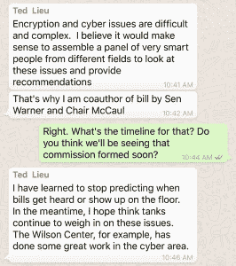

# 与喜欢加密的国会议员 Ted Lieu 的聊天

> 原文：<https://web.archive.org/web/https://techcrunch.com/2016/04/28/a-whatsapp-chat-with-crypto-loving-congressman-ted-lieu/>

随着国会讨论如何解决正在进行的加密辩论，众议员 Ted Lieu 正在努力让他的国会议员采用端到端加密来保护他们的通信。

Lieu 下周将与众议院首席信息官 Catherine Szpindor 会面，讨论如何让众议员加密他们与员工的通信，以及如何教育他们了解欺骗和鱼叉式网络钓鱼等常见的黑客方法。在参加了一个名为 [*60 分钟*的环节](https://web.archive.org/web/20221204010606/https://lieu.house.gov/media-center/press-releases/icymi-rep-ted-lieus-phone-hacked-cbs-60-minutes-security-report)后，Lieu 要求他自己的员工将通讯切换到 WhatsApp，在这个环节中，黑客们展示了他们如何能够监听代表的电话。

[本月早些时候，WhatsApp 为其 10 亿用户推出了端到端加密](https://web.archive.org/web/20221204010606/https://beta.techcrunch.com/2016/04/05/whatsapp-completes-end-to-end-encryption-rollout/)，这使得用户的通信即使通过该公司的服务器也将被加密。这使得聊天和通话保持安全，即使公司遭到破坏或收到搜查令。WhatsApp 用户可以通过比较指纹(与用户唯一相关的一串数字)或扫描对方的二维码来验证对方的身份。(WhatsApp 让验证在应用中的定位有点困难，但你可以通过在聊天中点击用户的名字，然后点击“加密”来找到用户的指纹。)

Lieu 在 WhatsApp 的一次聊天中告诉 TechCrunch:“在我的内心深处，我应该开始在我的移动设备上使用加密技术，但 *60 分钟*的片段为我点燃了一把火，让我做出了改变。”他说，他选择 WhatsApp 是因为他读过关于该应用引入端到端加密的新闻报道，但尚未指示他的员工使用 WhatsApp 的二维码来验证他们的联系人。

让黑客窃听他的电话让 Lieu 更加重视他的个人通信安全。“我认为很多人仍然没有意识到你的信息被监控或窃取是多么容易，”Lieu 说。他的全体员工现在都在使用 WhatsApp，员工们形容从发短信到应用程序的转变相对来说并不痛苦——反正他们中的大多数人已经在使用它了。

除了与 Szpindor 的会面，Lieu 还希望向整个国会新生班级简要介绍网络安全。

“新生班级是多样化的，”他解释道。“我认为网络安全意识因人而异。”

让国会工作人员使用加密技术很容易——但是推动国会通过加密立法要困难得多。国会目前正在考虑几项关于加密的法案，包括[华纳-麦克考尔法案](https://web.archive.org/web/20221204010606/http://www.usnews.com/news/articles/2016-02-24/warner-mccaul-plan-encryption-commission)，该法案将成立一个由安全专家和执法官员组成的委员会，以提出网络安全建议，以及 2016 年伯尔-范斯坦“[遵守法院命令法案”，该法案将授权加密中的后门。](https://web.archive.org/web/20221204010606/https://beta.techcrunch.com/2016/04/13/burr-feinstein-encryption-bill-is-officially-here-in-all-its-scary-glory/)

Lieu 说，他将反对像 Burr-Feinstein 法案中提出的那些后门授权。“作为一名正在恢复的计算机科学专业学生，我非常清楚，你不能只为执法部门建立一个后门。“黑客、罪犯或恐怖分子最终会发现这个漏洞，”Lieu 说。“我们已经看到了不加密或弱加密的后果:损害美国国家安全和美国消费者的大规模网络攻击。现在不是用后门削弱加密的时候；相反，我们应该尽可能加强加密技术，让更多的人使用它。”

他说，对国会来说，最好的办法是支持他参与起草的华纳-麦克考尔法案。该法案遭到了公民自由组织的反对，他们认为该委员会只是重新提出已经被问过和回答过的问题。美国公民自由联盟和电子前沿基金会转而支持由[众议院能源、商业和司法委员会](https://web.archive.org/web/20221204010606/https://energycommerce.house.gov/news-center/press-releases/upton-pallone-goodlatte-conyers-announce-bipartisan-encryption-working)支持的[工作组方法](https://web.archive.org/web/20221204010606/http://www.bna.com/encryption-fight-congress-n57982069281/)。