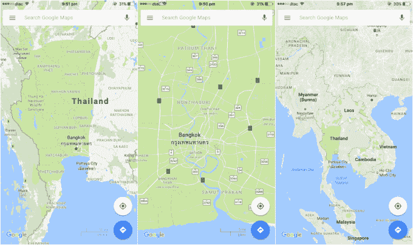

# 谷歌地图的一个错误把曼谷变成了一个巨大的公园

> 原文：<https://web.archive.org/web/https://techcrunch.com/2017/01/27/aaaaall-the-people-so-many-people/>

# 谷歌地图的一个错误把曼谷变成了一个巨大的公园

这里有一个有趣的故事，我希望它是真的——谷歌地图今天决定将曼谷和泰国其他大部分地区变成世界上最大的公园。

谷歌地图移动应用的用户和浏览其网站的游客在查看泰国首都时会注意到，整个城市和周围大部分地区都被绿色覆盖。绿色意味着草地，草地意味着公园。

*绿色非常明显*

对于曼谷来说，这是一个相当令人耳目一新的变化，它被列为世界上 100 个污染最严重的城市(T4)之一，但不幸的是，这不是某个大规模城市改造项目的结果。相反，谷歌似乎错误地重新划定了该国的 Thung Yai Naresuan 野生动物保护区的边界，并忘记正确关闭它，正如 Khao Sod 报道的那样。结果是一个非常有趣的景象，这也使得很难找到这个城市真正的公园，因为它们都融入了绿色。

我们打赌有人在调查这个案子，这个事故很快就会被处理掉。如果你想看看，现在正是时候。

这不是世界上最大的互联网公司之一最近在泰国搞砸的唯一事件。圣诞节刚过，[由于一则假新闻，脸书的安全检查服务被触发。](https://web.archive.org/web/20230403101659/http://www.theverge.com/2016/12/27/14088982/fake-news-safety-check-bangkok-thailand)