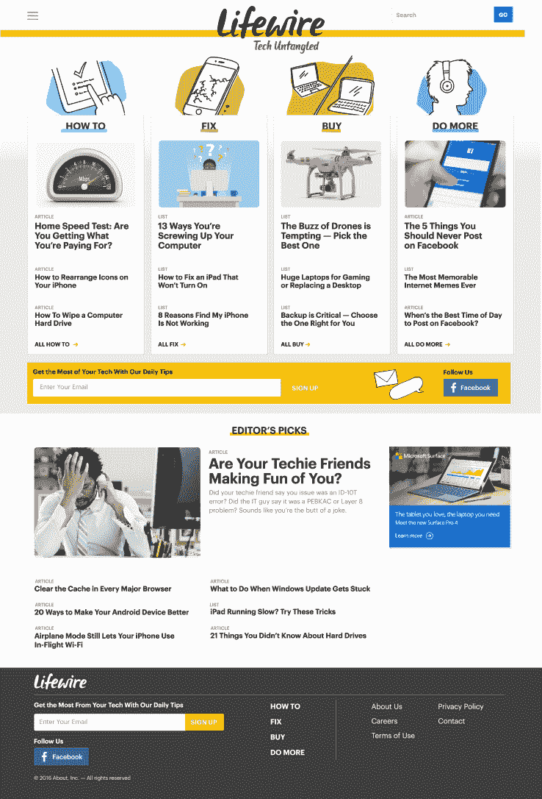

# About.com 推出科技信息网站 TechCrunch Lifewire

> 原文：<https://web.archive.org/web/https://techcrunch.com/2016/10/25/about-com-launches-lifewire-a-tech-information-website/>

About.com 正以科技信息和咨询网站 Lifewire 的形式推出其第三个独立品牌。

Lifewire 将尽可能以最清晰、最简单的形式提供关于常见技术问题的建议和答案。

IAC 旗下的媒体公司 About 正在转型。该公司不再在同一个地方提供如何烤馅饼和如何管理个人财务的信息，而是将其各种 DIY 和操作信息目录分解为品牌垂直市场。

这种转变始于今年春天，随着健康和保健网站 [Verywell](https://web.archive.org/web/20221209122345/https://beta.techcrunch.com/2016/04/26/about-com-launches-verywell-a-standalone-brand-focused-on-health/) 的推出。Verywell 推出了超过 5 万条内容，从糖尿病和类风湿性关节炎等常见疾病到如何获得更多睡眠或健身建议等简单的健康提示。

9 月初，About 与[余额宝](https://web.archive.org/web/20221209122345/https://beta.techcrunch.com/2016/09/06/about-com-launches-the-balance-a-personal-finance-website-for-everyone/)推出了第二个新的垂直个人理财网站。比 Verywell 更小的 Balance 推出了 34，000 条现有内容，所有内容都以个人理财、投资、理财、职业建议和小企业技巧为主题。

Lifewire 将推出由 40 位作家撰写的 16，000 篇内容，所有内容都集中在如何修复不工作的产品，购买什么设备，以及如何充分利用小工具。首席执行官 Neil Vogel 表示，该公司不打算涉足科技新闻，而是提供更多常青的信息内容。

关于计划推出五个品牌网站。然而，接下来的两个(家居和食品)会感觉与现有的垂直市场有点不同。Vogel 说，有了前三个网站，Verywell，the Balance 和 Lifewire，用户更有可能深入和缩小某个主题。但家居和食品垂直市场天生就更容易受到质疑。

Lifewire 可能是 About 新投资组合中最小的垂直市场之一，但该公司选择在 Home and Food(官方名称为 TBA)之前推出它，因为他们已经建立了以主题为中心的格式，非常好，而且平衡。

About 向独立品牌的转型不仅让用户受益，还帮助该公司在社交媒体上获得牵引力，并提供更有针对性、更有效的广告。

如果你想查看 Lifewire，请点击进入[网站。](https://web.archive.org/web/20221209122345/https://www.lifewire.com/)