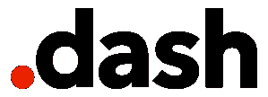

# About.com 更名为 Dotdash 

> 原文：<https://web.archive.org/web/https://techcrunch.com/2017/05/02/about-com-rebrands-to-dotdash/>

About.com，互联网上最古老和最熟悉的网站之一，即将完全淡出人们的记忆。这家总部位于 IAC 的公司一直在慢慢地将其内容从一体化网站拆解为品牌垂直网站，包括 [Verywell](https://web.archive.org/web/20230407053339/https://techcrunch.com/2016/04/26/about-com-launches-verywell-a-standalone-brand-focused-on-health/) (健康) [Lifewire](https://web.archive.org/web/20230407053339/https://techcrunch.com/2016/10/25/about-com-launches-lifewire-a-tech-information-website/) (科技) [The Balance](https://web.archive.org/web/20230407053339/https://techcrunch.com/2016/09/06/about-com-launches-the-balance-a-personal-finance-website-for-everyone/) (个人金融) [The Spruce](https://web.archive.org/web/20230407053339/https://techcrunch.com/2017/02/22/about-com-launches-the-spruce-a-standalone-site-for-home-decor-and-food/) (家居和食品)和 ThoughtCo(教育)。今天，About.com 放弃了它的旧名字，取了一个新名字:Dotdash。

有趣的事实:DotDash 是莫尔斯电码中的字母“A”。

首席执行官尼尔·沃格尔(Neil Vogel)自 2014 年以来一直领导着公司的转型，他告诉 TechCrunch，Dotdash 是对一直是 About.com 标志(dot)一部分的小红点的敬意，也是公司(对 dash)的前瞻性情感。

需要明确的是，Dotdash 是一个交易品牌名称，而不是面向消费者的品牌。新的 Dotdash 销售团队将使用这个伞状公司与客户和广告商沟通，这个名称也将用于代表更大的 IAC 中的所有五个媒体品牌。

Vogel 表示，该公司的转型进展得令人难以置信，DotDash 现在为其各种品牌的超过 1 亿用户提供服务。

该公司战略性地设计了自己的网站，为经常光顾它们的人群提供服务。例如，云杉是专为浅层和广泛的浏览体验，在那里你可以找到自己浏览灵感装饰的想法和美味的饭菜。另一方面，Verywell 和 Lifewire 专注于更深入和狭窄的浏览体验，因为人们通常会带着特定的问题或难题访问健康网站或技术帮助网站。

Vogel 也看到了电子商务领域的机会，因为 Lifewire 15%到 20%的收入来自于联盟销售。

从一体化品牌到垂直品牌的转变还没有完全完成——该公司还有一个面向旅行者的垂直品牌 TripSavvy。

“Dotdash 的每个人都有点像我们，因为我们没有继承这一点，”Vogel 说。“我们成功了，我们为此感到无比自豪，我们希望与大型媒体品牌正面交锋，并在这一水平上运营。我们想把它混合起来，投入战斗。”