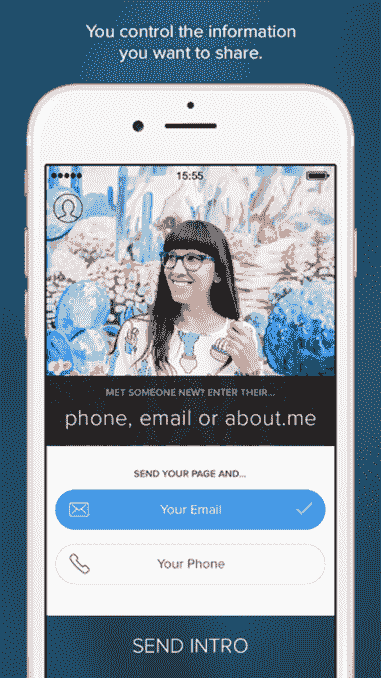
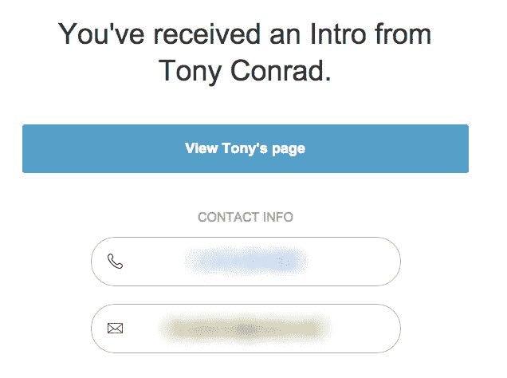

# 关于。Me 推出旨在取代名片的应用 

> 原文：<https://web.archive.org/web/https://techcrunch.com/2014/10/30/about-me-launches-app-that-aims-to-replace-the-business-card/>

Tony Conrad，about.me 的创始人，说是时候打破名片了。他今天发布了一款名为 Intro 的新应用来实现这一目的。

康拉德在电话中解释道:“你并不总是带着名片，但你总是带着手机。”。康拉德说:“这利用了我们现有的 About.me，使它成为手机的数字名片。”。

Intro 收集你在个人 about.me 页面上的信息，例如你的照片和联系信息，并将其放在应用程序的最前面和中心。然后，您可以与其他人分享这些信息。

你可以选择在应用程序上向其他人发布什么信息。一个人可能知道整个事情——你的手机、办公室和电子邮件。另一个人可能只是九年前得到了你的 Hotmail 地址。一旦您选择了想要分享的信息，Intro 会通过电子邮件或短信将其发送给您的新联系人。

“它解决了如今名片存在的问题。康拉德告诉我:“你可能不想把所有东西都拿出来。据与他交谈过的人说，他说他每次参加会议都带着三张不同的卡片，并在每张卡片上分发正确的信息。

你们中的一些人可能还记得. me [不久前试图通过与](https://web.archive.org/web/20221218181126/http://about.me/offers/cards) [Moo cards](https://web.archive.org/web/20221218181126/http://us.moo.com/) 的合作来重塑名片。但是那些仍然是实体卡片。这是一种通过智能手机分享信息的全新方式。

Intro 解决了另一个问题:给一个名字加上一张脸。“把你的照片放在名片上似乎有点奇怪，”康拉德说。“但我开始这么做了，现在已经习惯了。”现在，同样的事情也可以通过 Intro 在数字 about.me 联系人上实现。它可以帮助你记起给你联系方式的人实际上长什么样。这绝对是一个关键的变化。有多少会议交换了联系信息，却完全忘记了一群人是谁，他们长什么样？

这可能会成为 LinkedIn 的商业参考竞争对手。LinkedIn 目前有一系列独立的新闻、销售和招聘应用。一种被恰当地称为连接，显然是为了联系交流。“我们不是 LinkedIn 的竞争对手，”康拉德告诉我。他愿意相信他的新应用没有真正的竞争对手，但承认 Intro 中的简历部分接近 LinkedIn 提供的内容。

您发送或接收的所有信息也存储在应用程序中，并组织到“我的共享”和“与我共享”中，以便于参考。康拉德解释说:“我们创建 Intro 是为了让你第一次见到某人时——这是建立新关系的最关键部分，你可以留下一个实际传达你的身份的印象，并且在第一次交流后很久还会被记住。”

intro[从今天开始可以在 App Store 下载](https://web.archive.org/web/20221218181126/https://itunes.apple.com/us/app/intro-by-about.me/id929851006)。