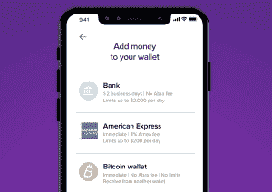

# 凯西在其钱包应用 中增加了 20 种加密货币

> 原文：<https://web.archive.org/web/https://techcrunch.com/2018/03/15/abra-adds-twenty-cryptocurrencies-to-its-wallet-app/>

凯西是一个全球货币钱包，是早期比特币舞会的美女，刚刚增加了 20 种加密货币和 50 种法定货币，这一功能允许你从钱包内充值并发送现金和加密货币。

该公司写道:“比特币、以太币、莱特币、Ripple、比特币现金、以太坊经典、Dash、Zcash、比特币黄金、恒星流明、DigiByte、Dogecoin、假人、奥米塞戈、Qtum、Augur、Status、Stratis、Vertcoin 和 0x 是最初的 20 种加密货币。”

“凯西开发了一个首款智能合约投资平台，该平台使用比特币技术，允许用户在智能手机上持有加密货币和法定货币，就像富达允许你在旧世界购买 ETF 一样，”创始人比尔·巴尔海德特说。“通过这种模式，我们可以接触任何资产——凯西仅从加密和菲亚特开始。”

该系统允许你在“没有交易费，在任何时候没有限制”的情况下进行货币之间的转换它的工作原理似乎类似于另一种允许货币之间几乎即时转换的解决方案 [ShapeShift](https://web.archive.org/web/20230307141150/https://techcrunch.com/2015/09/08/shapeshift-a-cool-cryptocurrency-converter-clinches-1-6-million-in-cash/) 。

凯西也有一些锦囊妙计，包括巧妙利用智能合约来降低与货币交易相关的波动性。他们写道:

> 消费者可以在美国使用银行账户、美国运通信用卡或使用在凯西境外从世界任何地方购买的比特币将钱存入他们的钱包。然后，他们可以快速、轻松、安全地投资凯西应用程序上提供的 20 种加密货币中的任何一种。为了开发新的钱包和集成交易所，凯西建立了一个使用价格稳定的加密令牌的首个平台，称为 stablecoins，通过基于莱特币和比特币的智能合约的组合，促进持有法币和加密货币。这种独特的基于多签名智能合约的投资平台使用莱特币和比特币区块链上的[支付脚本哈希](https://web.archive.org/web/20230307141150/https://en.bitcoin.it/wiki/Pay_to_script_hash)脚本来模拟投资合约，就像黄金 ETF 是基于美元的合约一样。凯西作为 P2SH 脚本的交易对手(即另一个签署方)，使该公司现在能够运行做市商操作，对冲这些脚本的交易对手风险。

简而言之，凯西正竭尽全力确保买卖不会因波动性而发生剧烈变化。

继 2017 年 10 月 1600 万美元的 B 轮融资后，凯西迄今已筹集了 4000 万美元的资金。投资者包括富士康科技集团、Silver8 Capital、Ignia、Arbor Ventures、美国运通风险投资公司、Jungle Ventures、Lerer Hippeau 和 RRE 风险投资公司。

“除了 50 种法定货币之外，凯西以前支持比特币和 Etherium，但发现他们的用户希望能够以简单快捷的方式投资替代加密货币——而没有多次交易和费用的麻烦，”Barhydt 说。