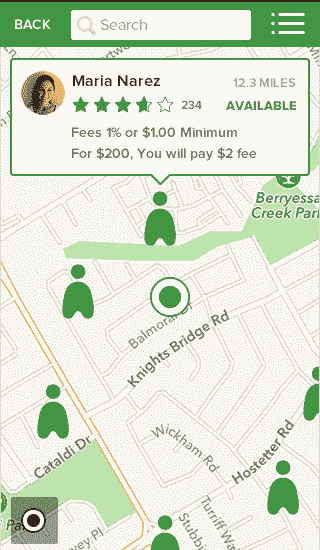

# 凯西为其基于比特币的汇款服务筹集了 1200 万美元的首轮融资

> 原文：<https://web.archive.org/web/https://techcrunch.com/2015/09/10/abra-raises-12m-in-series-a-funding-for-its-bitcoin-based-remittance-service/>

[凯西](https://web.archive.org/web/20230307141150/https://www.goabra.com/)，一个建立在区块链之上的汇款服务，已经完成了 1200 万美元的 A 轮融资。本轮投资方包括[阿伯创投](https://web.archive.org/web/20230307141150/http://www.arborventures.com/)、 [RRE 创投](https://web.archive.org/web/20230307141150/http://www.rre.com/)、[首轮资本](https://web.archive.org/web/20230307141150/http://firstround.com/)。迄今为止，该公司提供的资金总额已达 1400 万美元。

该公司的应用程序将很快向公众推出，让世界各地的用户以经济高效的价格转移任何货币的资金。

凯西通过即时将存款转换成比特币来实现这一点，比特币存储在用户的本地设备上。这意味着，与 Venmo 等服务不同，该公司实际上从不接触任何资金，这意味着它不需要处理汇款的监管问题。

凯西是这样工作的:用户可以通过一个关联的银行账户，或者利用凯西的凯西出纳员网络，将钱存入应用程序，这就像人类的 ATM 机。

在设定自己的费用后，柜员亲自与用户见面，接受现金存款并将资金存入用户的账户(如果用户想要提现，反之亦然)。

在用户的账户中存入资金后，这些钱会在幕后立即转换为比特币，但仍以传统货币计价。

重要的问题是，凯西如何应对比特币的极端波动性，让这种数字货币始终与法定货币挂钩？

凯西首席执行官比尔·巴尔海德特(Bill Barhydt)解释说，凯西立即为用户创建自我结算合同，这些合同建立在区块链上，并分配给将参与对冲的交易对手。

基本上，用户会得到一份短期合约来保护价格，而指定的交易对手则会做多。Barhydt 解释说，该公司已经从整个比特币生态系统中找到了有意愿的交易对手，他们的范围从交易所到矿业公司不等。

虽然幕后工作很复杂，但 Barhydt 强调，用户将能够在不知道(甚至看不到)比特币和区块链的任何复杂性的情况下使用这项服务。因此，两个用户可以互相发送 100 美元，即使比特币实际上正在被转移，双方也只会看到以美元计价的交易。

该公司通过向每次与凯西柜员交易的用户收取 0.25%的费用，以及向智能合同的交易对手收取少量费用来创收。

该公司即将推出，目前正在接受柜员申请，并表示目前已有超过 80 个国家的柜员注册。