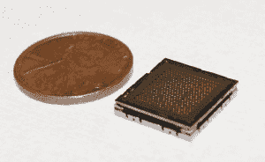
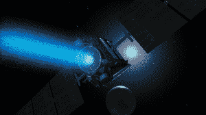
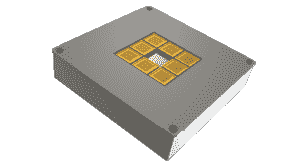

# Accion Systems 在 A 轮融资中筹集 750 万美元，以加速微型太空推进器的生产 

> 原文：<https://web.archive.org/web/https://techcrunch.com/2016/05/12/accion-systems-raises-series-a/>

开发微型空间推进系统的公司 Accion Systems 已经筹集了 750 万美元的首轮融资，由[沙斯塔风险投资](https://web.archive.org/web/20221127014510/https://www.crunchbase.com/organization/shasta-ventures#/entity)牵头。

RRE 创投、方正集体和 Slow Ventures 也参与了这轮融资。该公司此前从种子基金中筹集了 200 万美元，从与国防部的合作中筹集了 650 万美元。

虽然最出名的可能是他们早期对 Nest 的[投资](https://web.archive.org/web/20221127014510/https://beta.techcrunch.com/2014/01/13/nest-investors-strike-it-rich/)，但这并不是沙斯塔风险投资公司的第一笔航空交易。商业无人机公司 [Airware](https://web.archive.org/web/20221127014510/http://www.shastaventures.com/companies/airware) 和 [Spire](https://web.archive.org/web/20221127014510/https://beta.techcrunch.com/2016/02/12/newcomer-rocket-lab-secures-spire-as-their-next-customer/) ，一家计划发射 100 颗卫星星座的公司，都在沙斯塔风险投资公司的投资范围内。

Accion Systems 没有驾驶无人机或发射卫星，而是开发了一种独特的太空推进系统，这种系统足够轻，可以安装在小型卫星上，当同时使用许多卫星时，也可以扩展为大型航天器提供推进。

Accion 推进器/成像仪由 Accion 系统公司提供

Accion Systems 成立于 2013 年，将一种微型电喷雾离子引擎商业化，此前该引擎在麻省理工学院的一个实验室中经过了多年的开发和测试。

每个离子引擎大约只有一便士大小，通过以非常高的速度加速带电粒子来产生推力。根据卫星的大小和所需的推力水平，可以在任何给定的卫星上安装许多这样的发动机。

离子发动机长期以来一直是航天器推进的一个有吸引力的选择。美国宇航局自 20 世纪 50 年代以来一直使用太阳能电离子推进，最近投资 6700 万美元，努力使其更有效地用于深空探测。

黎明号飞船及其传统太阳能电离子推进系统的插图/图片由美国宇航局提供

但是这些传统的离子引擎体积相对较大，而且像其他的推进器一样，不可能安装在更小的卫星上。

小型商业卫星的数量也在增长。更便宜、更小的航天器技术和对地球观测相关应用日益增长的需求促成了[越来越大的](https://web.archive.org/web/20221127014510/http://finance.yahoo.com/news/small-satellite-market-type-application-225800274.html)小型卫星和微型卫星市场。

那些公司希望他们的小卫星能力更强，这往往需要增加太空推进。

小型化离子引擎可以让这些公司第一次在其系统中包括推进装置，从而使卫星更有能力。这些能力中最重要的是延长航天器在轨道上的运行寿命，以免其在重返大气层时受到大气阻力而烧毁。在轨道上的时间越长，意味着每颗卫星带来的收入越多。

Accion Systems MAX-1 推进系统/图片由 Accion Systems 提供

Accion Systems 公司正在与航天工业的老牌公司 Busek 公司争夺小型卫星市场的业务。

Accion Systems 首席执行官 Natalya Brikner 告诉 TechCrunch，虽然 Busek 在 Accion Systems 方面有近 30 年的经验，但她的公司的专利设计使其比 Busek 的同等电喷雾产品具有更长的使用寿命。

布里克纳在二月份告诉 TechCrunch，他们正在[开始](https://web.archive.org/web/20221127014510/https://beta.techcrunch.com/2016/02/18/space-propulsion-start-up-accion-systems-starts-taking-orders/)接受他们的第一批订单。迄今为止，该公司已经与三个合作伙伴签约:一个政府和两个商业客户。

> “首批订单将于 2017 年交付，我们目前正在为首批交付签署数量有限的额外合作伙伴。”Natalya Brikner，Accion Systems 首席执行官

有了额外的资金，Accion Systems 计划过渡到全面生产模式。

> “我们正处于公司历史的转折点。我们正从纯粹的工程和产品开发转向生产。是时候壮大团队，建立强大的运营基础，并开始交付我们的第一批订单了。”Natalya Brikner，Accion Systems 首席执行官

小型卫星的小型化空间推进为不断增长的小型卫星市场带来了很大的希望。未来几年与商业合作伙伴的进一步飞行将有助于确定这项技术是否符合宣传。