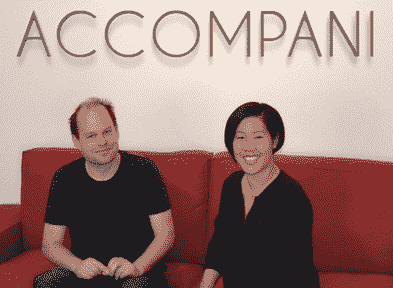

# 科塔尼想成为关系经理来统治他们所有人

> 原文：<https://web.archive.org/web/https://techcrunch.com/2014/06/16/accompani-wants-to-be-the-relationship-manager-to-rule-them-all/>

我们中的许多人都面临着同样的问题——随着我们的职业网络的增长，我们无法跟踪每个人的详细信息，包括工作、个人兴趣、孩子、新闻等等。艾米·常(Amy Chang)，前谷歌分析和测量产品全球负责人，花了很多时间思考这个问题。她和她在谷歌的前同事马蒂亚斯·于尔创建了一项服务，他们希望这项服务能不可逆转地改变关系管理。

正如 Chang 解释的那样，“在你的职业生涯中，你的网络是你最强大和最专有的资产，但目前没有任何服务可以帮助你深度管理它，通过相关的环境加强它，并每天从它的全部潜力中受益。”

当她和于尔帮助建立谷歌分析时，他们得出了三个主要观察结果。谷歌分析看到了主要的牵引力，因为它是一个容易有用和可用的产品。正因为如此，员工将谷歌分析作为个人带入公司，然后在整个组织中传播，因为他们强烈感受到它的价值。

第二，Chang 说，分析提供了一种体验，用户只需投入很少的信息，就可以立即获得大量的洞察力。最后，数据需要为用户服务。例如，和常开发了 Google Analytics Intelligence，以便让系统始终为用户服务，定期筛选交互数据，扫描模式和异常，而用户无需动一根手指。

目前仍处于 private alpha 阶段的伴奏合唱团希望将这些原则应用到关系管理中。虽然张艺谋和还没有准备好透露具体细节，但我们知道的是。

该公司开发了一种基于 iOS 和网络的产品，可以整合你的电子邮件、联系人和社交信息，帮助你管理与联系人的关系。该应用程序将智能地合并联系人，并使用专有算法，根据你的互动和参与信号显示最相关的内容。

“这不是一个小吃，这是一个完整的平台，给你在职业生涯中管理关系所需的一切，”Chang 解释说。

例如，在 Accompani 上，注册后 30 秒，该应用程序已经为你提供了从建立长期关系到准备下一次会议的各种见解和背景信息。伴奏还可以为每个用户及其所有联系人创建重要性和相关性排名。底层技术将鼓励其用户检查他们最重要的联系人，并将显示与联系人相关的有趣内容。Chang 进一步解释说，用户永远不会毫无准备地去会见对他们来说重要的人。“关于一个人的最重要的背景应该可以在任何地方、任何时间、任何设备上获得。而且用起来应该是一种享受。这是伴奏，”她说。

在人才方面，科塔尼已经悄悄地建立了一支令人印象深刻的工程师、产品经理和设计师团队。Chang 本人在谷歌工作了七年。她于 2006 年创立了谷歌分析，并帮助该产品在全球 100 万个顶级网站中从 1%增长到 70%以上。Chang 还在 Informatica 董事会和 Target 数字顾问委员会任职，并拥有斯坦福大学硬件和网络系统专业的本科和研究生学位。于尔在谷歌工作了九年，拥有大量大数据专利，并拥有麻省理工学院的计算机科学博士学位。

去年，伴奏合唱团还筹集了一轮 A 轮融资，金额达 560 万美元，由 Charles River Ventures 领投，Cowboy Ventures 和 Floodgate 参与其中。CRV 合伙人 Devdutt Yellurkar 评论说，随着专业人士被收件箱、社交订阅源等信息淹没，我们的网络变得更加复杂。他说，需要一个应用程序来智能地帮助确保人们与最重要的关系保持联系，并补充说，在当前的陪伴用户群中，参与度“超出了图表”

前易贝高管洛里·诺灵顿一直在测试这款应用，她说这是她早上打开的第一件事，也是她睡觉前检查的最后一款应用。该应用最令人印象深刻的一点是，它能够与她的网络无缝集成，并开始提供智能见解和建议，而无需她的太多输入。

在我看来，关系管理领域仍未被打破——这意味着没有一个几乎每个人都喜欢用智能方式管理联系人的专用应用程序。但许多创业公司和公司都在努力满足这种需求。

关系管理领域充满了竞争对手，而伴随尼正在加入一个拥挤的市场，其中包括 RelateIQ、LinkedIn 和 [Refresh](https://web.archive.org/web/20230322160428/https://techcrunch.com/2014/04/10/refresh-makes-you-smarter-at-meetings/) 等。

但是我有机会和伴奏一起玩，没有给出太多的细节，也没有太多的相似之处。我同意 Norrington 的观点，即它可能是你每天早上都想打开的应用程序之一，以了解你在会见谁，在一天中从一个会议前往另一个会议以刷新你的记忆，并在晚上探索管理从会议收集的信息的方法等等。

Chang 承认存在竞争，但他说团队现在专注于用户。她补充说，如果伴奏能够让用户感到愉悦和惊喜，那么竞争就不是一个因素。

敬请关注。