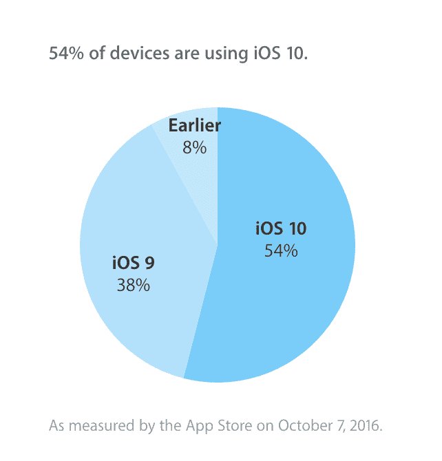
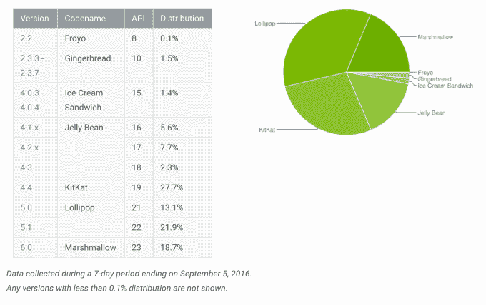

# 根据苹果的官方数据，iOS 10 的采用率现在达到了 54%

> 原文：<https://web.archive.org/web/https://techcrunch.com/2016/10/11/according-to-apples-official-figures-ios-10-adoption-rate-now-at-54/>

苹果公布了自己官方的 iOS 10 采用率测量数据，该数据为 54%。这意味着大多数 iOS 设备用户都在运行新的移动操作系统。然而，有趣的是，苹果的官方数字与本周早些时候发布的第三方估计数字[和](https://web.archive.org/web/20230404051303/https://techcrunch.com/2016/10/10/ios-10-hits-two-thirds-of-devices/)有多么不同，后者在其安装群中的采用率要高得多——事实上高达三分之二。

据[报道，两家公司发现，大约 66%的设备安装了 iOS 10。这两个数据集都基于使用该公司 SDK 的应用程序。在 Fiksu 的案例中，该公司报告了大约 1000 万个事件的批量每小时采样的数据，经过过滤以计数独特的设备；与此同时，Mixpanel 声称其报告是“从 300，083，243，931 条记录中生成的”Mixpanel 告诉我们，这相当于上亿独立用户的样本量。](https://web.archive.org/web/20230404051303/https://techcrunch.com/2016/10/10/ios-10-hits-two-thirds-of-devices/)

然而，就苹果而言，它是通过应用商店访问量来计算 iOS 的采用率的。这是一种更准确的确定方式，因为它不要求用户在设备上安装运行第三方特定 SDK 的应用程序。

根据苹果的数据，现在有 54%的人使用 iOS 10，38%的人使用 iOS 9，只有 8%的人运行的是旧版本的 iOS 移动操作系统。

同样值得注意的是，我们已经确认，在 iOS 更新可用的前两周，苹果没有提示用户升级他们的设备——这一延迟也在第三方公司的图表中发现。采用率在 9 月底急剧上升，这是警报通知开始冲击用户设备的时候。

据我们了解，推迟升级通知的决定是为了缓解苹果基础设施及其 Apple Care 支持团队的压力。这是苹果第一次实施推迟升级通知的新政策，以便更顺利地推出 iOS。在最初的升级热潮消退后，该公司才开始提醒尚未升级的用户，他们可以升级。

尽管延迟通知用户，但现在超过一半的活跃用户群转移到了 iOS 10。相比之下，比 iOS 10 早几周发布的 Android 7.0“牛轧糖”只安装在 0.1%的设备上。之前的版本，Android 6.0“棉花糖”，仍然存在于 18.7%的设备上，其他之前的版本也仍然占有很大一部分份额。

在某种程度上，这是因为在大多数情况下，Android 更新是由制造商和运营商处理的，而不是直接由谷歌处理。从历史上看，这对于谷歌来说是一个巨大的问题，不仅是因为安全原因，还因为它分裂了生态系统，使谷歌很难使用相同的功能和工具获得其整个安装基础。该公司表示，即使有了新的旗舰手机 Pixel，谷歌也允许威瑞森处理所有系统更新(T3)，除了安全补丁。