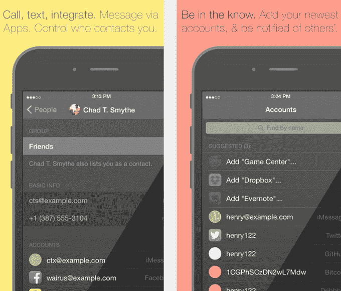

# Accounts 为 iOS 推出了一个新的地址簿，可以追踪你的许多身份 

> 原文：<https://web.archive.org/web/https://techcrunch.com/2014/11/07/accounts-launches-a-new-address-book-for-ios-that-tracks-your-many-identities/>

一个名为 [Accounts](https://web.archive.org/web/20221202075910/http://accounts.ms/) 的应用程序，现在在 iOS to start 上运行，是开发通用地址簿的新尝试。虽然在它之前的许多竞争对手都专注于聚合主要社交网络的用户账户，如脸书、LinkedIn 和 Twitter，但 accounts 很有趣，因为它试图对用户社交网络的长尾进行分类。在账号上，你可以添加 Yo、Steam、Fitbit、Reddit、Tango、Venmo 等小众的社交账号，然后确定哪一组联系人(工作、家庭、学校等。)可以查看您的相关信息。

该应用程序已经开发了一段时间，自从创始人 Ben Guild 在 5 月份首次与我们分享他的想法以来，已经经历了多次修改。本周，在根据用户反馈对概念进行迭代后，它将在 iTunes 应用商店推出 beta 版。

这个想法本身就很吸引人。随着移动通讯应用的兴起，其中许多应用与我们整体身份的不同方面相关联——例如，Yammer 是为了工作，Snapchat 是为了娱乐——我们的社交活动变得支离破碎。如今，很少有通讯录能让我们识别、汇总和联系我们所有的账户。

有了新的应用程序，一切都变了。在手机上输入联系人后，你可以进入应用程序中的个人资料，添加几十个帐户的用户名，这些帐户包括社交网络、手机信使、游戏网络等等。您添加的每个帐户都可以切换为对特定群组可见或不可见，或者您可以将帐户设定为对“所有人”可见或不可见

当您更改自己的帐户时，与您联系的其他人的通讯簿也会更新。

当然，这种自动更新地址簿的想法以前已经尝试过了。从多年前垃圾的 Plaxo 服务到最近的 Cobook ( [被 FullContact](https://web.archive.org/web/20221202075910/https://beta.techcrunch.com/2014/01/15/fullcontact-acquires-cobook-to-build-a-better-universal-address-book/) 收购)、[胡敏](https://web.archive.org/web/20221202075910/https://beta.techcrunch.com/2014/08/13/humin-the-app-that-organizes-phone-contacts-by-how-you-know-them-launches-in-the-app-store-today/)或[布鲁斯特](https://web.archive.org/web/20221202075910/https://app.brewster.com/landing)等应用。

不过，Accounts 没有这些新应用程序的优雅和用户友好性。它的深黑色背景让它看起来更适合在安卓手机上使用，而在账户中设置个人信息的手动操作非常繁琐。

此外，任何通讯录新用户都面临着一个始终存在的挑战:你的朋友不会在这个东西上，这最终会限制任何内置专有功能的实用性。(例如，在“帐户”中，如果打开了 Wi-Fi 和蓝牙，您可以立即与无线范围内的新朋友联系。俏皮，但谁在附近连接？该公司表示，当朋友加入新应用时，该应用还会提醒你。)

一天结束时，账户让我想知道是否大图愿景最终是有缺陷的。我真的想把我的多重的、小众的社会身份聚集在一个屋檐下，然后担心谁可以访问这些信息吗？也许更有意义的是，将众多应用程序本身与一个身份联系起来，并在每个应用程序中开发独特的联系人列表。你的玩家身份在 Xbox Live 上。你的健身伙伴在 Fitbit 上。你的家人在苹果的“查找我的朋友”上。诸如此类。

这种方式需要的配置和权限设置更少，您需要考虑的只是手边的活动:照片共享、发短信、视频聊天等。，而不是*“这个谁能看出来？”*

我以前的 it 呆子一面最初被帐户内的许可选项所吸引，但就像把人们拖入 Google+圈子一样，这是一个很酷的概念，只是没有规模。

在我看来，账户是管理身份的一个有趣的实验，但对我个人来说没有意义。正如他们所说，你的里程可能会有所不同。

账户是 iTunes 上的免费下载。Android 即将推出。