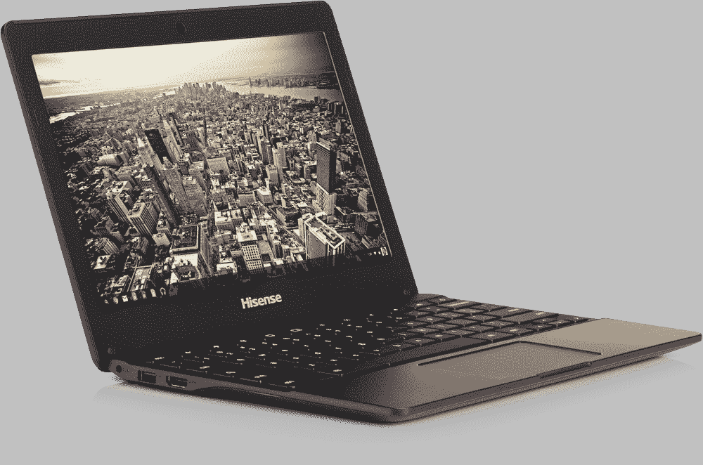
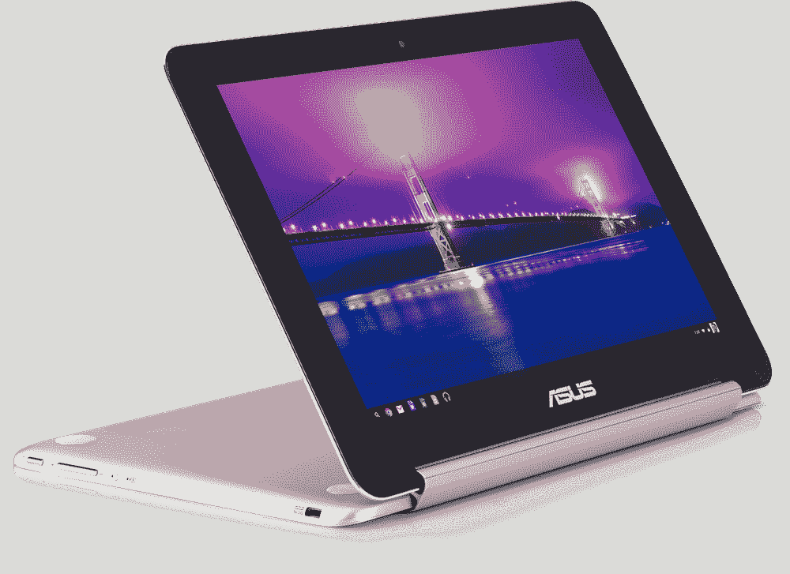
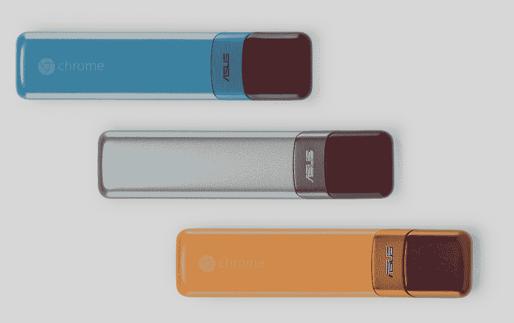

# 宏碁和海尔推出 149 美元的 Chromebooks，华硕预览 Chrome OS 敞篷版和 HDMI 棒

> 原文：<https://web.archive.org/web/https://techcrunch.com/2015/03/31/acer-and-haier-launch-149-chromebooks/>

几周前，谷歌发布了新款 Chromebook Pixel T1，成为头条新闻，这是市场上最高端的 chrome book(价格也很合理)。今天，Chrome OS 笔记本电脑生态系统推出了两款完全相反的产品:海尔 Chromebook 11(现已在亚马逊的[在线销售)和海信 Chromebook(现已在沃尔玛](https://web.archive.org/web/20230130100805/http://www.amazon.com/dp/B00V3DYVLM)的[销售)。这两款 11.6 英寸的 chrome book 零售价都将为 149 美元，这使它们成为迄今为止最实惠的 chrome book。](https://web.archive.org/web/20230130100805/http://www.walmart.com/ip/44389793)

此外，谷歌今天宣布，华硕计划很快推出 249 美元的可转换 Chrome book/平板电脑，以及 Chromebit，这是一款基于 HDMI 棒的全功能 Chrome OS 计算机，类似于英特尔的[计算棒。这两款产品的上市日期还不清楚。](https://web.archive.org/web/20230130100805/https://www-ssl.intel.com/content/www/us/en/compute-stick/intel-compute-stick.html)

即将推出的还有 11.6 英寸、售价 169 美元的华硕 Chromebook C201。这一款也是基于 Rockchip 四核处理器，也有 2GB 和 4GB 版本。它将于 5 月在亚马逊上市。

海尔和海信的新款 Chromebooks 采用了 Rockchip 的 3288 系统芯片。当你读到这封信的时候，很可能你只是看了两眼。毕竟，Rockchip 并不是一个家喻户晓的名字。但是这家公司不是一家不可靠的公司。该公司成立于 2001 年，是中国领先的无晶圆厂半导体公司之一，最近[与英特尔](https://web.archive.org/web/20230130100805/http://newsroom.intel.com/community/intel_newsroom/blog/2014/05/27/intel-enters-into-strategic-agreement-with-rockchip-to-accelerate-expand-portfolio-of-intel-based-solutions-for-tablets)签署了一项战略协议，将其凌动内核整合到其部分产品中。然而，3288 SoC 是基于 32 位四核 Cortex 17 设计的 ARM 芯片。

对于大多数用例，3288 应该提供体面的浏览速度。我们还没有看到它的实际应用，但它在许多基准测试中超过了英特尔最近推出的一些 Atom 芯片。

海信和海尔 Chromebooks 的基本规格基本相同:2GB 内存，16GB eMMC 闪存。两者都具有两个 USB 端口，SD 读卡器和 HDMI 输出，以及 720p 网络摄像头和 WiFi 和蓝牙天线。这两款设备都支持谷歌永远在线的“OK Google”语音命令，并配有谷歌略加修改的 Chrome 键盘。

除了 149 美元的版本，海尔还将提供 Chromebook 的第二个版本，配备更大的可移动电池，承诺 10 小时的电池寿命。普通版，海尔承诺 10 小时续航，海信 8 个半小时。

显示器通常是廉价设备的主要缺点。Rockchip 承诺其内置的 GPU 可以处理 4K 视频，但这些新设备上的显示并不完全接近 4K。

海尔 Chromebook 重 2.54 磅(类似于 11 英寸的 MacBook Air)，海信重 3.3 磅(与 Chromebook Pixel 完全相同)。

海尔和海信都指出，虽然这些设备很便宜，但仍然很坚固。例如，海信在其机器中添加了金属掌托，这应该比一些更昂贵的塑料 Chromebooks 感觉更好(我们应该很快就会有一个评测单元)。

随着这些设备的推出，Chrome OS 生态系统将与 Windows 世界并驾齐驱，据报道，微软[希望其原始设备制造商也将很快推出基于 Windows 10 的 149 美元笔记本电脑。](https://web.archive.org/web/20230130100805/http://www.digitimes.com/news/a20150327VL201.html?mod=3&q=MICROSOFT)

## 华硕 Chromebook Flip 和 Chromebit

华硕 Chromebit 的零售价应该低于 99 美元，也是一款 Rockchip 设备，配有 2GB 内存和与 Chromebooks 相同的 16GB eMMC 闪存。它基本上是一个糖果棒大小的 Chromebox(实际上我很惊讶它不被称为 Chromestick)。

作为一款 HDMI 棒，它的目标显然是希望将其用于移动工作人员的企业，以及希望将其用于店内展示的公司(毕竟，谷歌已经为 Chromeboxes 推出了类似的计划)。我很确定会有相当多的黑客也想玩这个设备。

