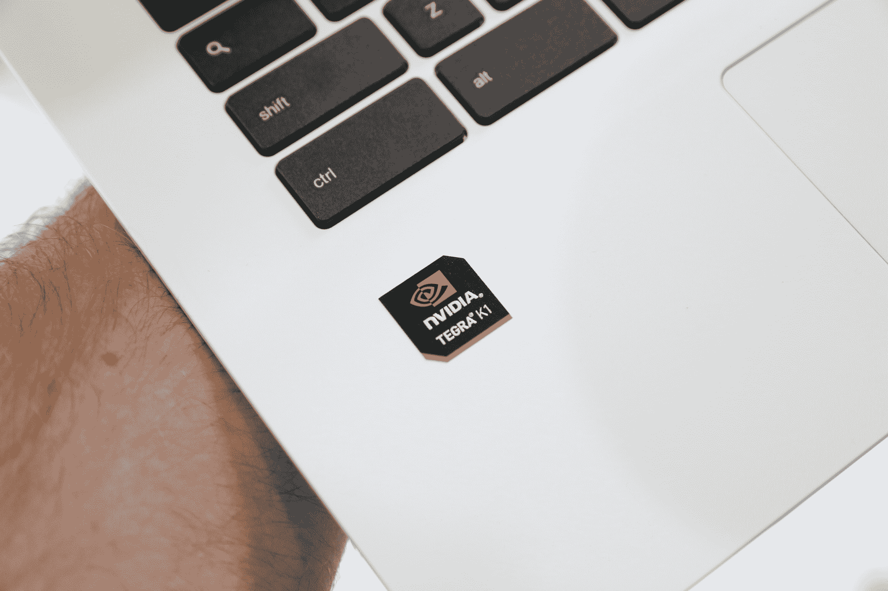

# 宏碁 Chromebook 13 评测:几乎可以弥补显示屏缺陷的电池 

> 原文：<https://web.archive.org/web/https://techcrunch.com/2014/09/04/acer-chromebook-13-review-a-battery-that-almost-makes-up-for-display-flaws/>

宏碁推出了一款新的 Chromebook，它正在寻找价格实惠的小型笔记本电脑中的冠军 Chromebook 13，顾名思义，它拥有 13 英寸的显示屏，尽管它拥有独特的高清显示屏选项，使其在一些竞争对手中脱颖而出。凭借高清屏幕和 11.5 至 13 小时(取决于您选择的型号)的电池寿命，宏碁新的 Chrome OS 硬件很强——但它仍然不是很好，尽管 Tegra K1 处理器使其令人印象深刻的能力成为可能。

## 基础

*   2.1GHz Nvidia Tegra K1 四核处理器
*   2GB 内存
*   16GB 固态硬盘
*   13.3 英寸 1920×1080 显示屏
*   英伟达开普勒显卡
*   蓝牙 4.0、802.11AC Wi-Fi、HDMI、USB 3
*   11 小时电池
*   建议零售价:299.99 美元
*   [产品信息页面](https://web.archive.org/web/20221006173656/http://us.acer.com/ac/en/US/content/series/acer-chromebook)

**优点**

*   良好的硬件设计
*   电池是真正的交易

**缺点**

*   显示质量差
*   表演没有达到标准

## 设计

[gallery ids="1052314，1052310，1052313，1052312"]

宏碁 Chromebook 13 是一款设计精良的电脑，因为它是全塑料的。无论是在打开还是翻盖式模式下，它都摸起来很结实，而且哑光的白色表面对视觉和触觉都很有吸引力。这款笔记本的下半部分带有纹理，这让它更容易抓握，也增加了设计上的区别，让人很难指责宏碁抄袭苹果的 MacBooks。

打开和关闭盖子不是最容易的，因为缺少一个可定义的闩锁，而且边缘很浅，但一旦你习惯了就没事了。一旦打开，Chromebook 还配备了一个漂亮的 chiclet 键盘，具有 Mac 风格，以及一个大而灵敏的触控板，其表面的纹理非常好用。

屏幕被宽边框所包围，这使得笔记本电脑看起来有点廉价，但话说回来，这是一台 300 美元的电脑，所以它肯定会在某个地方削减成本。不幸的是，总的来说，屏幕似乎是他们削减了很多成本的地方，但我稍后会谈到这一点。

## 表演

宏碁 Chromebook 13 在某些特定方面令人印象深刻——其关于电池寿命的声明并没有夸大，这款产品一次充电确实可以使用 11 个小时，对于大多数用户来说，这足以满足一整天的计算需求。这主要归功于英伟达 K1 移动芯片组的使用，该芯片组通常用于智能手机和平板电脑。K1 也有助于解释 Chromebook 的安静操作，这是通过无风扇设计实现的。

不过，总体而言，大多数用户不会注意到 Acer Chromebook 13 与市场上任何其他选项之间有任何明显的性能改进。Tegra guts 可能有助于它在图形或 3D 内容方面做得更好，但在尝试做其他事情时，它在多任务处理或流媒体方面没有表现出明显的改善。

Chrome OS 也取得了很大的进步，包括今天的一次更新，增加了多个帐户切换，但在我看来，它作为日常驱动程序桌面操作系统仍然不够，宏碁在硬件方面的工作无法改变这一点。然而，对于那些只需要一部手机或平板电脑的轻度用户来说，它应该符合要求。

## 屏幕

这可能是宏碁 Chromebook 13 最令人失望的地方，因为它吹嘘自己的图形功能。不可否认，笔记本配备的高分辨率显示屏是一个很好的补充，确实有助于提高 Chrome OS 的可用性，因为你可以并排排列更多的窗口。我听到其他人抱怨说，在我测试的 FHD 版本中，以 1920×1080 的分辨率渲染时，界面元素小了两个，但这对我来说不成问题。

然而，令人失望的是，显示器仍然很暗，从偏离中心的角度看很糟糕，而且通常看起来很便宜。对于一台售价 300 美元的电脑来说，这也并不十分令人惊讶，但这是 OEM 厂商在提高 Chromebook 的价值主张方面取得最大进展的地方，如果屏幕分辨率提高，观看角度和色彩渲染也更好，这将是一个很好的搭配。

## 电池

这是宏碁 Chromebook 13 的真正优势，也是它真正超越竞争对手的一个领域。测试中接近 12 小时的电池续航时间意味着，当你需要一台可以随身携带的电脑时，它可以走得更远，而且，尽管它有缺点，但这种电力正在被输送到几乎肯定需要额外电量的高分辨率屏幕。

如果宏碁想要吸引买家，除了吹嘘这一电池成就，它真的不需要做任何事情:它可能有缺点，但像这样的马拉松式的动力足以影响许多买家的决定，至少与当前 Chromebooks 的一般领域相比。

## 结果

毫不奇怪，300 美元的宏碁 Chromebook 13 并不完美。但是它有一些实际的改进，因为它独特地使用了 Nvidia 的 K1 移动芯片架构，这将为日常使用带来真正的效果。如果你对 Chromebook 没有迫切的需求，我仍然建议你不要买，但如果你有，这是你应该考虑的地方。