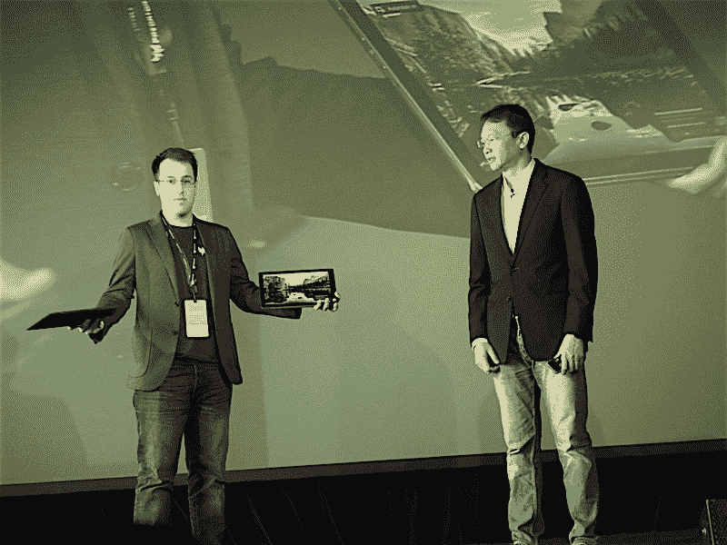
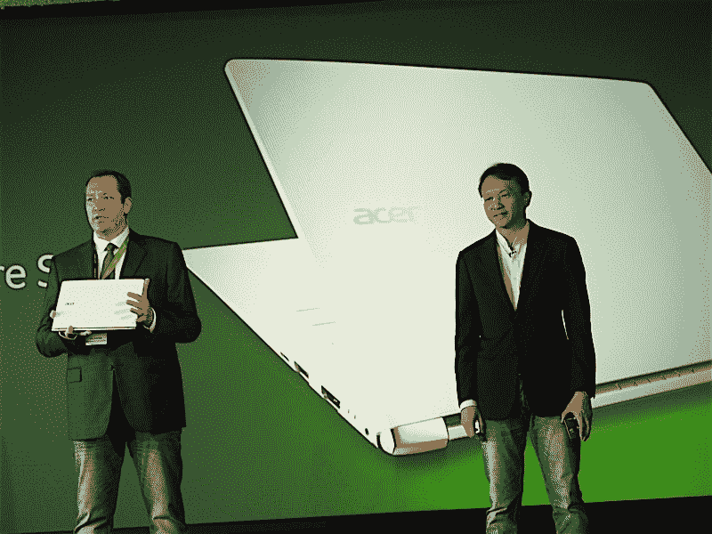

# 宏碁展示了坚固耐用的新 Chromebook 和一系列新笔记本电脑 

> 原文：<https://web.archive.org/web/https://techcrunch.com/2016/04/21/acer-chromebook/>

# 宏碁展示了一款坚固耐用的新 Chromebook 和一系列新笔记本

宏碁在曼哈顿一个世界贸易中心的阴影下举办了一个小型活动，展示了一些笔记本电脑，笔记本电脑和一些笔记本电脑。哦，还有一件事:笔记本，笔记本，笔记本(也有一些笔记本)。

notebooky 笔记本中的明星笔记本是该公司最新推出的 chrome book——直接命名为 Chromebook 14 for Work。

这款加固型设备的特点是防泼溅键盘和大猩猩玻璃外壳，该公司已同意将尺寸降至 48 英寸(这是一个军用标准 I，因为一台经验丰富的计算机会在机会出现时高兴地兜一圈)。内部是额定寿命为 12 小时的电池和英特尔酷睿 I 处理器。

这里还值得一提的是 Switch Alpha 12，这是一款 12 英寸二合一支架运动笔记本电脑，配有可拆卸键盘，为其第六代英特尔酷睿 I 处理器配备了无风扇液冷系统。与此同时，Predator G1 是一款便携式游戏笔记本电脑，内置三风扇冷却系统。

更便携的是 3.13 磅的 S 13，这是一款超薄笔记本电脑，配有可选触摸的 13 英寸高清显示屏和电池，据该公司统计，电池寿命可达 13 小时。这款笔记本电脑的设计显然是有针对性的，它有一个部分铝制的机身，该公司闪烁地指出，这是为了与“另一家以‘A’命名的公司”竞争。起价 699 美元，至少从经济角度来看，这款设备肯定很有竞争力。

请继续关注以上系统的一些实际体验。