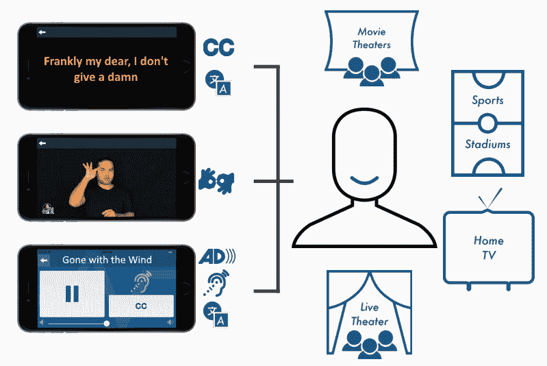
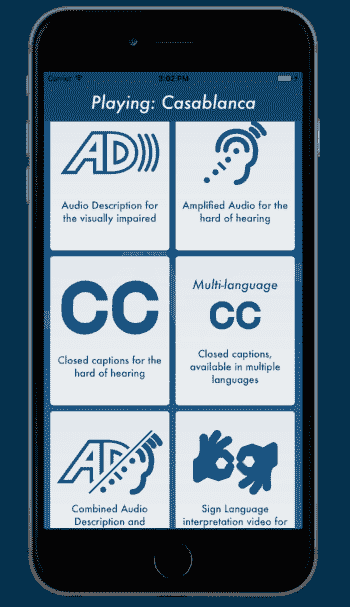

# Actiview 旨在简化数百万听障和视障人士观看电影的过程 

> 原文：<https://web.archive.org/web/https://techcrunch.com/2017/06/13/actiview-aims-to-streamline-movie-accessibility-for-millions-of-hearing-and-vision-impaired/>

大多数人不需要花很大力气去电影院看最新的电影，但对数百万美国人来说，事情并不那么简单。如果你有听力或视力障碍，获得必要的设备来为你提供放大的声音或场景描述可能是一种真正的痛苦，如果他们甚至可用的话。

[Actiview](https://web.archive.org/web/20221210034628/http://actiview.co/) 是一家初创公司，旨在让看电影变得像打开应用程序一样简单。为了启动这项事业，它将在《汽车总动员 3》的全国首映时推出。

问题很简单，用于可访问性的技术没有跟上世界其他地方的步伐。来自老牌影院音响和基础设施公司的定制硬件设置笨重且昂贵；一家影院可能会支付数千美元来获得足够的设备，以符合无障碍法律。

尽管存在一些技术上有趣的解决方案，如[索尼的闭路字幕眼镜](https://web.archive.org/web/20221210034628/http://www.syracuse.com/entertainment/index.ssf/2013/06/closed_caption_glasses_movies_regal_theaters_deaf.html)，但获得它们通常是一件苦差事——可能需要半个小时才能找到经理并安装好设备。一个影院可能有一个设备，另一个可能有第二个，或者根本没有。

索尼的 AR 字幕很简洁，但很贵，而且相当笨重。

真的没有一种解决方案可以为任何需要的人提供各种形式的可访问内容吗？亚历克斯·科伦认为你已经有了解决方案。

“我的手机是日常生活中的生命线，为什么我不能使用它？”科伦在接受 TechCrunch 采访时说。"业内资深人士认识到了这一点，但它被搁置了."

手机可以显示字幕，它可以携带音频，多种语言，场景描述，所有这些都是由剧院控制下的中央服务器提供的。

因此，科伦和他的联合创始人布劳恩·谢德决定让它成为现实。保罗·奇乔基也加入了他们，他在皮克斯从事了 17 年的后期制作工作。但很明显，他们不能跳进一个由老牌行业公司主导的领域。

连锁影院不想开放他们的系统，电影公司也不想交出原始文件进行测试。毕竟，盗版是一个问题，即使他们屈尊发送一部老电影的主文件，他们可能只是把 Actiview 纳入信任的发行商和连锁影院的紧密俱乐部吗？

由于不同的工作室或剧院使用不同的格式或设置(该公司通过一点逆向工程发现了奇怪的格式或设置)，没有简单的通用方法来获得音频——直到它离开系统，以波形从扬声器中出来。早期尝试重新传输这一点导致了整整两秒的延迟——这在影院中是不可接受的。

科伦和谢德直面这个问题，创造了一种超低延迟传输协议，他们称之为光速音频流技术。它通过 Wi-Fi 传输声音，几乎没有任何缓冲，更像是一种模拟传输。(当然，细节是商业秘密，但这里会有更详细的解释。)

【T2

剧院需要的只是一个大书本大小的盒子，它可以插入他们的 AV 系统并生成无线网络。用户需要的只是一个应用程序，他们可以在其中选择他们的电影和他们需要的内容:针对视觉障碍者的场景描述，针对听觉障碍者的放大音频和/或字幕，其他语言，甚至手语。

还有一个灵活的杯架支架，可以将手机固定在适当的位置，并阻挡光线，因此不会打扰其他人。这仍然比电池供电的 AR 字幕耳机更容易部署。

剧院将支付安装盒子的费用(几百美元)，然后按使用付费，几乎肯定比其他选择节省了金钱和时间。

wi-fi 盒的原型和几个杯架支架。

## 需要工作来获得获得工作的经验

当然，你不能就这么大摇大摆地走进国家影院的世界，即使你的系统很酷。但你需要在全国电影界证明自己，让任何人开始考虑你的平台。

为了打破创业公司经常遇到的这种循环，该公司首先与湾区的几家小影院合作。在那里，开发人员收到了反馈并清除了错误。科伦说:使用它的人肯定喜欢它。通过他们的行业关系，他们获得了主要工作室和连锁影院的观众。但是，当皮克斯决定尝试一下这项技术时，重大突破出现了。

毫无疑问，有小道消息称 Cichoki 正在开发 Actiview，Koren 告诉我，皮克斯的一名员工对帮助视障人士有兴趣，他在内部提出了这个问题。经过一番谈判，皮克斯同意让 Actiview 支持《汽车总动员 3》的首次亮相——至少是通过放大的音频和场景描述。

这不是一个正式的合作伙伴关系或任何东西，但皮克斯肯定是走了一步其他工作室还没有。

“如果一切顺利的话，我们将有机会拍摄更多的电影。对于应用程序的每一次下载，我们都向好莱坞证明这是值得的，”科伦说。

这种大规模的首次展示可能是 Actiview 获得曝光率和证明该系统有效所需的突破口。

不幸的是，这个系统的第一次主要练习没有完整的字幕或手语，因为皮克斯没有提供(至少现在没有)。但是这些方法实现起来要简单得多，并且已经在较小的影院上映过，所以聋人不需要担心——他们没有被遗忘。事实上，这款应用程序(其设计本身自然是可访问的)提醒新用户，他们可以期待其他功能的到来。

## 更广泛的可访问性平台

虽然电影是这种无障碍技术的显而易见的玩法，但 Actiview 热衷于以后采用更多的媒体。“电影只是我们要去的第一个地方，”科伦说。“我们想象这样一个世界，篮球和棒球比赛以及现场剧院都可以像这样进行。”

这一策略只是为了表明，是的，事实上，有数百万视力和听力受损的人真的想花钱买票，但却得不到满足。通过使满足这些需求的能力变得简单且经济实惠，任何一方都不会被遗漏。

 该计划的一部分是将内容也带到云上(你不会认为我们没有说“云”就已经读了一千个单词了吧？)——因为 Actiview 还旨在成为你在家看电影和电视时的一个辅助选项。

像网飞这样的公司可能会为自己的节目提供场景描述这样的无障碍音轨，但这绝不是规则。一个相对便宜的订阅服务(每月 3 美元左右，或者免费增值)将为用户提供完整的隐藏字幕库、美国手语伴奏和其他选项。

作为最后的激励措施，2018 年将有新的法规生效，对影院提出了更严格的要求:他们需要音频描述和隐藏字幕，以及基本的助听设备。恰好，Actiview 以比市场上其他选项低得多的价格满足这些要求，而且由于它是一个软件平台，它可以更新以反映新的法规或提供新的服务。

因此，如果帮助人们、省钱和增加门票销售的前景没有引起某个特定剧院的兴趣，也许不违反残疾法规的机会会引起兴趣！

除了《汽车总动员 3》的首次公开亮相，Actiview 还在筹集资金。该公司从媒体和无障碍空间的天使投资者那里筹集了 22.5 万美元，其中包括 DirecTV 和旧金山盲人灯塔的前首席执行官麦克·怀特。现在的目标是 150 万美元，这将有助于支付制造各种部件的费用——应该补充的是，这些部件是内部设计的，随时可以制造——以及在公司朝着下一个挑战发展时为公司配备人员。

科伦很有信心:“我对我们的投资者非常满意，我们相信融资不会很困难，”他说。

如今，这是一个适度的要求，尤其是对一家硬件初创公司来说，但潜力是存在的，可以成为一家大公司——更重要的是，可以对经常被硅谷自吹自擂的创新者遗忘的群体产生真正的积极影响。

Actiview 应该很快就可以下载了；试着告诉你当地的剧院——这很可能正是他们所期待的。