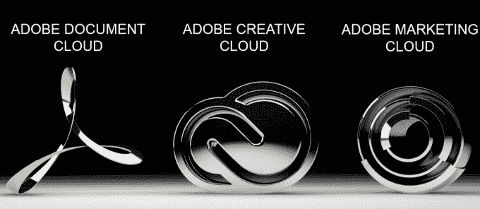

# Adobe 推出 Document Cloud，这是一项针对 Acrobat、EchoSign 和新应用程序的订阅服务 

> 原文：<https://web.archive.org/web/https://techcrunch.com/2015/03/16/adobe-brings-pdfs-to-the-cloud-with-its-new-acrobat-dc-service/>

在过去两年左右的时间里，围绕 Adobe 的新闻大多集中在它的 Creative Cloud 上，所以很容易忘记该公司在 Acrobat 文档领域也有巨大的业务。现在，随着[发布其文档云](https://web.archive.org/web/20221225193705/http://www.adobe.com/news-room/pressreleases/201503/031715AdobeIntroducesDocumentCloud.html)，它开始重新强调产品。

其核心是 Acrobat DC，这是一个适用于桌面、网络和移动设备的新版 Acrobat，将包括基于 Adobe EchoSign 的免费电子签名工具和相当多的智能图像处理和 OCR 技术。

该公司还推出了一个名为 Fill and Sign 的新移动应用程序，以及一个新的 Acrobat enterprise 解决方案，该解决方案具有额外的高级功能，如精细的权限控制和第三方集成。

所有这些新工具将在未来 30 天内推出，并将提供给目前每月支付 14.99 美元的现有 Acrobat Cloud 用户。Adobe 还将为 Acrobat DC 提供永久许可证。

Adobe 声称仅去年一年就有超过 500 亿个 pdf 被打开。其移动版 Acrobat reader 每天有 40 万次移动安装，EchoSign 现在已经处理了超过 1 亿份协议。但该公司也辩称，其用户仍然经常不得不求助于打印文件，因为他们需要获得签名。

据 Adobe 产品营销副总裁马克·格里利称，几乎 80%的基于文档的流程至少部分依赖于纸张。为了解决这个“最后一英里”的问题，Adobe 决定利用它从 Creative Cloud 中学到的知识并应用到 it 文档中。

这里的想法是创建一个跨所有平台的统一体验，电子签名是其中一个关键特性。

这是 Adobe 高级产品营销经理 Lisa Croft 给我的演示。假设你有一份需要签名的纸质表格。现在，您可以使用新的签名和填充应用程序为文档拍照。类似于像 [TurboScan](https://web.archive.org/web/20221225193705/http://turboscanapp.com/) 这样的移动应用程序，新应用程序将自动尝试识别表单的边界，但它也会清理表单，修复灯光，并执行一些操作，使其在数字表单中看起来更好。然后，你可以填写表格，电子签名，然后用电子邮件发送回去(例如，可能发给老师)。大多数情况下，你最终会在你得到的每张表格上填写相同的信息(姓名、地址、出生日期等。)和“填充和签名”允许您保存这些数据，然后快速将其添加到纸质表单中。

新的 Acrobat 移动应用程序也提供这些功能，但它远不止于此。在那里，你现在也可以扫描表格，但之后你可以去网上填写。不过，这里真正巧妙的是 Acrobat 也在文本上运行其 OCR 软件，然后将纸质文档重新创建为易于修改的可编辑文件。该软件试图将纸质文档的字体与 Adobe 的库中的字体相匹配，因此您编辑的文档看起来可能与纸质版本相同(反正大多数文档是以有限的几种字体打印的)。

在很大程度上，适用于 iOS 和 Android 的移动应用程序具有与桌面应用程序相同的工具，只有少数例外，如只能在桌面上使用的编校。格里利说，从长远来看，Adobe 可能会把填表和签名以及 Acrobat Mobile 整合成一个应用程序。为了存储文档，Acrobat DC 目前支持 Adobe 自己的存储解决方案和 Microsoft Sharepoint。