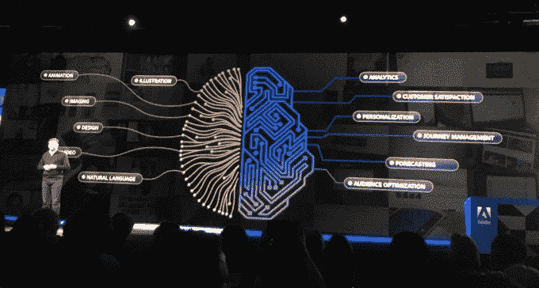

# Adobe 首席技术官领导公司的广泛人工智能赌注 

> 原文：<https://web.archive.org/web/https://techcrunch.com/2018/05/12/adobe-cto-leads-companys-broad-ai-bet/>

现在，没有一家软件公司不在进行某种人工智能计划。这些组织明白，人工智能将成为游戏规则的改变者，即使他们可能还没有完全理解这将如何工作。

在 3 月份的 Adobe 峰会上，我与 Adobe 执行副总裁兼首席技术官 T2 和 T4 谈论了一系列话题，包括公司在未来十年建立云平台的目标，以及人工智能在其中的重要作用。

Parasnis 告诉我，他有一系列广泛的职责，首先是为公司的技术战略定调的典型 CTO 角色，但绝不仅限于此。他还负责核心云平台的运营执行以及构建该平台的所有工程——包括人工智能和唤醒。这包括管理一个数千人的工程团队。最后，他负责所有的数字基础设施和 IT 组织，这只是他的一点职责。

## 十年后的今天

该公司从销售盒装软件转型为基于订阅的云公司[始于 2013 年，](https://web.archive.org/web/20230113080329/https://techcrunch.com/2013/05/06/adobe-goes-all-in-with-subscription-based-creative-cloud-will-stop-selling-regular-cs-licenses-shrink-wrapped-boxes/)远在 Parasnis 加入之前。这是一次非常成功的尝试，但是 Adobe 知道要想长期生存，仅仅摆脱盒装软件是不够的。当 Parasnis 到来时，下一步是以一种足够灵活的方式重新构建基础平台，以持续至少十年——是的，十年。

“当我们第一次开始考虑下一代平台时，我们必须考虑我们想要构建什么。这是一个巨大的提升，我们必须设计成能持续十年，”他说。这是一个巨大的挑战，因为随着时间的推移，很多事情都会发生变化，尤其是现在技术发展如此之快。

这意味着他们必须建立灵活性，以允许随着时间的推移发生这种变化，甚至可能是他们现在还无法预料的变化。该公司当然认为 AR 和 VR 等沉浸式技术以及语音是他们需要开始考虑的未来赌注——他们的基础平台必须具有足够的适应性来支持这一点。

## 让这一切苏醒过来

但 Adobe 也需要围绕人工智能做好准备。这就是为什么大约 18 个月前，该公司做出了另一项战略决策[，将人工智能](https://web.archive.org/web/20230113080329/https://techcrunch.com/2017/10/18/adobe-says-it-wants-ai-to-amplify-human-creativity-and-intelligence/)开发为新平台的核心部分。他们看到许多公司都在为开发人员寻找更通用的人工智能，但他们有不同的愿景，紧紧围绕 Adobe 的核心功能。帕拉尼斯认为这是该公司云平台战略的关键部分。“人工智能将是技术领域最具变革性的力量，”他说，并补充说，唤醒是迄今为止他花时间最多的事情。"

照片:罗恩·米勒

该公司开始考虑新的云平台，并牢记更大的人工智能目标，建立人工智能驱动的算法来处理核心平台功能。一旦他们改进了这些算法供内部使用，下一步就是向第三方开发者开放这些算法，以使用 Adobe 的人工智能工具构建他们自己的应用程序。

它实际上是[一个经典的软件平台游戏](https://web.archive.org/web/20230113080329/https://techcrunch.com/2015/05/06/apis-fuel-the-software-thats-eating-the-world/)，无论该服务是否涉及人工智能。从 Box 到 Salesforce 的每个云公司多年来一直在公开他们的服务，让开发人员利用他们的专业知识，以便他们可以专注于他们的核心知识。他们不必担心从零开始构建存储或安全性之类的东西，因为他们可以从一个具有内置专业知识的平台获取这些功能，并提供一种轻松将其集成到应用程序中的方法。

这里的区别在于，它涉及到 Adobe 的核心功能，所以可能是 Adobe Experience Manager 中的智能自动裁剪和智能标记，也可能是 Creative Cloud 中的 AI 驱动的可视化股票搜索。这些是 Adobe 软件体验的基本功能，该公司将这些功能打包成 API，提供给开发人员在他们自己的软件中使用。

无论 Sensei 能否成为未来 10 年驱动 Adobe 云平台的技术，Parasnis 和该公司都非常致力于这一愿景。在未来的几个月和几年里，我们应该会看到 Adobe 发布更多的公告，因为他们将更多的人工智能算法构建到平台中，并向开发者开放，供他们在自己的软件中使用。

帕拉尼斯当然认识到这是一个持续的过程。“我们仍有许多工作要做，但我们正朝着一个非常好的建筑方向前进，人工智能将是至关重要的一部分，”他说。