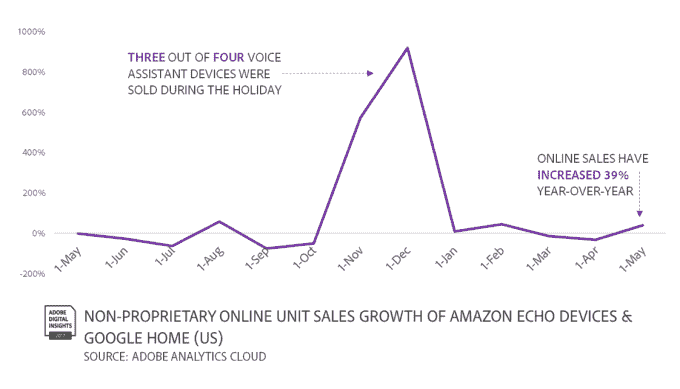
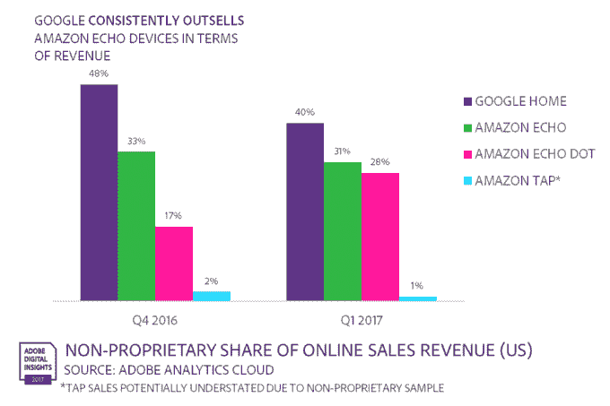
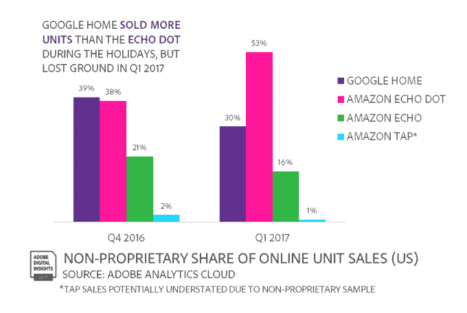
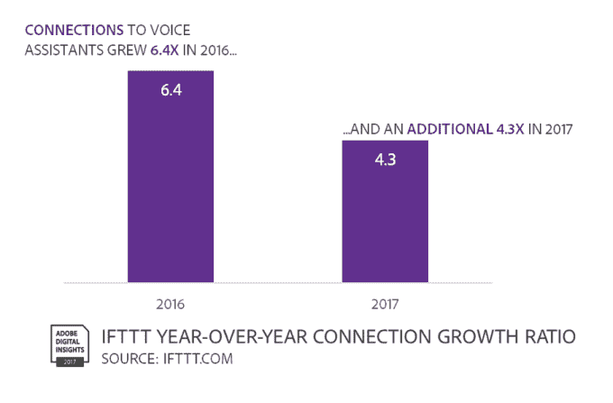

# Adobe: Echo Dot 现在领先语音扬声器销售 

> 原文：<https://web.archive.org/web/https://techcrunch.com/2017/06/29/adobe-echo-dot-now-leads-voice-speaker-sales/>

根据 Adobe 今天早上发布的新电子商务销售数据,在新兴的联网扬声器市场，消费者似乎被价格更实惠的亚马逊 Echo Dot 所吸引。然而，研究发现，谷歌在 11 月发布其竞争对手 Echo Google Home 的决定获得了良好的回报。在 2016 年假期期间，Google Home 的销量超过了亚马逊 Echo 和 Echo Dot，然后在今年第一季度输给了 Dot。

总体而言，Adobe 的报告为语音设备描绘了一个可观的市场，但它表示这个市场“还不算大”，并补充说这些设备“还不算是家庭用品”。

然而，这是一个稳定增长的趋势。Adobe 表示，网上销售额同比增长了 39%。这些设备在节日期间是特别受欢迎的礼物——在此期间售出了四分之三的语音设备。

Adobe 的这份报告基于对 2016 年 5 月至 2017 年 5 月在线零售商 143 亿次访问的分析，由 [Adobe 分析云](https://web.archive.org/web/20221210065033/https://www.adobe.com/advertising-cloud.html)测量，以及由 [Adobe 营销云](https://web.archive.org/web/20221210065033/https://www.adobe.com/marketing-cloud.html)跟踪的 1450 万次关于语音助手和语音助手设备的社交提及。

该公司没有披露其在线零售商客户的名称，但它对市场有着深刻的了解，因为美国 500 强零售商每 10 美元的在线消费中有 7.5 美元通过其分析云平台。它还通过其分析云跟踪美国前 100 家零售商 80%的交易。

然而，这些数据并没有描绘出智能音箱市场的全貌，因为它跟踪的是亚马逊和谷歌自己的店面外发生的在线零售。显然，这些网站对这些语音扬声器的大量销售负有责任 Adobe 没有这些数字。

相反，这是一个进入市场的窗口，而不是一个明确的快照。

也就是说，仍然可以发现一些有趣的趋势。

例如，谷歌主页在假期前后的收入都领先。

在假期期间，谷歌获得了 48%的收入，而 Echo 为 33%，Echo Dot 为 17%，亚马逊 Tap 仅为 2%。后来，谷歌下降到 40%，但仍超过 Echo 的 31%，Echo Dot 的 28%和 Tap 的 1%。(Adobe 表示，由于数据来源的原因，Tap 销售额在这里可能没有得到充分代表。)

Google Home 在假期期间的销量也超过了 Echo Dot，但只是勉强达到 39 %,而 Dot 为 38%。最初的回声报在此期间占有 21%的份额。

然而，假期过后，Dot 很快在单位销售方面赶上来，以 53%的份额超过 Google Home，而 Home 的份额为 30%。

这些数字表明，谷歌 Home 的推出时间在假日购物季能够推动其超过亚马逊设备方面发挥了重要作用。但这也反映了这项分析本身的数据——也就是说，美国非自营零售商的销售额并不能说明全部情况。

这项全面的研究还调查了语音助手的其他方面，如来自 IFTTT 服务的社交提及和定制互动。Siri 在社交热度方面仍然领先，尽管三星的 Bixby 在 3 月份发布时有所上升。

[gallery ids="1509782，1509783"]

与此同时，IFTTT 上的语音助手现在有 77.8 万个连接——例如，那些将你的 Alexa 待办事项列表与你的 iOS 提醒应用程序同步的连接。这一数字在 2016 年增长了 6.4 倍，在 2017 年增长了 4.3 倍。

更多数据见[这里](https://web.archive.org/web/20221210065033/http://www.cmo.com/adobe-digital-insights/articles/2017/6/21/voice-assistants-poised-to-be-the-next-tech-disruptor.html#gs.L3FNo9I)。

*图片/图形鸣谢:Adobe*