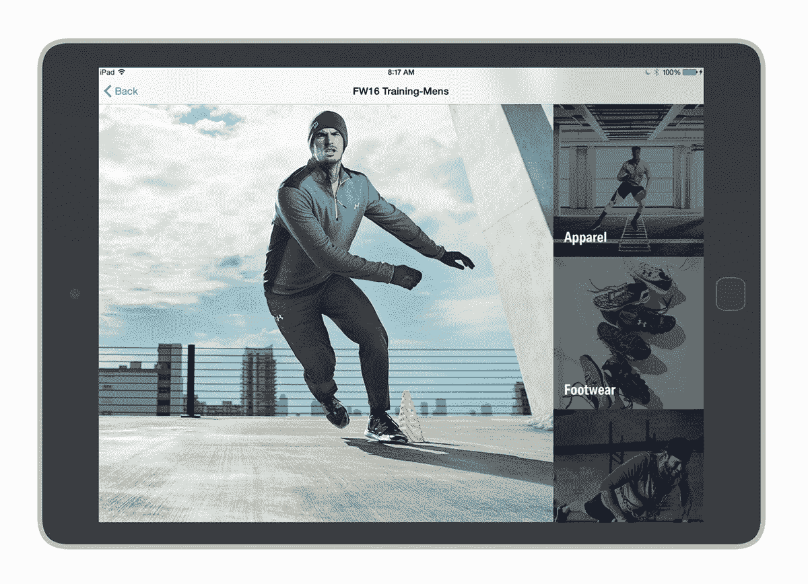

# Adobe 通过 Experience Manager Mobile、新的营销云核心服务 扩展其移动产品组合

> 原文：<https://web.archive.org/web/http://techcrunch.com/2016/02/21/adobe-expands-its-mobile-portfolio-with-experience-manager-mobile-new-marketing-cloud-core-services/>

Adobe 今天在巴塞罗那举行的世界移动通信大会上宣布了一系列新产品，这些产品将扩展该公司营销云中的移动核心服务集，并使企业更容易管理其移动应用程序的内容。

Adobe 的[体验管理器](https://web.archive.org/web/20230324041339/http://www.adobe.com/marketing-cloud/enterprise-content-management.html)，其用于构建内容丰富的网站的企业工具，今天得到了最大的更新。该公司正在推出 Adobe Experience Manager Mobile，这是 Experience Manager 工具的另一个版本，允许企业为 iOS、Android 和 Windows 构建和管理移动应用程序，并将其插入现有的企业内容管理系统。使用该工具，公司内部的任何人都可以为一个基本的内容驱动的移动应用程序构建一个模板，然后将其连接到公司的数据源。

通过体验管理器移动版，该公司本质上是将现有的——更以开发者为中心——体验管理器应用程序的功能与其更以设计师为中心的数字出版解决方案相结合。

Adobe 认为，对大多数公司来说，问题不在于开发应用程序，而在于维护它们并保持更新。

【T2

Experience Manger Mobile 的工作方式有点类似于 Adobe 的其他一些以设计师为中心的工具，如[Muse](https://web.archive.org/web/20230324041339/http://muse.adobe.com/)——但这里的重点更多的是建立模板并将它们与数据连接起来，而不是设计一个单独的 HTML 网站。Experience Manager Mobile 使用一种基于网格的设计工具，类似于 Muse 之类的工具，但设计师可以添加可以连接到企业数据源的“卡片”，而不是为应用程序编写静态内容。

所有这些也直接与 Adobe 的营销云集成，因此企业可以确切地看到他们的应用程序实际上执行得有多好，并将其与现有的营销解决方案集成。

目前，Adobe 只支持它自己的分析套件，这可能不会很快改变。该公司表示，其目标是让用户尽可能容易地整合分析。有了这个解决方案，他们只需在服务中输入一次分析报告的地址，从那时起，应用程序中发生的一切都会自动发送给分析。

在技术方面，使用体验管理器移动版构建的应用程序可以使用 [Cordova 插件](https://web.archive.org/web/20230324041339/https://cordova.apache.org/)和体验管理器移动 API 的组合来扩展，以将它们连接到业务系统。

## 新的核心服务

Experience Manager Mobile 以及 Adobe 的其他营销工具现在也将受益于许多旨在为开发人员提供更多营销选择的附加移动核心服务。

例如，新的移动体验增强使开发者能够利用基于位置的个性化。例如，你可能想向那些安装了你的应用程序并在你的商店附近的顾客发送一条信息。直到现在，这还不是营销云用户的真正选择，但现在集成起来非常简单。

营销云的这些核心服务中的新功能是将深度链接集成到应用程序中。毕竟，太多时候，从网络到应用程序的链接仍然会把你带到应用程序主页。

不过，这里最重要的更新可能是改进了对移动推送和应用内消息的支持。Adobe 正在为其所有营销云产品迁移到一个统一的消息平台，这将使品牌更容易通过推送消息发送深层链接。

https://www.youtube.com/watch?v=wnQ26NGGTK8&feature=youtu.be