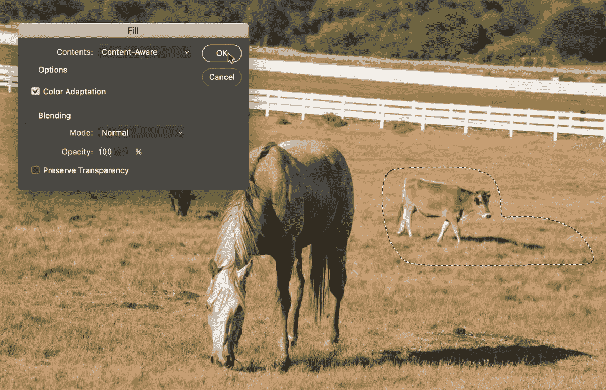

# Adobe 增强了 Photoshop 的内容感知填充，因此您有更多的选择，更少的人工智能失败

> 原文：<https://web.archive.org/web/https://techcrunch.com/2018/09/10/adobe-supercharges-photoshops-content-aware-fill-so-you-have-more-options-fewer-ai-fails/>

# Adobe 增强了 Photoshop 的内容感知填充功能，让你有更多的选择，更少的人工智能失败

当 Adobe 在 Photoshop 中推出“内容感知填充”时，每个人都为之疯狂。听起来无聊的功能实际上是一个非常有用的工具，本质上是一个人工智能驱动的克隆图章，它智能地引入图像的其他部分来取代你的选择。但它仍然以只有人工智能才能做到的滑稽方式失败了。随着 Adobe 即将推出的热门新工具，这种情况应该会少很多。

[在今天的一个先睹为快的视频中被取笑](https://web.archive.org/web/20230311151548/https://youtu.be/O9t5POPPNfg)，新的内容感知填充有大量新的设置，射击者会喜欢玩。摄影师喜欢调整东西——这是事实——他们必须调整的东西越多越好。

那么，以前是这样的…

…偶尔会产生这样的结果…

…现在有一个充满可爱选项的右侧菜单可供选择。

最重要的区别当然是当填充代理寻找要放入你的套索区域的东西时，能够选择图像的哪一部分进行采样。如果像上面的失败一样，它决定用马的部分来填充字段，您只需用几笔就可以将马从代理的考虑中排除。不需要精确——该算法足够智能，可以在没有少数像素因过于急切的鼠标操作而受损的情况下工作。

改进的算法还可以让你告诉算法，它应该自由地旋转和缩放它使用的元素，或者它应该镜像它找到的内容，使其更适合。

最后，您可以将填充输出到新图层-无损编辑对于任何数字艺术家的工作流程都至关重要。我无法想象为什么以前不是这样。

好吧，也许一些纯粹主义者会嘲笑那些用如此粗暴的手段来修理镜头的人。但是有时候你不得不去面对你已经得到的机会，有时候这里面有太多的奶牛了。因此，我至少欣赏做一些重大修改的选择，而没有手动克隆印记和其他技术的麻烦。

新的更新“即将推出”，所以请留意您的客户端的更新。