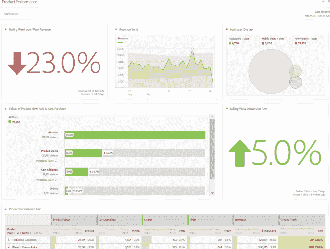

# Adobe 希望让每个在线零售商更具分析性 

> 原文：<https://web.archive.org/web/https://techcrunch.com/2017/09/27/adobe-wants-to-make-every-retailer-more-analytical/>

# Adobe 希望让每个在线零售商更具分析性

在最近的收益报告中，Adobe 报告了 T2 创纪录的收入，但是首席执行官山塔努·纳拉延承认他对体验云的结果有点失望。这是 Adobe 包含分析云的部分。今天，该公司宣布更新专门针对利润丰厚的零售/电子商务市场的分析产品。也许这不是巧合。

Adobe 瞄准这种专业产品的零售也不是巧合。这是近年来感受到破坏之痛最严重的一个行业，因为来自亚马逊的竞争尤其挑战了零售商，迫使他们找到更好的方法来了解他们的线上和线下客户。

正如 Adobe Analytics 的高级产品营销经理内特·史密斯(Nate Smith)所说，“今年，我们已经看到零售业发生了巨大的转变，出现了数十家破产和商店关闭——这在很大程度上是由于数字化正在如何扰乱这个行业，”他告诉 TechCrunch。

随着成功的在线零售商越来越了解他们的客户并提供更好的体验，消费者的期望也相应提高。正确使用分析甚至可以帮助竞争对手。“分析在帮助零售商了解谁是他们的客户方面发挥着作用，特别是谁是最高价值的客户以及他们的行为方式，”Smith 解释道。

很明显，不管你的业务是什么，你都需要数据驱动，这在零售业中甚至更为关键，但史密斯表示，那些在分析方法上落后或缺乏成熟度的公司可能会因追赶的前景而感到停滞或不知所措。

这就是 Adobe 希望通过今天的发布提供帮助的地方。该公司创建了专门针对零售行业的分析工作区。这些模板旨在快速启动零售商的分析，并帮助他们更好地了解他们的客户。

照片:土坯

但他们不只是想向这些公司展示他们各种在线营销计划的效果如何，他们还想揭露分析策略中的差距。这包括帮助指导他们建立更完整、更智能的分析方法。具体来说，模板是用内置异常检测和贡献分析的 Adobe Sensei 人工智能设计的。

这为零售商提供了对数据的实时访问，如转换率、产品性能网格、驱动访问的域和其他数据，这些数据对于零售商了解他们的客户以及他们在让访客从进入到购买方面做得如何至关重要。

Adobe 希望这些新产品能让那些在分析领域发展不太快的公司领先一步，同时帮助那些拥有更成熟的分析策略的公司继续发展。“这是一个反复的过程。你从小处着手，不要试图煮沸海洋。获取一些数据点，看到一个盲点，改进，让它变得更好。任何类型的分析洞察力都将有助于提高与客户互动的能力，”史密斯说。