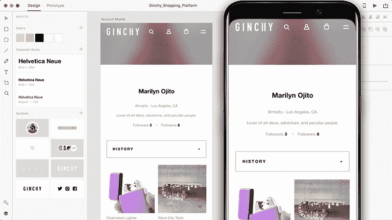
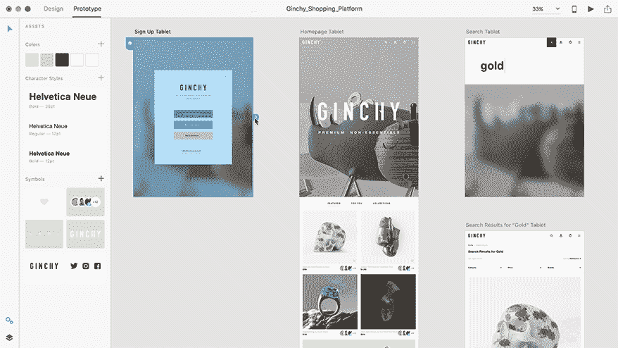
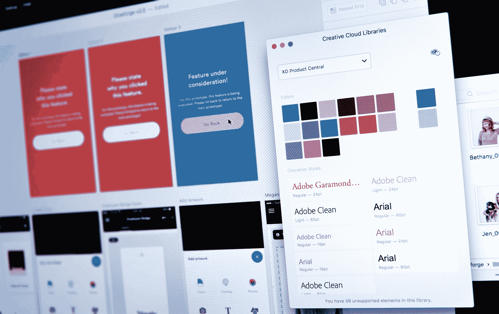

# Adobe 的 XD 原型和线框工具现已停止测试

> 原文：<https://web.archive.org/web/https://techcrunch.com/2017/10/18/adobe-xd-designing-at-the-speed-of-thought/>

XD 是 Adobe 的工具，用于帮助用户体验和用户界面设计师设计新的移动和网络应用程序的原型和线框。该公司早在 2016 年就开始测试这款应用[；](https://web.archive.org/web/20230407095928/https://techcrunch.com/2016/03/14/adobe-launches-experience-design-cc-a-new-tool-for-ux-designers/)今天终于出公测了。该公司今天在其年度 MAX 大会上宣布，XD(之前被称为 [Adobe 体验设计](https://web.archive.org/web/20230407095928/http://www.adobe.com/products/experience-design.html?red=a&tduid=335166cb6725431b354b17fdac4d46d5&url=http://www.adobe.com/products/experience-design.html)工具)现已发布 1.0 版本。

正如 Adobe 集团 XD 产品经理思科·古兹曼告诉我的，“XD 就是以思维的速度进行设计。”超过 100 万的下载量，XD 显然触动了业界的神经，许多公司甚至在测试阶段就已经将它作为核心工具。

“在今天的现代环境中，作为一名设计师，实际上不仅仅是创造视觉设计的美学，或者 UX 设计师可能要承担的工作流程，或者 UI 设计师要关注的交互，”古兹曼指出。“这实际上是与人合作，并尽早快速失败。”因此，这就是 Adobe 在开发 XD 时关注的问题:例如，构建工具来确保设计人员可以将时间花在设计上，而不必担心浪费时间来复制多种分辨率的东西。

因此，借助 XD，设计师现在可以轻松地将他们的解决方案制成线框，创建低保真度或高保真度的设计，并轻松地在画板和交互式原型之间转换。完成后，他们可以轻松地将资产导出用于生产。Guzman 开玩笑说:“XD 是一个 UX/UI 解决方案，面向那些希望以应用程序开始一天工作，并在一天结束时戴上帽子的设计师。”

在 beta 测试的过程中，该公司仔细听取了反馈，增加了许多功能，并对 XD 进行了大量的更改。例如，这意味着更容易处理重复的颜色、符号或图案，而且除了现有的团队协作注释功能之外，还要添加注释功能。该团队还利用这段时间来提高应用程序的整体速度，这是 Guzman 在我们的通话中多次提到的，它让应用程序感觉非常流畅。

展望未来，古兹曼说他们的团队还没有完成。“我们正在寻找所有那些存在摩擦的地方，设计师必须花时间研究那些与设计师的核心优势无关的东西，”他告诉我——这也是 XD 继续发展的指导哲学。

不过，具体来说，该公司表示，它将继续专注于核心工具，以增加一些功能，例如 JPG 导出和对布局网格的支持。很快还会有更多的第三方工具集成，如 [Zeplin](https://web.archive.org/web/20230407095928/https://zeplin.io/) 和 [Sympli](https://web.archive.org/web/20230407095928/https://sympli.io/) ，以及发布设计规范的能力。

