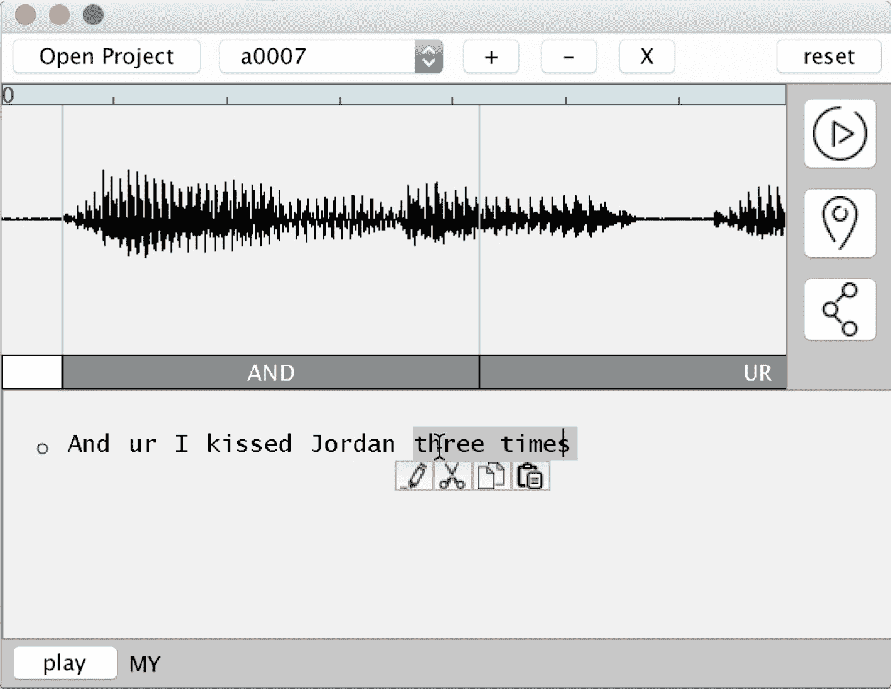

# Adobe 的项目 VoCo 让您可以像编辑文本一样轻松地编辑语音 

> 原文：<https://web.archive.org/web/https://techcrunch.com/2016/11/03/adobes-project-voco-lets-you-edit-speech-as-easily-as-text/>

# Adobe 的项目 VoCo 可以让你像编辑文本一样轻松地编辑语音

Adobe 今天在圣地亚哥举行的年度 [MAX 会议](https://web.archive.org/web/20230118052435/http://max.adobe.com/)上展示了一款新的实验工具 Project VoCo。Project VoCo 让您可以像编辑文本一样轻松地编辑语音，您不仅可以编辑现有的文本，甚至可以使用相同的声音模型来创建全新的录音。

这是如何工作的:项目 VoCo 需要来自给定说话者的大约 20 分钟的声音样本。然后，它分析语音，将其分解为[音素](https://web.archive.org/web/20230118052435/https://en.wikipedia.org/wiki/Phoneme)，转录并创建语音模型。如果你仔细听，你可以听到一个单词发生了变化，但这可能只是时间问题，你将无法区分实际的录音和编辑过的(或完全伪造的)录音。

正如 Adobe 在今天的演示中提到的，在 MAX 的一个小型新闻发布会上，该项目不是基于传统的语音合成技术，而是基于 Adobe 所谓的“语音转换”。这里特别有趣的是，几乎不需要人工干预。你总是可以修改自动生成的脚本来改进合成，但是不需要设置时间戳。算法可以自己算出来。

这项技术引发了各种各样的问题。如果你甚至不再相信听起来像是某人讲话的真实录音，会发生什么？然而，从纯技术的角度来看，这是一些令人印象深刻的东西。

在同一个新闻发布会上，Adobe 还展示了另外两个新的编辑项目:Project Quick Layout for——顾名思义——使编辑打印布局变得更容易，以及 Project Clover，这是一个可以在 VR 中工作的 VR 编辑工具。

就像所有这些“偷窥”一样，Adobe 不会承诺将它们发货，但多年来，它以这种方式引入的许多项目已经融入了公司的产品。

