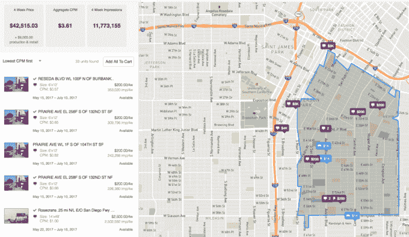

# AdQuick 筹集 110 万美元，将在线工具引入户外广告

> 原文：<https://web.archive.org/web/http://techcrunch.com/2017/07/14/adquick-seed-funding/>

# AdQuick 筹资 110 万美元，将在线工具引入户外广告

AdQuick 希望让广告牌广告更容易、更透明。

这家初创公司宣布，它已经从 Initialized Capital(由前 Y Combinator 合伙人 Garry Tan 和 Alexis Ohanian 创建)、VTF 资本(由 Zappos 的谢家华创建)和 Haystack Ventures 获得了 110 万美元的种子资金。

AdQuick 创始人马修·奥康纳(Matthew O'Connor)表示，他在包括 Instacart 在内的初创公司工作时，多次遇到广告牌广告世界。每一次，他都发现自己“困惑于为什么寻找和购买户外广告如此困难。”

他说，这是一个仍然由电子邮件、电子表格和 PowerPoint 演示主导的购买过程，广告购买者很少清楚他们所有的选择是什么，或者他们的活动是否真的有回报。

包括 [ADstruc](https://web.archive.org/web/20230331050010/https://techcrunch.com/2012/10/31/adstruc-relaunch-telmar/) 和[ad assemble](https://web.archive.org/web/20230331050010/https://techcrunch.com/2017/03/29/adsemble-open-display/)在内的其他公司也试图将更多的过程带到网上，但奥康纳认为，即使与这些竞争对手相比，AdQuick 也更多地采取了“技术优先”的方式。

同样，在一篇宣布 Initialized 投资的博客文章中，Ohanian(他自己也做了一些户外广告)写道，“我们已经为这项业务准备了近十年，但这无疑是最令人印象深刻的技术执行，而且处于非常早期的阶段。”

这项技术需要什么？在广告购买方面，AdQuick 汇总了各种不同公司的库存。目标是让买家全面了解他们在特定地理区域的选择，允许他们使用单一界面从多个供应商购买广告，甚至根据人口统计等因素来确定他们的活动目标。

在分析方面，奥康纳说，AdQuick 采用了一系列方法来衡量广告的效果。这包括创建特定于广告活动的短码，与谷歌分析和谷歌广告词整合，进行地理定位调查，并在社交媒体上使用图像识别来检测人们何时分享广告图像。

使用过 AdQuick 的广告商包括 Lyft、have 布洛克、Orange Theory Fitness ( [出现在本案例研究中](https://web.archive.org/web/20230331050010/https://news.adquick.com/see-how-adquick-proved-a-594-roi-for-orange-theory-fitness-using-outdoor-advertising-c655cd26d8ef))和奥康纳的前雇主 Instacart。