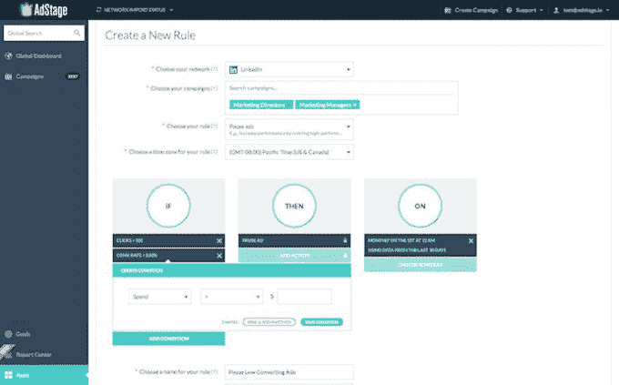

# AdStage 筹集 625 万美元，将其跨网络广告平台推向大众 

> 原文：<https://web.archive.org/web/https://techcrunch.com/2014/08/13/adstage-series-a/>

AdStage 是一家初创公司，其联合创始人兼首席执行官 [Sahil Jain](https://web.archive.org/web/20221207145737/http://www.crunchbase.com/person/sahil-jain-2) 表示，他计划“将真正的 SaaS 模式引入广告技术领域”，该公司宣布已经筹集了 625 万美元的 a 轮融资

该公司[在去年的发布会](https://web.archive.org/web/20221207145737/https://beta.techcrunch.com/2013/03/05/adstage-launch-funding/)上首次亮相，向客户承诺一种简单的方式来创建跨谷歌、必应、脸书和 LinkedIn 的广告。当年晚些时候， [AdStage 宣布了一个更广泛的平台](https://web.archive.org/web/20221207145737/https://beta.techcrunch.com/2013/09/24/adstage-platform/)，通过与外部工具和由 [AdStage](https://web.archive.org/web/20221207145737/http://www.crunchbase.com/organization/adstage) 自己创建的应用程序集成来扩展核心产品的功能。

除了资金，该公司还宣布了该平台的一个新成员— [自动化规则应用](https://web.archive.org/web/20221207145737/http://www.adstage.io/features/automation)。这些规则允许广告商决定他们的活动将如何改变(比如，通过调整预算或出价)以适应变化的环境。Jain(上图中穿着黑色 t 恤的人)将该应用描述为 AdStage 走向真正自动化的第一步，尽管自动化给了广告商很大的灵活性。

“每次竞选都不一样，”他说。"一个通用的算法实际上是行不通的."

AdStage 表示，超过 10，000 家企业(包括科技公司 New Relic 和 T2 zene fits)已经注册，链接了超过 20，000 个链接广告账户，在过去的三个月里，他们在 AdStage 管理的活动上花费了 2500 万美元。

尽管如此，该产品在技术上仍处于测试阶段。Jain 说，计划是在接下来的几个月里去掉 beta 标签。听起来，该公司仍在弄清楚当这种情况发生时会发生什么变化，但有一点肯定会发生变化，那就是 AdStage 的商业模式。

该公司目前每月收费 99 美元，Jain 计划增加更多的定价层级，特别是针对较大的公司。与此同时，他说他不希望计划变得过于复杂，他强调 AdStage 将坚持收取订阅费，而不是在广告活动上收取一定比例的费用。

这听起来可能是一个微小的区别，但 Jain 认为只有软件即服务模式才能吸引小型企业并“对大众有意义”此外，它迫使 AdStage 继续专注于构建真正的自助产品，而不是为大广告商承担大量定制工作。

他补充说，自动化规则应用程序实际上有助于这种方法，因为它给了 AdStage 一种快速帮助客户的新方法——客户经理可以直接进入客户账户，提出可能改善他们活动的新规则，而不是通过漫长的客户服务电话。

新一轮融资使 AdStage 的总融资额达到 878 万美元。它由[威瑞森风险投资](https://web.archive.org/web/20221207145737/http://www.crunchbase.com/organization/verizon-ventures)和[数字车库](https://web.archive.org/web/20221207145737/http://www.crunchbase.com/organization/digital-garage)领投，另外还有来自 Bay Partners 的[纽伯里风险投资](https://web.archive.org/web/20221207145737/http://www.crunchbase.com/organization/newbury-ventures)、[自由式资本](https://web.archive.org/web/20221207145737/http://www.crunchbase.com/organization/freestyle-capital)、[克里斯诺布尔](https://web.archive.org/web/20221207145737/http://www.crunchbase.com/person/chris-noble)和[尼尔邓普西](https://web.archive.org/web/20221207145737/http://www.crunchbase.com/person/neal-dempsey)的投资。