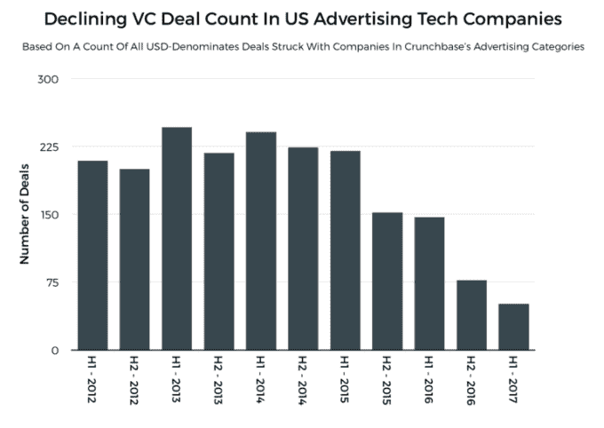
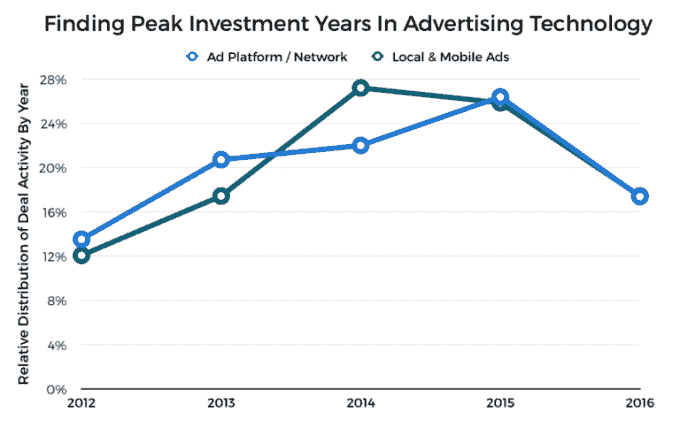
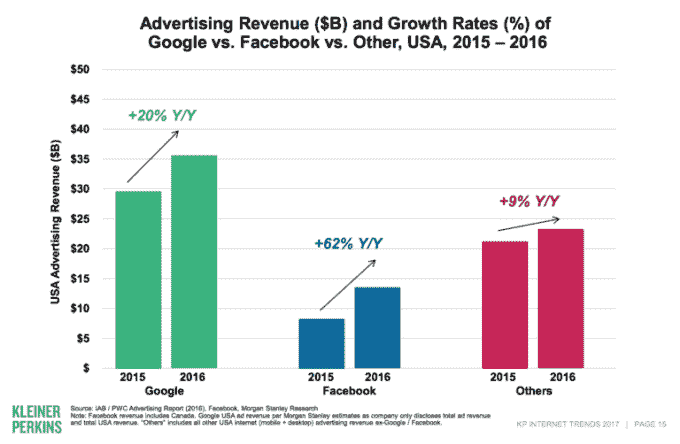

# 广告巨头给广告技术初创公司留下的空间很少，风投们也注意到了这一点 

> 原文：<https://web.archive.org/web/https://techcrunch.com/2017/06/13/advertising-giants-leave-little-room-for-adtech-startups-and-vcs-are-noticing/>

杰森·罗利是《金融时报》的风险投资和科技记者

[Crunchbase News](https://web.archive.org/web/20221006045532/https://about.crunchbase.com/news/)

.

More posts by this contributor

自商业网络诞生之初，用户和内容发布者之间就达成了一个浮士德式的交易:用户可以免费访问在线内容，交换条件是允许发布最新文字、图像和视频的发布者销售广告。

总的来说，这对数字广告商来说是一笔划算的买卖。

根据 Statista 上发布的[数据，2017 年全球数字广告支出总额预计约为 2290 亿美元。到 2020 年，这一数字预计将增长 45%以上，达到约 3355 亿美元。](https://web.archive.org/web/20221006045532/https://www.statista.com/statistics/237974/online-advertising-spending-worldwide/)

在许多行业，这种增长可能意味着新的市场机会已经成熟，可供快速发展的初创公司选择。但盈利能力集中在少数几家大公司，加上其他市场力量，让我们得出这样的结论:对广告技术初创公司的风险投资已经见顶。

## 描绘广告技术领域风险投资基金的崩溃

下面，我们根据 [Crunchbase 与美国公司在广告技术行业各子行业达成的近 2000 笔风险投资交易](https://web.archive.org/web/20221006045532/https://www.crunchbase.com/app/search/funding_rounds/52932ca4b505bd5eb458ba6a476d5ac73f02431f?utm_source=twitter.com&utm_content=buffer9f7c7&utm_medium=social&utm_campaign=buffer)的数据，绘制了交易活动的低迷期。

(注意:Crunchbase 的类别结构通常区分“广告技术”和“营销技术”，我们在这里重点关注广告技术。)

自 2013 年 H1 广告技术交易活动达到高峰以来的五年里，风险资本投资的速度下降了近 80%。

广告行业是多方面的，令人眼花缭乱的公司服务于几乎每一个可以想象的商业领域。也就是说，甚至一些更有前景的广告技术类别也可能经历过巅峰时期。

虽然没有足够的关于广告平台和广告网络，或本地和移动广告技术公司的原始数据来得出有意义的结论，但我们可以将这些子类组合成两组。通过绘制 2012 年初和 2016 年底这两个群体之间达成的交易的比例分布，我们可以看到，这些曾经辉煌的类别可能已经过时。

(注:其他有前景的类别，如社交媒体广告和视频广告平台，没有足够的数据进行分析。)

至少在过去的五年里，这两个群体不久前都达到了局部最大值。如果五年之间的每一年都相等，我们预计会看到 20%的持平线。但在过去五年中，本地和移动广告类别的公司达成的一系列交易中，有 27.2%是在 2014 年发起的。广告平台和网络初创公司在一年后即 2015 年发现了交易数量的峰值，当时约有 26.4%的交易达成。

当然， [2016 年对于几乎所有行业的风险投资](https://web.archive.org/web/20221006045532/http://about.crunchbase.com/news/inside-global-q1-2017-vc-market/)来说都是艰难的一年，因此有可能会从这些下滑中出现某种程度的复苏。尽管如此，第一张图表中描绘的广告技术投资活动的持续下降趋势可能表明了其他情况。

## (盈利)能力的集中

“我们这一代最聪明的人都在思考如何让人们点击广告，”杰夫·哈默巴赫尔说，他当时是脸书的一名早期雇员，在接受阿什莉·万斯为 T2 彭博商业周刊采访时说。

坚持不懈的结果是什么？在一个网络效应是所有价值的根本的行业中，这是一个良好的开端。根据[玛丽·米克尔 2017 年互联网趋势报告](https://web.archive.org/web/20221006045532/http://about.crunchbase.com/news/charting-growth-mary-meekers-internet-trends-report/)中的一张幻灯片，谷歌和脸书加在一起，在 2016 年赚取了美国互联网广告收入的大约三分之二。

这将剩下的三分之一美国互联网广告收入留给了其他所有人，包括 Twitter 和 Snapchat 等社交网络形式的较小竞争对手，BuzzFeed 等本土广告和媒体公司，Taboola 和 Outbrain 等出版商的工具(它们是许多新闻文章底部的古怪广告的负责人)，以及其他人的长尾。

但是，即使有广告技术的所有智力，仍然有可能遇到障碍。

## 不要跟着我

在过去的几年里，趋势已经趋于鼓励越来越多的网络用户安装广告拦截软件。这一主要趋势是越来越多令人讨厌的广告类型已经爬上了桌面和手机屏幕。

根据 adblock analytics 和有点反常的“防 adblock 广告服务”提供商 [PageFair](https://web.archive.org/web/20221006045532/https://www.crunchbase.com/organization/pagefair#/entity?utm_source=twitter.com&utm_content=buffer9f7c7&utm_medium=social&utm_campaign=buffer) 的[调查结果](https://web.archive.org/web/20221006045532/https://pagefair.com/blog/2017/adblockreport/)，截至 2016 年底，全球约有 6 亿台设备运行 Adblock 软件。在这些设备中，62%是移动设备。同一份报告指出，广告拦截软件的使用同比增长了 30%。

这种增加广告拦截器使用的趋势已经被一些浏览器制造商所接受。苹果公司的 Safari 浏览器拥有大约 3.6%的全球市场份额，将配备阻止网络追踪器和自动播放视频内容的功能。谷歌的 Chrome 浏览器控制着全球近 60%的浏览器市场，它将实施一种新的广告过滤器。

尽管广告开发商和广告拦截软件开发商之间似乎一直在进行军备竞赛，但几乎可以肯定的是，广告巨头可能比一些斗志昂扬的新贵更能经受住这场风暴。

## 高高的城堡里的广告

脸书和谷歌已经用我们的数据为自己建造了护城河。

只需看看谷歌和脸书，这两家公司都有能力继续主导数字广告行业，正是因为这些公司深入到了我们的生活中。

在很大程度上，脸书拥有我们沟通渠道和社交关系的数字模型，所有这些都是由社交图建模并反馈到社交图中的。谷歌拥有浏览器，电子邮件通信，视频消费习惯，最重要的是，超过四分之三的日常搜索引擎流量。

在这两家公司的案例中——脸书推出了即时文章项目，谷歌推出了移动网页加速项目，谷歌推出了移动网页加速项目——很有可能将网络内容从出版商所有的网站中分离出来，至少在移动领域，这将那些此前让互联网赚钱引擎运转的初创公司拒之门外。

对于广告领域的企业家来说，市场机会确实存在，并将继续存在，但市场的结构是这样的，收入增长的最大份额将流向一小撮现有企业，剩下的利润相对微薄。

难怪，至少现在，风投们越来越回避广告技术投资。护城河越来越宽。