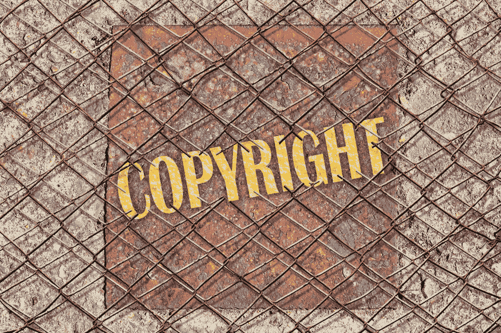

# 倡导团体抨击“不公正”的版权延伸经典法案 

> 原文：<https://web.archive.org/web/https://techcrunch.com/2018/06/04/advocacy-groups-knock-unjust-copyright-extending-classics-act/>

版权是一团乱麻，但在某些方面比其他方面更乱，现在最大的混乱之一是数字广播音乐的许可。音乐现代化法案旨在消除一些最大的障碍，但它的一个配套条款引起了一些互联网倡导组织[的愤怒，他们通过版权学者劳伦斯·莱斯格写的一封信表达了他们的担忧。](https://web.archive.org/web/20221206054441/https://equalcitizens.us/fixtheclassicsact/)

经典法案是一个有争议的法案，尽管没有人质疑其缩写的聪明之处:它代表对传统艺术家的歌曲、服务和对社会的重要贡献进行补偿。事实上，该法案的目标是协调 1972 年以前创作的音乐作品的版权，这是一个转折点，此后版权法发生了重大变化。

目前的问题是，尽管由于版权的复杂性，任何总结都必然是不充分的，但 1972 年以前的作品基本上没有资格获得联邦版权地位，而是由州和普通法的大杂烩进行注册。诚然，开始时这是一件痛苦的事情，但随着音乐的数字传输增加，联邦版权变得更加重要，它真的开始变得令人恼火，版税问题变得越来越复杂。([今日抄袭](https://web.archive.org/web/20221206054441/https://www.plagiarismtoday.com/2017/07/20/understanding-classics-act/)有很好的总结如果你想了解更多细节。)

CLASSICS 想要做的是赋予那些 1972 年以前的作品一种联邦版权的表象，帮助消除这种关于音乐如何获得许可的武断的界限。听起来不错，对吧？而且大部分都是。但是有一个条件——或者两个条件。

Lessig 在一次采访中告诉我，“整个计划的目标是让数字时代的音乐授权过程更加高效，我认为这很棒。”“但我认为，这是一条重要的界限，我们批评的是公众没有受益。”

他说，在与其他知识产权专家的讨论中，特别是与互联网档案馆的创始人布鲁斯特·卡尔(Brewster Kahle)的讨论中，出现了这些问题。莱西格说，布鲁斯特·卡尔曾面临严重的法律障碍，尤其是与音乐档案馆有关的法律障碍。

“美国的版权系统需要现代化，但不是像这样，”[在“平等公民”的信中写道](https://web.archive.org/web/20221206054441/https://equalcitizens.us/fixtheclassicsact/)，“当然也不能导致过长的保护期，在录音版权方面造成严重的不一致，并给这些录音提供不公平的访问权。”

共同签署者包括需求进展、EFF、公共知识和互联网档案馆。

## 一个半世纪的保护

首先，在经典著作中，1972 年以前的作品被赋予了相当于(尽管法律上并不完全相同)到 2067 年的版权延期。为什么是 2067 年？这是 1972 年加 95 年，如果今天注册，一部作品将享有版权。

但是不仅仅是 1972 年到 2067 年的作品。追溯到另一个 50 年前的作品也将在 2067 年前受到保护，直到 T2。换句话说，一张 1927 年的唱片将获得 140 年的版权保护。

如果你看不到这里的危害，考虑一下这样的录音通常会在几年后进入公共领域，但在 CLASSICS 下将被授予另外 42 年，在此期间必须支付版税和管理权利。

现在，多年来版权的不断延长更有利于权利人而不是消费者。与此同时，很难想象像米老鼠这样的东西会成为公共领域，但是真的，必须有一些限制。一部作品在将近一个半世纪的时间里不公开似乎有些过分。

布鲁斯特·卡尔在一封电子邮件中告诉我，经典公司“在 2067 年之前甚至不会向公众发布爱迪生蜡缸——如果你问我，我会说这是胡说。”

几十名学者在五月发表的一封信中就这一点进行了辩论:

> 该法案存在严重缺陷……因为它只对很久以前创作的作品(年龄范围从 46 岁到 95 岁)给予新的联邦保护，它对激励新作品的创作没有任何作用。相反，它只是为现有的版权所有者提供新的回报。

批评者指出，这些作品实际上并没有获得版权延期——它们将受到不同法律的管辖。但这带有语义学的意味:经典著作本身指定了与侵犯版权相同的“补救措施”作为对相同罪行的惩罚。这不是版权，但它看起来、走起来肯定会像版权一样被起诉。这是一种白标版权，因为延长和减少实际版权期限是一个有点困难的问题。

## 无需登记即可追溯

但 Lessig 说，2067 年的事情只是我们见过的相同的版权延长的东西。

“很多人担心长度，我也是，”他告诉我。“但 2067 年的事情没有你必须做些什么来赢得这一权利的想法重要。如果你打算给予延期或福利，至少要以向公众阐明权利的方式来做。”

主要的问题是，经典将普遍适用于 1972 年之前创作的每一部作品，无论年代、现状、创作者是否还活着，是否仍在受益等等。老歌电台每天播放的一首热门歌曲被赋予了与一张没有人试图货币化或重新发行的晦涩的爵士乐唱片相同的权利。

Lessig 和他的同事认为，后一种作品应该进入公共领域。在经典之下，它们默认受到版权保护，它们的公共领域地位被推迟了几十年，而它们本应像其他旧的和废弃的媒体一样免费提供。

“我希望看到人们使用的作品和人们不使用的作品之间有一条清晰的界限，”Lessig 说。

让《诱惑》这样的人从他们的热门歌曲中再受益一个世纪，如果政府和行业认为这是一个合理的术语的话——他们应该做的就是注册这些作品。

通过让艺术家和版权所有者注册，它解决了每个人的问题。任何想将 1972 年以前的作品纳入新计划的人都可以很容易地做到这一点，但孤儿作品将进入公共领域，这是他们应该做的。

这具有将 1972 年以前作品的版权地位集中化和正规化的副作用；如果你是一名纪录片制作人或 DJ，想在自己的项目中使用一些音乐，你可以很容易地检查一些 60 年代的唱片是否是版权管理的，在这种情况下，你可以许可它，或者如果它是孤儿，在这种情况下，你可以像任何其他公共领域的作品一样安全地使用它。

在知识产权法中，注册一直是一个棘手的问题，因为它不是创造版权的必要条件——但由于这不是创造版权，事实上在某些方面根本不是技术上的版权，这是一个理想的时机来引入这一概念，以造福公众，并给权利持有人带来很少的不便。

音乐产业联盟(music industry Coalition)music first 的执行董事克里斯·伊斯雷尔(Chris Israel)不同意这种观点:他称注册是“一个糟糕的想法”，他认为对于已经在处理 1972 年前后的复杂问题的艺术家来说，不得不“跳过新的法律圈”是一项繁重的工作他并不担心许多计划进入公共领域的作品不会这样做。

“我关心的是如何保护成千上万有价值的 72 年前的表演被商业利用，而不是豁免它们。让我们从那开始吧，”他在一封电子邮件中写道。

反对的理由必然是推测性的，但同样没有理由认为注册过程会是复杂、耗时或劳动密集型的。它实际上只是一个基本的过滤器，用于将使用过的作品与未使用的作品分开，甚至可以从整个转换过程的其他部分中提取出来。

“我们从来没有一个点来利用这一点进入系统，”Lessig 说。他补充说，现在还有时间添加它，而且这样做的成本很低。

在高水平上管理的集体、自动权利是大公司的领域，这些公司可以在法律赶上世界其他地区的同时，操纵协议并支付与其条款外经营相关的巨额罚款。莱西格认为，经典著作会让这些公司受益。

“这集中了他们作为知识产权清算所的权力，”他说。“现在我们没有办法说出什么是受保护的，哪些人有什么权利，为什么。能够做到这一点的是像 Spotify 和 Google 这样的公司，它们能够承担责任。但这并不能让无人问津的文化为大众所用。”

(注意:Lessig 和其他人一样，被指责为谷歌的付费学术傀儡；他对这个建议一笑置之，说“我很想看看那些支票中的一张。”许多上述学者都[类似地拒绝了这个概念](https://web.archive.org/web/20221206054441/https://techcrunch.com/2017/07/17/google-responds-to-academic-funding-controversy-with-a-gif/)，尽管科学领域的私人资助肯定必须受到密切监控。)

Kahle 和其他人已经推荐了经典作品的替代方案，甚至是经典作品的修改版本，[一个名为 ACCESS](https://web.archive.org/web/20221206054441/https://www.finance.senate.gov/imo/media/doc/ACCESS%20to%20Recordings.FINAL.pdf) 的竞争法案，它采取了一种更简单的方法来联邦化 1972 年以前作品的版权。批评者认为，这可能太简单了:它会将大量工作直接推给版权局，像大多数联邦机构一样，版权局已经超负荷工作，效率低下。

音乐现代化法案得到了两党的大力支持；它以 415 票对 0 票在众议院获得通过，这在今天这个时代简直不可思议。因此，它似乎有望成为一项法律。但这并不意味着它是完美的，正如我们最终因数字千年版权法案部分条款的草率措辞和缺乏远见而自责一样，花点时间在第一次就把它做好可能会更好。