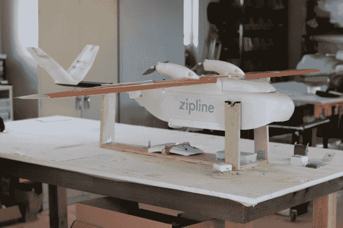

# 非洲正在成为商业无人机服务的试验场

> 原文：<https://web.archive.org/web/https://techcrunch.com/2016/05/22/africa-is-becoming-a-testbed-for-commercial-drone-services/>

UPS 最近与医疗无人机送货初创公司 [Zipline](https://web.archive.org/web/20230321042810/http://flyzipline.com/product/) 达成合作，开始在卢旺达空运医疗用品。协议中包括 [Gavi，疫苗联盟](https://web.archive.org/web/20230321042810/http://www.gavi.org/)，一个盖茨基金会支持的专门从事免疫接种的非营利组织。

Zipline 将于 7 月开始首次分发医疗用品包，这意味着在[无人驾驶亚马逊车辆](https://web.archive.org/web/20230321042810/http://time.com/4185117/amazon-prime-air-drone-delivery/)在美国门口放下任何订单之前，一家初创公司将开始在非洲进行无人机送货

虽然 UPS、Zipline、Gavi 的安排听起来可能是相当的社会风险，但肯定有商业技术支撑。

Zipline 是一家总部位于加州的盈利性企业，由 1900 万美元的风险资本支持。投资方包括[红杉资本](https://web.archive.org/web/20230321042810/https://www.crunchbase.com/organization/sequoia-capital)，谷歌风投，微软联合创始人保罗艾伦，雅虎联合创始人杨致远，[减法资本](https://web.archive.org/web/20230321042810/http://subtractioncapital.com/)。

UPS 将通过 UPS 基金会向 Gavi 提供 80 万美元的资助，但这笔交易也将带来这家全球快递巨头的物流专业知识。

“重点是人道主义方面，但 UPS 一直希望从这样的事件中吸取教训，”UPS 发言人 Glenn Zaccara 告诉 TechCrunch。“我们还将带来……物流、供应链和冷链管理方面的专业知识，”他补充说，并指出 UPS 本身，而不仅仅是其基金会，将参与合作。

非洲正日益成为商业无人机服务和交付的试验场。在看到一些现有的跨越式创新达到极限后，Zipline 的联合创始人 Keller Rinaudo 看到了无人机医疗交付的跨越式潜力。

在对坦桑尼亚的一次研究旅行中，他考察了一个基于手机的警报系统，该系统为诊所中急需特定医疗用品的病人提供服务。“数字数据库和手机让人们知道何时有人需要帮助，但系统的另一半——医疗用品和将他们送到那里的交通基础设施——却缺失了，”Rinaudo 说。

他开始与 Zipline 的联合创始人 Will Hetzler(哈佛大学的前同学)和机器人专家 Keenan Wyrobek 合作，研究非洲医疗保健相关交付的专用无人机和物流结构。

他们开始集中投资，设计自己的专用无人机，并开始在旧金山郊外的一个设施进行飞行测试。

里瑙多强调 Zipline 的使命是“提供可以拯救生命的产品”，但也强调这是一项业务。“我们正在向政府和公共卫生组织出售一项服务，为生活在农村和偏远地区的数百万人提供更高水平的医疗保健，”Rinaudo 说。

他证实该公司已经开始记录收入，但拒绝透露具体数额。Rinaudo 说，Zipline 计划扩展到卢旺达以外的地区，并估计非洲紧急卫生物流服务的价值超过 10 亿美元。

首先在卢旺达推出与卢旺达政府致力于发展 ICT 基础设施和商用无人机有很大关系。

2015 年末，卢旺达政府宣布计划启动世界上第一个无人机港口之一，并一直在通过卢旺达民航局制定商业无人机(UAV)的监管框架。

> 像卢旺达这样的地方没有像美国古老的空中交通管制系统这样的旧模式所阻碍。 Keller Rinaudo，Zipline 联合创始人

这反映了南非最近通过的商用无人机立法(TechCrunch 对此进行了报道)，该立法监管该国[民航局](https://web.archive.org/web/20230321042810/http://www.caa.co.za/Pages/RPAS/Remotely%20Piloted%20Aircraft%20Systems.aspx)下属的部门，并创建了特殊的无人机商业运营许可证。

这些框架反驳了一种误解，即非洲无人机测试的诱惑源于完全缺乏监管。

“根本不是这么回事，”里瑙多说。“人们认为在非洲测试无人机的吸引力是因为没有法律。像卢旺达这样的地方没有像美国古老的空中交通管制系统这样的旧模式所阻碍。它们拥有更简单的空间、更小和更具创新性的政府，并且实际上可以更快地实施现代监管实践。"

这种环境为整个大陆当前和计划中的无人机活动带来了资金和测试的激增。

在南非，Rocketmine 预计在 2016 年为其采矿、农业、林业和土木工程领域的“航空数据解决方案”服务预订[100 万美元的收入](https://web.archive.org/web/20230321042810/https://techcrunch.com/2016/03/02/africas-commercial-drones-take-off/)。瑞士领导的企业[飞驴](https://web.archive.org/web/20230321042810/http://www.flyingdonkey.org/)正在研究无人驾驶的机器人飞行器，以运送重型货物穿越非洲。

另一项努力，Afrotech，正在指导[红线](https://web.archive.org/web/20230321042810/http://afrotech.epfl.ch/page-115280-en.html)项目推出开源货运无人机和无人机航线。保加利亚公司 [Dronamics](https://web.archive.org/web/20230321042810/http://www.dronamics.com/) (由 [SpeedInvest](https://web.archive.org/web/20230321042810/https://www.crunchbase.com/organization/speedinvest#/entity) 支持)正在与三个非洲政府进行对话，以在 2017 年开始商业无人机服务，公司消息人士秘密告诉 TechCrunch。

7 月下旬，当 Zipline、UPS 和 Gavi 的合作关系在卢旺达从测试转向全面运营时，首席执行官 Keller Rinaudo 认为这将标志着非洲和无人机行业的一个里程碑。“当我们推出它时，它将是世界上第一个在全国范围内运营的无人机送货。”