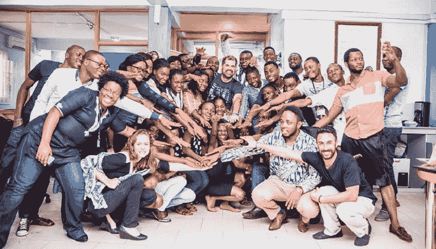
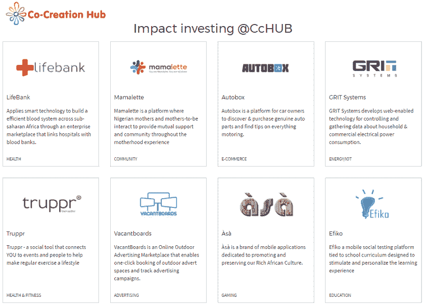

# 非洲综述:Andela 增加乌干达，CcHub 尼日利亚挖掘国外人才和投资

> 原文：<https://web.archive.org/web/https://techcrunch.com/2017/06/15/africa-roundup-andela-adds-uganda-cchub-nigeria-taps-talent-and-investment-abroad/>

开发者培训和招聘服务公司 Andela 宣布将其业务扩展到乌干达。该公司招聘非洲软件开发人员，并将他们安置在全球公司中，在坎帕拉完成了第一轮招聘。

乌干达的开业增加了在内罗毕、拉各斯、纽约和旧金山的办事处。这也标志着安德拉作为一家风投支持的、以收入为中心的公司崛起的第三年，这家公司经常被误读为慈善机构。

首席执行官 Jeremy Johnson [将该组织](https://web.archive.org/web/20230327064553/https://techcrunch.com/2017/05/30/african-andela-marks-year-three-with-uganda-expansion/)描述为“一家以使命为导向的营利性公司”――一个“你可以实际建立业务，创造真正影响”概念的模型

安德拉将培训和雇佣来自非洲前沿市场的开发人员的机会与计算机科学工作和合格毕业生之间的未来缺口联系起来。

该公司将 it 选拔过程称为[【极限招募】](https://web.archive.org/web/20230327064553/https://andela.com/what-we-do)，并补充说，它将“从世界上最大的未开发人才库中挑选 1%的技术人才”用于其 6 个月的培训项目。在其第一个乌干达招聘周期中，加速器接受了 800 名申请人中的 8 人。

“我们每个月都会带来一个班级，每个月都会有新的一批人加入合作公司。”据约翰逊介绍，安德拉为全世界 25 个城市的 80 多家公司安排了程序员。

安德拉从投资者那里筹集了 3900 万美元的风险资金，这些投资者包括[陈·扎克伯格倡议](https://web.archive.org/web/20230327064553/https://chanzuckerberg.com/)、星火资本和 [GV](https://web.archive.org/web/20230327064553/https://www.crunchbase.com/organization/google-ventures) 。安德拉目前从付费使用开发者的合作伙伴那里获得收入。“这些公司认为这有点像 AWS 的人才，”他说，指的是亚马逊网络服务。

尼日利亚的共同创造中心(CcHub)在 5 月份采取了两项措施来挖掘国外的人才和投资。总部位于拉格斯的创新空间在伦敦发起了“散居者挑战”:该计划将为居住在英国、美国和欧洲的非洲人经营的初创企业提供高达 25 万美元和 9 个月的指导。

该计划向三个类别的企业开放——教育、金融科技和能源——标准是他们的初创公司“解决了一个明显的问题……影响了非洲的大量人口”

在与 TechCrunch 讨论侨民挑战时，CcHub 首席执行官孙波·蒂贾尼提到了非洲的人才流失，“我们在非洲大陆以外的美国和欧洲有很多人，他们做得非常好，”他说。他认为寻找外部人才是非洲科技生态系统的必要条件。“如果我们找不到激励最聪明的人的方法……我们将无法建立在全球范围内完成的企业，也无法解决非洲大陆的问题。”

蒂贾尼提到了海外科技企业家的出现——比如 Konga 的 [Sim Shagaya](https://web.archive.org/web/20230327064553/https://www.linkedin.com/in/simdul?ppe=1) 或 iRoko 的[Jason njo ku](https://web.archive.org/web/20230327064553/https://www.crunchbase.com/person/jason-njoku)——他们在海外工作和学习的影响下创建了非洲初创公司。“拥有全球视野有助于让你的业务更加全面，”他说。

与散居者挑战并行的是，CcHub 宣布与谷歌(Google)合作为企业家举办欧洲 [PitchDrive](https://web.archive.org/web/20230327064553/http://pitchdrive.xyz/) 巡演。从 8 月份开始，Tijani 将带领 15 家由 CcHub 挑选的泛非科技公司在伦敦、阿姆斯特丹、柏林和苏黎世的活动中向投资者推介。目标是在为期三周的巡回演出期间筹集大约 2000 万美元的投资。这是对 CcHub 现有的[影响力投资基金](https://web.archive.org/web/20230327064553/http://cchubnigeria.com/impact/)的补充，该基金已经投资了 9 家初创公司，并产生了 6 笔退出。

蒂贾尼将非洲科技生态系统中正在出现的资金缺口称为推销动力。“非洲的科技在过去 5 年里发展非常强劲，但挑战在于我们主要能够建立早期资金来源，然后是一些对成熟创业公司感兴趣的来源，”他说。

“如果你正在筹集 5 万至 25 万至 50 万美元之间的资金……你可以找到在这个水平上投资的人……那么超过 200 万美元就更容易筹集，”他说，他指的是少数投资于非洲初创企业后期阶段的风投。“不幸的是，50 万到 200 万美元之间的任何东西都很难。蒂贾尼说:“许多优秀的企业都在努力寻找资金，所以我们想，‘让我们向世界展示它们吧。’”

美国科技投资者可能很快就会有机会向 CcHub 精选的初创公司提问。“如果欧洲变得成功，也许下一个推介活动将是五个美国城市，”蒂贾尼说。

****

**更多非洲相关报道@TechCrunch**

* * *

**非洲科技围网**

*   微软在埃塞俄比亚推出 AppFactory 学院 [―@DisruptAfrica](https://web.archive.org/web/20230327064553/http://disrupt-africa.com/2017/05/microsoft-launches-appfactory-academy-in-ethiopia/)
*   沃达丰向南非子公司出售 26 亿美元的肯尼亚[Safaricom]股份[―@彭博](https://web.archive.org/web/20230327064553/https://www.bloomberg.com/news/articles/2017-05-14/vodafone-south-africa-said-to-buy-2-8-billion-safaricom-stake)
*   脸书选出我参加 Messenger 开发者挑战赛的决赛选手 [―@ITNewsAfrica](https://web.archive.org/web/20230327064553/http://www.itnewsafrica.com/2017/05/facebook-selects-mea-finalists-for-messenger-developer-challenge/)
*   Sweep South 结束了系列赛——一轮七位数总和的黑咖啡 [―@VentureBurn](https://web.archive.org/web/20230327064553/http://ventureburn.com/2017/05/sweep-south-concludes-series-involving-top-sa-musician/)
*   肯雅的孔扎科技城会启动吗 [―@AFKInsider](https://web.archive.org/web/20230327064553/http://afkinsider.com/139462/will-kenyas-konza-techno-city-ever-get-off-the-ground/)
*   不，Taxify 并没有“赢得”对优步的“战争” [―@TechCabal](https://web.archive.org/web/20230327064553/http://techcabal.com/2017/05/10/taxify-uber-what-war/)