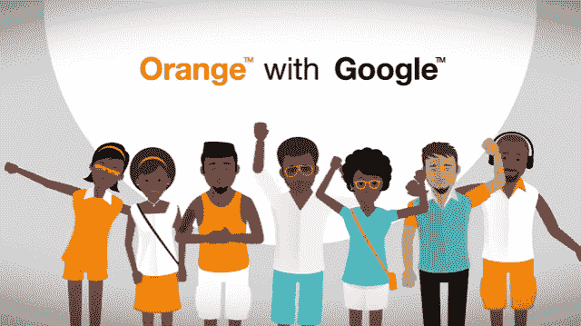
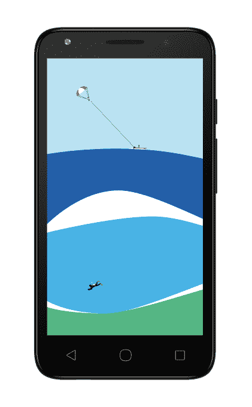

# 非洲综合报道:肯尼亚的 Safaricom 挑战优步，Orange 扩大泛非形象

> 原文：<https://web.archive.org/web/https://techcrunch.com/2016/08/07/africa-roundup-kenyas-safaricom-takes-on-uber-orange-expands-pan-african-profile/>

内罗比的优步司机举行罢工，抗议公司 7 月份的降价。此举正值肯尼亚打车市场竞争加剧之际，因为当地电信公司 Safaricom 推出了自己的小型出租车应用。

Safaricom 与肯尼亚的 [Craft Silicon](https://web.archive.org/web/20230315095317/https://www.crunchbase.com/organization/craft-silicon#/entity) 合作，推出了这项新服务，以积极应对优步——立即提供更便宜的价格和更好的驱动程序条款，正如最近的 TechCrunch 专题报道所述。

除了较低的票价，Little Cab 首次推出了一系列独特的服务，首先是通过提供其他 Safaricom 产品的界面访问其出租车上的免费 Wi-Fi。Little Cab 还有一个名为 Lady Bug 的“女性友好”选项，女性可以请求女司机，还有一个企业选项，让公司通过一个账户整合所有的出租车服务。

预计优步、Little Cab 和肯尼亚其他可行的乘车预订服务公司之间将围绕价格和产品进行针锋相对的交流。第一个举措是优步降价 35%(推出小出租车后)，这促使一些优步司机罢工。优步·肯尼娅可能会找到解决办法。正如 [TechCrunch 此前报道的](https://web.archive.org/web/20230315095317/https://techcrunch.com/2016/06/02/as-it-expands-in-africa-uber-adapts-to-local-markets-and-adopts-cash-payments/)，优步非洲在适应当地市场方面表现出显著的灵活性。

肯尼亚打车市场发生的事情可能会波及非洲刚刚起步的在线交通服务市场。非洲大陆最知名(也是最有资本的)电信公司之一 Safaricom 已经开发了一款本土应用来对抗全球市值最高的初创公司优步。其他非洲国家的移动公司和在线运输初创公司肯定会关注这一事件的发展。

与此同时，Orange 继续提升其泛非洲形象。

在整个 2016 年，这家法国移动巨头增加了其在整个非洲大陆的产品存在、投资和收购。在 Orange 7 月 28 日的伦敦战略会议上，中东和非洲首席执行官布鲁诺·梅特林重申了公司对[“在该地区的数字化转型中发挥重要作用”的承诺](https://web.archive.org/web/20230315095317/http://www.balancingact-africa.com/news/en/issue-no-837/telecoms/orange-drives-digita/en)

梅特林宣布今年 9 月与谷歌合作推出 Orange 51 4G 智能手机。这款手机定位于平价安卓设备，是 2016 年 2 月在 9 个撒哈拉以南非洲国家推出的 Orange Rise 31 的升级版。Orange 发言人 Vanessa Clarke 证实，Rise 51 设备将首先在塞内加尔和科特迪瓦上市，然后在今年晚些时候推广到其他市场。此类产品倡议推动了非洲大陆最重要的 IT 市场趋势之一:非洲庞大且不断增长的移动群体([目前约为 5 亿](https://web.archive.org/web/20230315095317/http://www.gsma.com/mobileeconomy/africa/))向智能设备的转变。

Orange 的 Rise 31 和 51 智能手机也增强了该公司的非洲金融科技服务。Orange Money 是一家提供移动支付服务的公司，在 12 个非洲国家运营。

与 Safaricom ( [见 M-Kopa](https://web.archive.org/web/20230315095317/https://techcrunch.com/2016/04/28/solar-startup-m-kopa-leapfrogs-africas-electricity-grid/) )类似，Orange 也将利用其移动网络进入能源领域。它计划于 2016 年在象牙海岸、塞内加尔和喀麦隆的农村地区试点低收入太阳能发电套件。

在非洲投资方面，Orange 2016 年迄今最引人注目的举动是在一轮投资中(包括高盛、安盛等)获得了 Jumia Group8500 万美元的股份，这使这家电子商务初创公司成为独角兽。Orange 将其在非洲的业务从 16 个国家扩展到 19 个国家，2016 年收购了[塞拉里昂](https://web.archive.org/web/20230315095317/http://www.orange.com/en/Press-and-medias/press-releases-2016/Orange-completes-acquisition-of-mobile-operator-Airtel-in-Sierra-Leone)、利比亚和[布基那法索](https://web.archive.org/web/20230315095317/http://www.orange.com/en/Press-and-medias/press-releases-2016/Orange-completes-acquisition-of-mobile-operator-Airtel-in-Burkina-Faso)的移动运营商。投资部门 Orange Digital Ventures(在其硅谷办公室的帮助下)最近参加了 PayJoy 的 850 万美元 A 轮股权融资，PayJoy 是一家总部位于加利福尼亚州的智能手机融资初创公司，专注于非洲和新兴市场。

总而言之，这是 Orange 的一个相当大的承诺，可能代表着非洲移动电信市场的第二阶段。第一阶段造就了一些非洲大陆的第一批 IT 亿万富翁(即，Mo Ibrahim、stival Masiyiwa 和 Mike Adenuga)，这是一个非常初级的阶段，让那些以前从未以任何方式使用移动设备的人接触到，主要是通过路边供应商购买的廉价手机和按分钟付费的 SIM 卡。

非洲移动的第二阶段将标志着更多的全球参与者，更好的连接，更广泛和更先进的产品网络，基于订阅的套餐，更多的金融科技和电子商务选择，以及向平价智能设备的转变。

看看 Orange 和非洲移动电信市场上的其他本地和全球移动公司，美国大公司的缺席令人震惊。几乎没有美国移动运营商在非洲大陆有所作为的消息。

在谷歌上搜索非洲和美国的电信运营商，比如 T-Mobile、威瑞森或 Sprint，得到的大多是关于他们用户漫游选项的信息。我们将看到美国无线公司还能绕过这个世界上增长最快的移动市场多久。

**更多非洲故事@TechCrunch**

**非洲科技围网**

*   非洲为旧手机开发新应用以利用谷歌盲点—[@彭博](https://web.archive.org/web/20230315095317/http://www.bloomberg.com/news/articles/2016-07-27/africa-s-making-new-apps-for-old-phones-to-tap-google-blind-spot)
*   非洲十大科技先锋—[@卫报](https://web.archive.org/web/20230315095317/https://www.theguardian.com/business/2016/jul/25/africas-tech-pioneers-we-have-become-an-internet-consuming-culture)
*   Appsfrica 创新奖开始报名— [@Appsfrica](https://web.archive.org/web/20230315095317/https://www.appsafrica.com/entries-open-appsafrica-innovation-awards-2016/)
*   Demo Africa 发布 2016 年最终 30 家创业公司名单— [@AllAfrica](https://web.archive.org/web/20230315095317/http://allafrica.com/stories/201607181463.html)