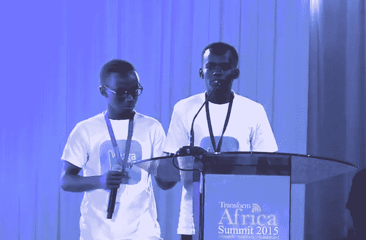
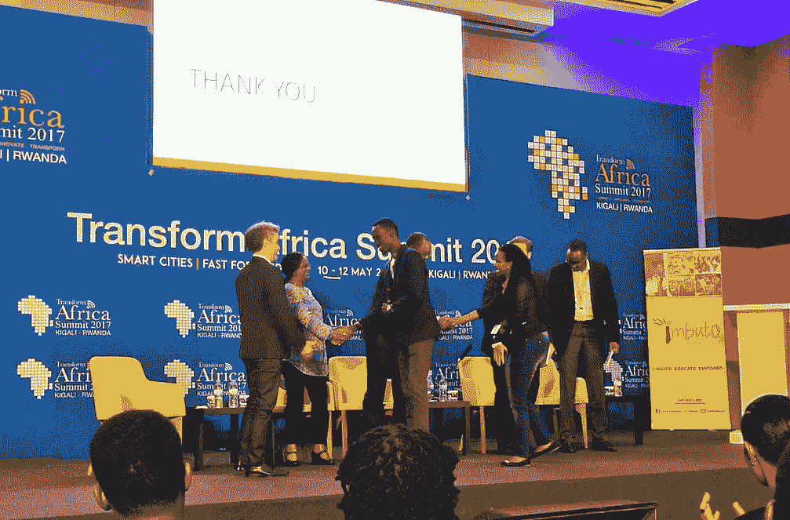

# 非洲创业公司的“鲨鱼池”是卢旺达的新节目“直面大猩猩”

> 原文：<https://web.archive.org/web/https://techcrunch.com/2017/06/22/africas-shark-tank-for-startups-is-rwandas-new-show-face-the-gorillas/>

非洲的初创公司现在可以实时获得资本承诺――只要他们在现场观众面前说服风险投资家给他们。

这是《直面大猩猩*[的形式，这是一部卢旺达 IT 推介系列片，每年在当地电视、YouTube 和一些特定活动上播出几次。](https://web.archive.org/web/20221210032503/https://www.smartafrica.org/tas17/ftg)*

这项比赛最初是由 Yariv Cohen 和他的妻子 [Angela Homsi](https://web.archive.org/web/20221210032503/https://www.seedsofpeace.org/team/angela-homsi/) 在 2013 年构思的，他们通过影响力投资公司 [Kaenaat](https://web.archive.org/web/20221210032503/http://www.kaenaat.com/) 和 [Ignite Power Solar](https://web.archive.org/web/20221210032503/http://www.ignite.solar/) 计划参与了卢旺达的科技领域。

科恩在基加利的办公室告诉 TechCrunch:“我们支持 ICT 行业，组建了一个团队……投资初创公司，然后把它变成了一场秀。”。“我们的想法是为卢旺达初创公司提供商业推介工具，并让他们了解投资者在寻找什么，”他说。

*直面大猩猩*已经与卢旺达的 [ICT 商会](https://web.archive.org/web/20221210032503/http://www.ict.rw/index.html)和合作伙伴如 [kLab](https://web.archive.org/web/20221210032503/https://klab.rw/public/event/155) 合作，每年制作几次该系列节目。根据科恩的说法，自 2013 年以来，它已经进行了 8 期分期付款，资助了 8 家初创公司，并拒绝了 3 笔交易。风险企业可以获得高达 20 万美元的投资，包括加速器类型的合作伙伴关系。

2015 年，由大学时代的兄弟 Patrick Muhire 和 Cedrick Muhoza 创建的卢旺达金融科技风险投资公司 [VugaPay](https://web.archive.org/web/20221210032503/https://www.youtube.com/watch?v=CNQKAx9s97Y) 获得了两位风投巨头的指导和 2 万美元的 10%股权。这一曝光让他们获得了来自硅谷投资者[蒂姆·德雷珀](https://web.archive.org/web/20221210032503/https://www.crunchbase.com/person/timothy-draper)的后续投资。

根据科恩的说法，*面对大猩猩*向整个大陆的初创公司开放。一旦确定了日期和地点，“我们就向所有信息和通信技术中心发出征求建议书。选择那些我们认为可以投资的人――指导他们，训练他们――然后他们来推销，”他说。

虽然这个系列的“现场股权交易”类似于美国的 *[鲨鱼池](https://web.archive.org/web/20221210032503/http://abc.go.com/shows/shark-tank)* ，但还是有一些明显的区别。*直面大猩猩*只对科技创业公司开放。该节目采用了更具建设性的语气:“我们选择那些更注重帮助和指导，而不仅仅是投资本身的风投，”科恩说。*直面大猩猩*通常也给大众中的投资者一个机会，向风投小组提出竞争性报价。科恩说:“最近的三部剧已经得到了观众的认可。”。

卢旺达的转变非洲峰会已经成为*直面大猩猩*更引人注目的场所之一。在 2017 年 5 月的活动中，年轻的初创公司创始人，如企业家 Ines Muhoza，在向可能的报价提问之前，向科恩和投资者小组做了 5 分钟的推介。虽然内容流媒体应用的首席执行官没有收到协议，但她对面对大猩猩持积极态度。“我今天得到的资源是知识……提出令人信服的因素，以便投资者下次会投资于我，”她说。

向穆霍扎提供建议的投资者之一是尤金·尼亚加赫恩，一位拥有 50 万美元基金的卢旺达媒体高管和企业家。作为一名风投大猩猩，他说他“首先寻找创业者对他们业务的热情，然后是他们的数字。如果这两者中有一个不起作用，我就不会投资，”他说。

两者似乎都在 2017 年非洲转型大会上结盟，Nyagahene 加入了一项 35，000 美元的投资，获得太阳能公用事业初创公司 Ibaze Group 18%的股权——闭幕式[赢得了热烈的掌声](https://web.archive.org/web/20221210032503/https://www.youtube.com/watch?v=gDiWF4jYH9s)。

那么*能很快在非洲面对大猩猩的*吗？制片人兼投资人亚里夫·科恩说:“我们收到了一些请求，正在考虑。”。“如果我们这样做，我们只是想确保我们保持同样的教育主题……并关注企业家，而不仅仅是投资者，”他说。

科恩预计下一部《直面大猩猩》将会在 2017 年第四季度的某个时候上映。感兴趣的非洲创业公司可以关注 kLab 网站上的详细信息和申请信息。