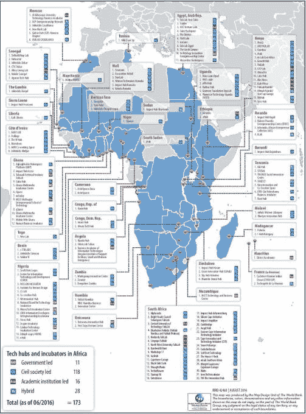
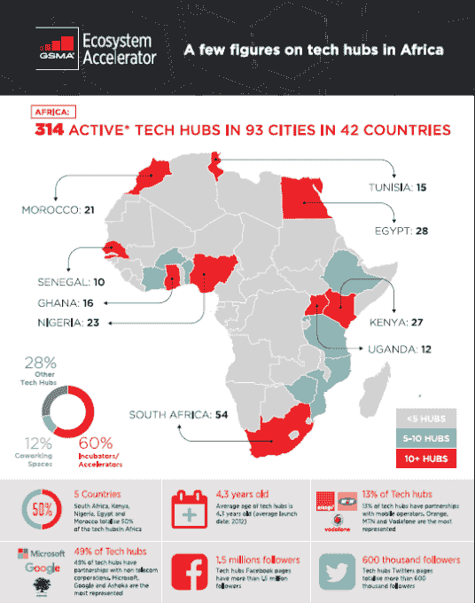

# 非洲的科技中心

> 原文：<https://web.archive.org/web/https://techcrunch.com/2016/12/09/africas-tech-hubs/>

创新中心已经成为非洲新兴技术生态系统的支柱。揭开非洲大陆信息和通信建筑的表面，你可能会发现与科技空间的联系。

超过 150 家创业公司已经在肯尼亚的 iHub 上成立。 [MEST 的](https://web.archive.org/web/20230327064737/http://meltwater.org/incubator/about-the-incubator/)孵化器种子基金项目源自加纳的融水 IT 学院。非洲的科技领袖正通过尼日利亚的[共创中心](https://web.archive.org/web/20230327064737/http://cchubnigeria.com/) (CcHub)接受谷歌的企业家指导。

在过去五年中，非洲的创新空间从少数几个增加到数百个，重点和资金有很大差异。现在，许多这些技术中心正在非洲大陆快速发展的 ICT 环境中寻找可持续的运营模式。

“在第一波大的枢纽浪潮中，人们非常兴奋，但这种兴奋已经消退。下一阶段是关于生存能力和长期挖掘，”MEST 孵化器的董事会成员和前董事尼尔·汉斯奇说。“‘我们如何创造收入、弥补运营成本、创造真正的 IT 成功案例？’这些是当今非洲科技中心面临的挑战。"

## 多少？

在可持续性问题之前，一些组织已经接受了量化欧洲大陆科技中心的挑战。有多少？2012 年，[非洲实验室](https://web.archive.org/web/20230327064737/http://afrilabs.com/)(一个非洲创新空间协会)，估计大约有 70 个。2014 年，赞比亚的 BongoHive 和波士顿的 Fab 基金会合作了 170 个项目。世界银行正在进行的非洲技术中心地图项目总计有 173 个。而[GMSA 2016 年 7 月](https://web.archive.org/web/20230327064737/http://www.gsma.com/mobilefordevelopment/programme/ecosystem-accelerator/things-learned-tech-hubs-africa-asia)的研究估计为 314。

后两种估计的差异主要来自分类。世界银行对科技中心和科技孵化器的定义更窄。GMSA 描绘了活跃的“物理空间，这些空间属于技术中心的广义范畴:孵化器、加速器、联合工作空间、工厂实验室、创客空间、黑客空间和其他创新空间。”

## 重点和资金

虽然不可能对所有数百家公司进行分类 TechCrunch 也找不到全面的融资调查——但还是出现了一些一般性的分类。到目前为止，许多非洲的科技中心都得到了政府或基金会的资助，并面向合作空间。一些公司，比如 Jokkoklabs(T2)，更关注社会风险。其他人已经转向盈利、自筹资金和/或创业加速器模式。

肯尼亚的 iHub 是非洲最引人注目的科技中心之一，已经朝着这个方向发展。总部设在内罗毕的 iHub 被认为激发了整个非洲大陆创新空间的热潮。该中心成立于 2010 年，很大程度上是埃里克·赫斯曼的愿景，他[确定了非洲“为技术专家、投资者和科技公司创造一个连接点”的需求](https://web.archive.org/web/20230327064737/http://kenya-matters.we-magazine.net/)

iHub 最初由赠款资助，现已将其范围多元化——现在是社区技术空间、共同工作空间和加速器的混合——并将运营资金(咨询、活动和企业合作伙伴关系)增加到 70%。2016 年初，IT 中心[宣布了其战略](https://web.archive.org/web/20230327064737/http://ihub.co.ke/blogs/26994)，通过投资者和运营收入实现 100%自筹资金。

iHub 并不是唯一一个向赚钱和投资转型的非洲科技空间。[赞比亚创新中心 BongoHive](https://web.archive.org/web/20230327064737/http://bongohive.co.zm/) 成立于 2011 年，几乎完全依靠赠款，创始人 Lukonga Lindunda 告诉 TechCrunch，BongoHive 已经“转向基于成本/市场的服务价格”，并正在建立一只创业投资基金。

2016 年，尼日利亚的 CcHub 推出了其下一个经济加速器计划和[增长资本基金](https://web.archive.org/web/20230327064737/http://www.gc.fund/)，这两个基金都在提供业务支持的同时收购早期创业公司的股权。

## 对生态系统的重要性，寻找可持续性

随着非洲大陆创新中心的发展，专家们认为它们对非洲科技的重要性正在增加。“最重要的……角色是催化剂。围绕技术发展的生态系统需要催化剂，”iHub 联合创始人埃里克·赫斯曼说。“政府自己做不到，私营部门发挥着重要作用，但演员很难完全中立。你需要某种程度上中立的实体来连接和推动生态系统向前发展。”

技术顾问 Tayo Akinyemi 将枢纽视为非洲脆弱的 IT 格局中的结构性支柱。“基础设施存在根本性的差距，这些差距影响着数字创业、连通性、技术开发和创新。中心正在提供有利的基础设施，”Akinyemi 说，他是非洲实验室的第一任执行董事。她还指出了非洲大陆对信息技术培训的需求。“枢纽正试图填补这些技能缺口，”她说。

关于非洲科技中心的可持续发展模式，Akinyemi 强调了地理位置对于那些更多关注盈利和投资的公司的重要性。“某些国家和城市对科技空间和初创企业有更有利的 ICT 政策，”她说。“需要有一个足够成熟的周边生态系统来支持可行的创业、孵化和加速器活动。”

iHub 的埃里克·赫斯曼也认为位置是一个主要因素。“如果你在一个主要城市，这里有足够数量的所有合适的东西，资金、大学、国际科技公司、媒体、企业家等。这是建立成功的科技中心的自然选择，”他说。“但如果你试图在非洲联系不那么紧密的二线城市建设同样的东西，事情会变得复杂得多。”

谈到可持续资金，无论是基于赠款还是基于收入，赫斯曼建议非洲技术中心专注于解决问题和支持生态系统特定需求的服务模式。“当你看例子时，需求驱动的模型往往会找到一种存在的方式。他说:“确定一些人们愿意为之付费的东西。

尼尔·汉施将非洲科技中心的未来直接与成功的公司联系起来。

“在所有不同的方法中，问题是哪种方法能够证明它们是可持续的，并产生最大的影响。这个问题的答案将会是，哪些中心能够启动和发展最成功的创业公司。”